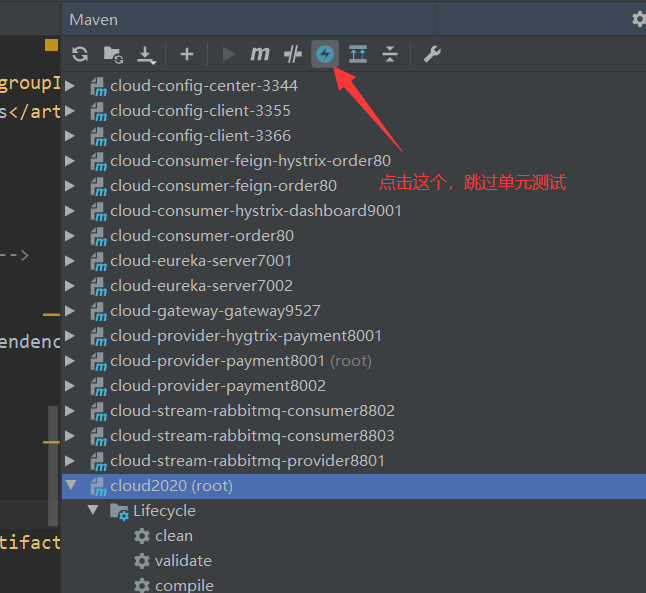
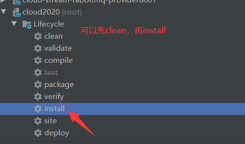
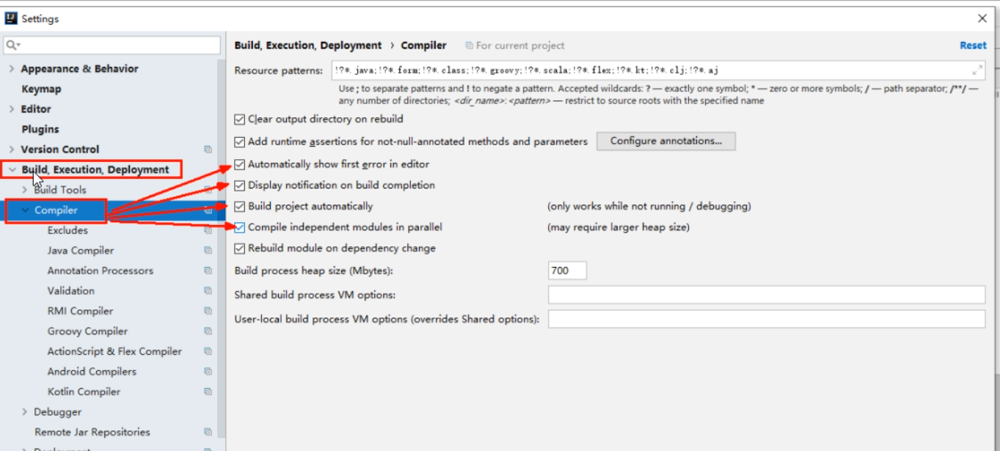
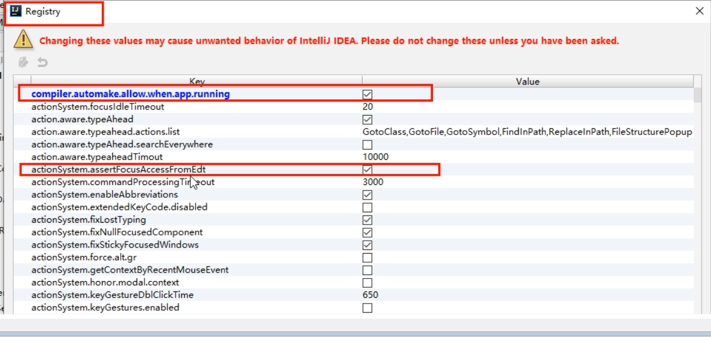
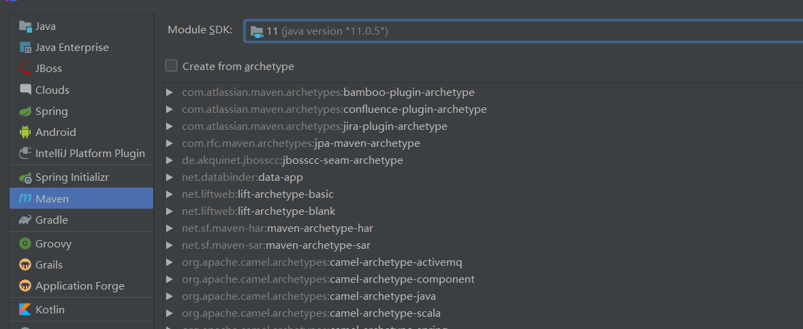
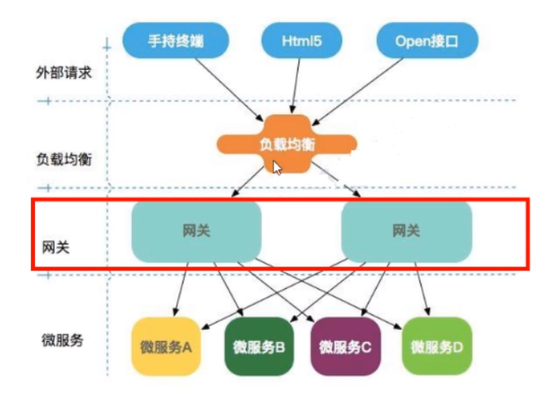

## 父工程Project空间新建

参考博客：https://blog.csdn.net/qq_42199464/article/details/114698204

创建微服务cloud整体聚合父工程Project，有8个关键步骤：

 一、父目录创建 ：

> 1、New Project - maven工程 - create from archetype: maven-archetype-site
> 2、聚合总父工程名字
> 3、Maven选版本
> 4、工程名字
> 5、字符编码 - Settings - File encoding
> 6、注解生效激活 - Settings - Annotation Processors
> 7、Java编译版本选8
> 8、File Type过滤 - Settings - File Type*`

 二、在pom.xml中加入SpringBoot相关的Jar包  
这里网上其他人的加的包也不同，看你自己(够用就行) 

```xml
<?xml version="1.0" encoding="UTF-8"?>

<project xmlns="http://maven.apache.org/POM/4.0.0" xmlns:xsi="http://www.w3.org/2001/XMLSchema-instance"
  xsi:schemaLocation="http://maven.apache.org/POM/4.0.0 http://maven.apache.org/xsd/maven-4.0.0.xsd">
  <modelVersion>4.0.0</modelVersion>

  <groupId>org.example</groupId>
  <artifactId>cloud2020</artifactId>
  <version>1.0-SNAPSHOT</version>
   <!--指定打包方式:pom-->
    <packaging>pom</packaging><!-- 这里添加，注意不是jar或war -->

  <!-- 统一管理jar包版本 jar包根据自己需要更改-->
  <properties>
    <project.build.sourceEncoding>UTF-8</project.build.sourceEncoding>
    <maven.compiler.source>1.8</maven.compiler.source>
    <maven.compiler.target>1.8</maven.compiler.target>
    <junit.version>4.12</junit.version>
    <log4j.version>1.2.17</log4j.version>
    <lombok.version>1.18.10</lombok.version>
    <mysql.version>8.0.16</mysql.version>
    <druid.version>1.1.16</druid.version>
    <mybatis.spring.boot.version>1.3.2</mybatis.spring.boot.version>
  </properties>

  <!-- 子模块继承之后，提供作用：
      锁定版本+子modlue不用写groupId和version -->
  <dependencyManagement>
    <!--微服务搭建：springboot+spring cloud Hoxton.SR1 + spring cloud alibaba 三个必不可少-->
    <dependencies>
      <!--spring boot 2.2.2-->
      <dependency>
        <groupId>org.springframework.boot</groupId>
        <artifactId>spring-boot-dependencies</artifactId>
        <version>2.2.2.RELEASE</version>
        <type>pom</type>
        <scope>import</scope>
      </dependency>
      <!--spring cloud Hoxton.SR1-->
      <dependency>
        <groupId>org.springframework.cloud</groupId>
        <artifactId>spring-cloud-dependencies</artifactId>
        <version>Hoxton.SR1</version>
        <type>pom</type>
        <scope>import</scope>
      </dependency>
      <!--spring cloud alibaba 2.1.0.RELEASE-->
      <dependency>
        <groupId>com.alibaba.cloud</groupId>
        <artifactId>spring-cloud-alibaba-dependencies</artifactId>
        <version>2.1.0.RELEASE</version>
        <type>pom</type>
        <scope>import</scope>
      </dependency>
      <dependency>
        <groupId>mysql</groupId>
        <artifactId>mysql-connector-java</artifactId>
        <version>${mysql.version}</version>
      </dependency>
      <dependency>
        <groupId>com.alibaba</groupId>
        <artifactId>druid</artifactId>
        <version>${druid.version}</version>
      </dependency>
      <dependency>
        <groupId>org.mybatis.spring.boot</groupId>
        <artifactId>mybatis-spring-boot-starter</artifactId>
        <version>${mybatis.spring.boot.version}</version>
      </dependency>
      <dependency>
        <groupId>junit</groupId>
        <artifactId>junit</artifactId>
        <version>${junit.version}</version>
      </dependency>
      <dependency>
        <groupId>log4j</groupId>
        <artifactId>log4j</artifactId>
        <version>${log4j.version}</version>
      </dependency>
      <dependency>
        <groupId>org.projectlombok</groupId>
        <artifactId>lombok</artifactId>
        <version>${lombok.version}</version>
        <optional>true</optional>
      </dependency>
    </dependencies>
  </dependencyManagement>

  <build>
    <plugins>
      <plugin>
        <groupId>org.springframework.boot</groupId>
        <artifactId>spring-boot-maven-plugin</artifactId>
        <version>2.3.4.RELEASE</version>
        <configuration>
          <fork>true</fork>
          <addResources>true</addResources>
        </configuration>
      </plugin>
    </plugins>
  </build>
   <!--导入阿里镜像-->
  <repositories>
    <repository>
      <id>aliyun-repos</id>
      <url>http://maven.aliyun.com/nexus/content/groups/public/</url>
      <snapshots>
        <enabled>false</enabled>
      </snapshots>
    </repository>
  </repositories>
  <pluginRepositories>
    <pluginRepository>
      <id>aliyun-plugin</id>
      <url>http://maven.aliyun.com/nexus/content/groups/public/</url>
      <snapshots>
        <enabled>false</enabled>
      </snapshots>
    </pluginRepository>
  </pluginRepositories>

</project>

```

 3、可以删除父目录不用的部分，如：src等(反正用不到) 

**Maven工程细节：**

**DependencyManagement和Dependencies  解释说明：**

Maven使用dependencyManagement元素来提供了一种管理依赖版本号的方式。

通常会在一个组织或者项目的最顶层的父POM中看到dependencyManagement元素。

使用pom.xml中的dependencyManagement元素能让所有在子项目中引用个依赖而不用显式的列出版本量。

Maven会沿着父子层次向上走，直到找到一个拥有dependencyManagement元素的项目，然后它就会使用这个
dependencyManagement元素中指定的版本号。

如

```xml
<dependencyManagement>
    <dependencies>
        <dependency>
        <groupId>mysq1</groupId>
        <artifactId>mysql-connector-java</artifactId>
        <version>5.1.2</version>
        </dependency>
    <dependencies>
</dependencyManagement>
```

然后在子项目里就可以添加mysql-connector时可以不指定版本号，例如：

```xml
<dependencies>
    <dependency>
    <groupId>mysq1</groupId>
    <artifactId>mysql-connector-java</artifactId>
    </dependency>
</dependencies>

```

- dependencyManagement里只是声明依赖，并不实现引入，因此子项目需要显示的声明需要用的依赖。
- 如果不在子项目中声明依赖，是不会从父项目中继承下来的；只有在子项目中写了该依赖项,并且没有指定具体版本，才会从父项目中继承该项，并且version和scope都读取自父pom。
- 如果子项目中指定了版本号，那么会使用子项目中指定的jar版本。

**maven跳过单元测试：**
 IDEA右侧旁的Maven插件有`Toggle ' Skip Tests' Mode`按钮，这样maven可以跳过单元测试 




父工程创建完成执行mvn : install将父工程发布到仓库方便子工程继承，如



## 热部署Devtools

 **1.Adding devtools to your project** 

```xml
<dependency>
    <groupId>org.springframework.boot</groupId>
    <artifactId>spring-boot-devtools</artifactId>
    <scope>runtime</scope>
    <optional>true</optional>
</dependency>
```

 **2.Adding plugin to your pom.xml** 

 下段配置复制到聚合父类总工程的pom.xml 

```xml
<build>
    <!--
	<finalName>你的工程名</finalName>（单一工程时添加）
    -->
    <plugins>
        <plugin>
            <groupId>org.springframework.boot</groupId>
            <artifactId>spring-boot-maven-plugin</artifactId>
            <configuration>
                <fork>true</fork>
                <addResources>true</addResources>
            </configuration>
        </plugin>
    </plugins>
</build>
```

 **3.Enabling automatic build** 

 

 **4.Update the value of** 

 键入Ctrl + Shift + Alt + / ，打开Registry，勾选：  

 

 **5.重启IDEA** 

## 工程重构

 两工程有重复代码 ，重构 

1.新建 - cloud-api-commons
2.POM

```xml
<?xml version="1.0" encoding="UTF-8"?>
<project xmlns="http://maven.apache.org/POM/4.0.0"
         xmlns:xsi="http://www.w3.org/2001/XMLSchema-instance"
         xsi:schemaLocation="http://maven.apache.org/POM/4.0.0 http://maven.apache.org/xsd/maven-4.0.0.xsd">
    <modelVersion>4.0.0</modelVersion>
    <parent>
        <artifactId>cloud2020</artifactId>
        <groupId>org.example</groupId>
        <version>1.0-SNAPSHOT</version>
    </parent>

    <artifactId>cloud-api-commons</artifactId>
    <version>1.0-SNAPSHOT</version>
    <dependencies>
        <dependency>
            <groupId>org.springframework.boot</groupId>
            <artifactId>spring-boot-devtools</artifactId>
            <scope>runtime</scope>
            <optional>true</optional>
        </dependency>
        <dependency>
            <groupId>org.projectlombok</groupId>
            <artifactId>lombok</artifactId>
            <optional>true</optional>
        </dependency>
        <dependency>
            <groupId>cn.hutool</groupId>
            <artifactId>hutool-all</artifactId>
            <version>5.1.0</version>
        </dependency>
    </dependencies>

</project>
```

3.entities
将cloud-consumer-order80与其它工程的公有entities包移至cloud-api-commons工程下。

4.maven clean、install cloud-api-commons工程，以供给其它工程调用。

 5.其它工程直接引入

```xml
<dependency>
    <groupId>org.example</groupId>  <!--看你自己的groupId是多少-->
    <artifactId>cloud-api-commons</artifactId><!--看你自己的共有工程名是什么-->
    <version>${project.version}</version>
</dependency>
```

## 子工程

创建微服务模块套路：

> 1. 建Module
> 2. 改POM
> 3. 写YML
> 4. 主启动
> 5. 业务类

1.建Module，我是直接新建maven，然后一路next



2.改POM

```xml
 <!--这是子pom基本的，其它如eureka等要自己引入-->
<dependencies> 
        <dependency>
            <groupId>org.springframework.boot</groupId>
            <artifactId>spring-boot-starter-web</artifactId>
        </dependency>
        <dependency>
            <groupId>org.springframework.boot</groupId>
            <artifactId>spring-boot-starter-actuator</artifactId>
        </dependency>
        <dependency>
            <groupId>org.mybatis.spring.boot</groupId>
            <artifactId>mybatis-spring-boot-starter</artifactId>
           <!--<version>1.3.2</version>-->
        </dependency>
        <dependency>
            <groupId>com.alibaba</groupId>
            <artifactId>druid-spring-boot-starter</artifactId>
            <version>1.1.10</version>
        </dependency>
        <!--mysql-connector-java-->
        <dependency>
            <groupId>mysql</groupId>
            <artifactId>mysql-connector-java</artifactId>
        </dependency>
        <!--jdbc-->
        <dependency>
            <groupId>org.springframework.boot</groupId>
            <artifactId>spring-boot-starter-jdbc</artifactId>
        </dependency>
        <dependency>
            <groupId>org.springframework.boot</groupId>
            <artifactId>spring-boot-devtools</artifactId>
            <scope>runtime</scope>
            <optional>true</optional>
        </dependency>
        <dependency>
            <groupId>org.projectlombok</groupId>
            <artifactId>lombok</artifactId>
            <optional>true</optional>
        </dependency>
        <dependency>
            <groupId>org.springframework.boot</groupId>
            <artifactId>spring-boot-starter-test</artifactId>
            <scope>test</scope>
        </dependency>
</dependencies>
```

 3.写YML 

```yml
server:
  port: 8001

spring:
  application:
    name: cloud-payment-service    #微服务在注册中心的应用名
  datasource:
    type: com.alibaba.druid.pool.DruidDataSource            # 当前数据源操作类型
    driver-class-name: com.mysql.cj.jdbc.Driver              # mysql驱动包
    url: jdbc:mysql://localhost:3306/my?&useSSL=false&serverTimezone=UTC&characterEncoding=UTF-8
    username: root
    password: 1234

mybatis:
  mapperLocations: classpath:mapper/*.xml
  type-aliases-package: com.lun.springcloud.entities    # 所有Entity别名类所在包
```


## Eureka

**Eureka Server提供服务注册服务**
各个微服务节点通过配置启动后，会在EurekaServer中进行注册，这样EurekaServer中的服务注册表中将会存储所有可用服务节点的信息，服务节点的信息可以在界面中直观看到。

**EurekaClient通过注册中心进行访问**
它是一个Java客户端，用于简化Eureka Server的交互，客户端同时也具备一个内置的、使用轮询(round-robin)负载算法的负载均衡器。在应用启动后，将会向Eureka Server发送心跳(默认周期为30秒)。如果Eureka Server在多个心跳周期内没有接收到某个节点的心跳，EurekaServer将会从服务注册表中把这个服务节点移除（默认90秒)

> 包：见下面的xml文件
>
> 注解：==@EnableEurekaServer  和  @EnableEurekaClient==
>
> yml配置见下面的代码

### EurekaServer服务端安装

1.建Module(略)
2.改POM:

```xml
<dependency>
    <groupId>org.springframework.cloud</groupId>
    <artifactId>spring-cloud-starter-netflix-eureka-server</artifactId>
</dependency>
```

 3.添加application.yml 

```yaml
server:
  port: 7001

eureka:
  instance:
    hostname: locathost #eureka服务端的实例名称
  client:
    #false表示不向注册中心注册自己。
    register-with-eureka: false
    #false表示自己端就是注册中心，我的职责就是维护服务实例，并不需要去检索服务
    fetch-registry: false
    service-url:
      #设置与Eureka server交互的地址查询服务和注册服务都需要依赖这个地址。
      defaultZone: http://${eureka.instance.hostname}:${server.port}/eureka/
```

4.主启动添加 ==@EnableEurekaServer== 注解，表明这是一个注册中心

### 微服务入驻进EurekaServer

1.建Module(略)
2.改POM:

```xml
<dependency>
    <groupId>org.springframework.cloud</groupId>
    <artifactId>spring-cloud-starter-netflix-eureka-client</artifactId>
</dependency>
```

 3.写YML 

```yaml
eureka:
  client:
    #表示是否将自己注册进Eurekaserver默认为true。
    register-with-eureka: true
    #是否从EurekaServer抓取已有的注册信息，默认为true。单节点无所谓，集群必须设置为true才能配合ribbon使用负载均衡
    fetchRegistry: true
    service-url:
      defaultZone: http://localhost:7001/eureka    #7001是eureka注册中心的端口
```

4.主启动添加  ==@EnableEurekaClient==  注解   表明这是一个微服务

###  自我保护机制 

 **一句话：某时刻某一个微服务不可用了，Eureka不会立刻清理，依旧会对该微服务的信息进行保存。在自我保护模式中，Eureka Server会保护服务注册表中的信息，不再注销任何服务实例， 好死不如赖活着 **

 如果在Eureka Server的首页看到以下这段提示，则说明Eureka进入了保护模式: 
EMERGENCY! EUREKA MAY BE INCORRECTLY CLAIMING INSTANCES ARE UP WHEN THEY’RE NOT. RENEWALS ARELESSER THAN THRESHOLD AND HENCFT ARE NOT BEING EXPIRED JUST TO BE SAFE.

紧急情况！EUREKA可能错误地声称实例在没有启动的情况下启动了。续订小于阈值，因此实例不会为了安全而过期。

**什么是自我保护模式?**

默认情况下，如果EurekaServer在一定时间内没有接收到某个微服务实例的心跳，EurekaServer将会注销该实例(默认90秒)。但是当网络分区故障发生(延时、卡顿、拥挤)时，微服务与EurekaServer之间无法正常通信，以上行为可能变得非常危险了——因为微服务本身其实是健康的，此时本不应该注销这个微服务。Eureka通过“自我保护模式”来解决这个问题——当EurekaServer节点在短时间内丢失过多客户端时(可能发生了网络分区故障)，那么这个节点就会进入自我保护模式，不会剔除该服务 。

**禁止自我保护**
出厂默认，自我保护机制是开启的 

在eurekaServer端 使用`eureka.server.enable-self-preservation = false`可以禁用自我保护模式 

```yaml
eureka:
  ...
  server:
    #关闭自我保护机制，保证不可用服务被及时踢除
    enable-self-preservation: false
    eviction-interval-timer-in-ms: 2000

```

关闭效果：

spring-eureka主页会显示出一句：
THE SELF PRESERVATION MODE IS TURNED OFF. THIS MAY NOT PROTECT INSTANCE EXPIRY IN CASE OF NETWORK/OTHER PROBLEMS.

客户端可以设置心跳等：

```yaml
eureka:
  ...
  instance:
    instance-id: payment8001
    prefer-ip-address: true
    #心跳检测与续约时间
    #开发时没置小些，保证服务关闭后注册中心能即使剔除服务
    #Eureka客户端向服务端发送心跳的时间间隔，单位为秒(默认是30秒)
    lease-renewal-interval-in-seconds: 1
    #Eureka服务端在收到最后一次心跳后等待时间上限，单位为秒(默认是90秒)，超时将剔除服务
    lease-expiration-duration-in-seconds: 2
```


### Eureka集群

 **互相注册，相互守望**   实现负载均衡+故障容错 

在自己的电脑上模拟

- 找到C:\Windows\System32\drivers\etc路径下的hosts文件，修改映射配置添加进hosts文件

  127.0.0.1 eureka7001.com
  127.0.0.1 eureka7002.com

- 修改配置文件,两个都要修改，我这里只列了一个的

  ```yaml
  server:
    port: 7001
  
  eureka:
    instance:
      hostname: eureka7001.com #eureka服务端的实例名称
    client:
      register-with-eureka: false     #false表示不向注册中心注册自己。
      fetch-registry: false     #false表示自己端就是注册中心，我的职责就是维护服务实例，并不需要去检索服务
      service-url:
      #集群指向其它eureka
        defaultZone: http://eureka7002.com:7002/eureka/
      #单机就是7001自己
        #defaultZone: http://eureka7001.com:7001/eureka/
  ```

微服务注册进Eureka集群
更改配置文件

```yaml
eureka:
  client:
    #表示是否将自己注册进Eurekaserver默认为true。
    register-with-eureka: true
    #是否从EurekaServer抓取已有的注册信息，默认为true。单节点无所谓，集群必须设置为true才能配合ribbon使用负载均衡
    fetchRegistry: true
    service-url:     #注册进两个注册中心
      defaultZone: http://eureka7001.com:7001/eureka, http://eureka7002.com:7002/eureka
```

### actuator微服务信息完善

 主机名称：服务名称修改（也就是将IP地址，换成可读性高的名字）+   访问信息有IP信息提示 
只要修改yml

```yaml
eureka:
  ...
  instance:
    instance-id: payment8001 #添加此处   修改之后eureka主页将显示payment8001代替原来显示的IP地址。
    prefer-ip-address: true #访问信息有IP信息提示，（就是将鼠标指针移至payment8001名下，会有IP地址提示）
```

### 服务发现Discovery

 对于注册进eureka里面的微服务，可以通过服务发现来获得该服务的信息 

```java
@Resource
private DiscoveryClient discoveryClient;
//使用这个类可以获得服务的信息
```

启动类添加  ==@EnableDiscoveryClient==    注解

 @EnableDiscoveryClient和@EnableEurekaClient的区别 :
其实二者的功能是一样的。但是如果选用的是eureka服务器，那么就推荐@EnableEurekaClient，如果是其他的注册中心，那么推荐使用@EnableDiscoveryClient。 

**zookeeper和Consul（略）**

## Ribbon

 **==负载均衡 + RestTemplate调用==** 

 ==@LoadBalanced==   

 主要功能是提供**客户端的软件负载均衡算法和服务调用** 
 **LB负载均衡(Load Balance)** 
**Ribbon就属于进程内LB**，它只是一个类库，集成于消费方进程，消费方通过它来获取到服务提供方的地址。 
 Ribbon提供了多种策略：比如轮询、随机和根据响应时间加权 

 **总结**：Ribbon其实就是一个软负载均衡的客户端组件，它可以和其他所需请求的客户端结合使用 

 **POM** 

```xml
<dependency>
    <groupld>org.springframework.cloud</groupld>
    <artifactld>spring-cloud-starter-netflix-ribbon</artifactid>
</dependency>
```

###  **RestTemplate的使用** 

**getForObject()** / getForEntity() - GET请求方法
getForObject()：返回对象为响应体中数据转化成的对象，基本上可以理解为Json。
getForEntity()：返回对象为ResponseEntity对象，包含了响应中的一些重要信息，比如响应头、响应状态码、响应体等。
 **postForObject() / postForEntity()** - POST请求方法  

### 实例

==一般在客户端配置负载均衡==

1.一般定义一个配置类，当然也可以将这个方法放到启动类中

```java
@Configuration
public class ApplicationContextConfig {
    @Bean
    @LoadBalanced//使用@LoadBalanced注解赋予RestTemplate负载均衡的能力
    public RestTemplate getRestTemplate(){
        return new RestTemplate();
    }
}
```

2.controller类中

```java
    @Resource
    private RestTemplate restTemplate;

    public static final String PAYMENT_URL = "http://CLOUD-PAYMENT-SERVICE";  //通过服务名查找服务提供者

    @RequestMapping("/consumer/payment/zipkin")
    @ResponseBody
    public String paymentZipkin()
    {
        String result = restTemplate.getForObject(PAYMENT_URL+"/payment/zipkin/", String.class);
        //服务提供者的controller的端口
        return result;
    }
```

 ribbon默认采用轮询的方式进行负载均衡 

### Ribbon负载规则替换

 另加一个包 写个配置类 ， 注意这个自定义配置类不能放在@ComponentScan所扫描的当前包下以及子包下， ==即不能和主启动类在一个包==

 配置类 ：

```java
@Configuration
public class MySelfRule {
    @Bean
    public IRule myRule(){
        return new RandomRule();//自定义随机
    }
}
```

 客户端启动类加注解 ：

```java
@RibbonClient(name = "CLOUD-PAYMENT-SERVICE", configuration = MySelfRule.class)
```

 **默认负载轮训算法: rest接口第几次请求数 % 服务器集群总数量 = 实际调用服务器位置下标，每次服务重启动后rest接口计数从1开始**。 


## OpenFeign

 **Feign集成了Ribbon**  Feign在此基础上做了进一步封装 

### 实例

 接口+注解：微服务调用接口 + @FeignClient     **一般也在客户端**

1.POM：

```xml
<dependency>
    <groupId>org.springframework.cloud</groupId>
    <artifactId>spring-cloud-starter-openfeign</artifactId>
</dependency>
```

2.主启动添加  ==@EnableFeignClients==   注解

 3.业务类 ：
业务逻辑接口+@FeignClient配置调用provider服务
 新建PaymentFeignService接口并新增注解@FeignClient 

```java
@Component
@FeignClient(value = "CLOUD-PAYMENT-SERVICE")  //注册中心的服务名
public interface PaymentFeignService
{
    @GetMapping(value = "/payment/get/{id}")  //该微服务的访问接口地址
    public CommonResult<Payment> getPaymentById(@PathVariable("id") Long id);
   //要加@PathVariable注解，不然可能会识别不到
}
```

 控制层Controller 

```java
@RestController
@Slf4j
public class OrderFeignController
{
    @Resource
    private PaymentFeignService paymentFeignService;

    @GetMapping(value = "/consumer/payment/get/{id}")
    public CommonResult<Payment> getPaymentById(@PathVariable("id") Long id)
    {
        return paymentFeignService.getPaymentById(id);
    }
}
```

###  **OpenFeign客户端超时控制** 

```yaml
#方法一：这个可能不会起效，这是OpenFeign内ribbon的设置
#设置feign客户端超时时间(OpenFeign默认支持ribbon)(单位：毫秒)   
ribbon:
  #指的是建立连接后从服务器读取到可用资源所用的时间
  ReadTimeout: 5000
  #指的是建立连接所用的时间，适用于网络状况正常的情况下,两端连接所用的时间
  ConnectTimeout: 5000
  
#方法二：当上面的不起效的时候，用下面的
#设置feign客户端超时时间(OpenFeign默认支持ribbon)(单位：毫秒)
feign:
  client:
    config:
      default:
        connectTimeout: 5000
        readTimeout: 5000
```

### OpenFeign日志增强

日志打印功能
Feign提供了日志打印功能，我们可以通过配置来调整日恙级别，从而了解Feign 中 Http请求的细节。
说白了就是对Feign接口的调用情况进行监控和输出

日志级别

> NONE：默认的，不显示任何日志;
> BASIC：仅记录请求方法、URL、响应状态码及执行时间;
> HEADERS：除了BASIC中定义的信息之外，还有请求和响应的头信息;
> FULL：除了HEADERS中定义的信息之外，还有请求和响应的正文及元数据。

1、 **配置日志bean** 

```java
@Configuration
public class FeignConfig
{
    @Bean
    Logger.Level feignLoggerLevel()
    {
        return Logger.Level.FULL;
    }
}
```

 2、**YML文件里需要开启日志的Feign客户端** 

```yaml
logging:
  level:
    # feign日志以什么级别监控哪个接口,要写详细的 类路径
    com.lun.springcloud.service.PaymentFeignService: debug
```

## Hystrix

 Hystrix是一个用于处理分布式系统的**延迟**和**容错**的开源库，在分布式系统里，许多依赖不可避免的会调用失败，比如超时、异常等，Hystrix能够保证在一个依赖出问题的情况下，**不会导致整体服务失败，避免级联故障，以提高分布式系统的弹性**。 

- 服务降级
- 服务熔断
- 接近实对的监控

 **服务降级** 
服务器忙，请稍后再试，不让客户端等待并立刻返回一个友好提示，fallback 

 **服务熔断** 
**类比保险丝**达到最大服务访问后，直接拒绝访问，拉闸限电，然后调用服务降级的方法并返回友好提示。
服务的降级 -> 进而熔断 -> 恢复调用链路

 **服务限流** 
 秒杀高并发等操作，严禁一窝蜂的过来拥挤，大家排队，一秒钟N个，有序进行。 

### 服务降级fallback实例

一般是在客户端进行，减少服务端的压力

 降级配置 - ==@HystrixCommand== 
 **设置自身调用超时时间的峰值，峰值内可以正常运行，超过了需要有兜底的方法处埋，作服务降级fallback**。 

**但存在问题： 每个业务方法对应一个兜底的方法，代码膨胀** 

1、YML

```yaml
#开启
feign:
  hystrix:
    enabled: true
```

2、

```java
@Service
public class PaymentService{
//当前服务不可用了，做服务降级，兜底的方案都是paymentInfo_TimeOutHandler
    @HystrixCommand(fallbackMethod = "paymentInfo_TimeOutHandler"/*指定善后方法名*/,commandProperties=    { @HystrixProperty(name="execution.isolation.thread.timeoutInMilliseconds",value="3000")})
     public String paymentInfo_TimeOut(Integer id)
    {
        try { TimeUnit.MILLISECONDS.sleep(5000); } catch (InterruptedException e) { e.printStackTrace(); }
        return "线程池:  "+Thread.currentThread().getName()+" id:  "+id+"\t"+"O(∩_∩)O哈哈~"+"  耗时(秒): ";
    }

    //用来善后的方法
    public String paymentInfo_TimeOutHandler(Integer id)
    {
        return "线程池:  "+Thread.currentThread().getName()+"  8001系统繁忙或者运行报错，请稍后再试,id:  "+id+"\t"+"o(╥﹏╥)o";
    }   
}
```

3、 **主启动类激活**  添加新注解==@EnableHystrix== 

注意： @EnableHystrix 和  @EnableCircuitBreaker  都是激活hystrix的功能 ，但 @EnableHystrix注解已经涵盖了@EnableCircuitBreaker的功能。 

### 全局服务降级DefaultProperties

 通过@DefaultProperties(defaultFallback = “”)统一跳转到统一处理结果页面 ，通用的和独享的各自分开，避免了代码膨胀，合理减少了代码量 

 ==@DefaultProperties   @HystrixCommand==  

```java
@RestController
@Slf4j
@DefaultProperties(defaultFallback = "payment_Global_FallbackMethod")//***********
public class OrderHystirxController {
    @Resource
    private PaymentHystrixService paymentHystrixService;

    @GetMapping("/consumer/payment/hystrix/ok/{id}")
    public String paymentInfo_OK(@PathVariable("id") Integer id)
    {
        String result = paymentHystrixService.paymentInfo_OK(id);
        return result;
    }
     //这里********
    @GetMapping("/consumer/payment/hystrix/timeout/{id}")
//    @HystrixCommand(fallbackMethod = "paymentTimeOutFallbackMethod",commandProperties = {
//            @HystrixProperty(name="execution.isolation.thread.timeoutInMilliseconds",value="1500")
//    })
    @HystrixCommand//用全局的fallback方法
    public String paymentInfo_TimeOut(@PathVariable("id") Integer id) {
        String result = paymentHystrixService.paymentInfo_TimeOut(id);
        return result;
    }
    public String paymentTimeOutFallbackMethod(@PathVariable("id") Integer id)
    {
        return "我是消费者80,对方支付系统繁忙请10秒钟后再试或者自己运行出错请检查自己,o(╥﹏╥)o";
    }

    // 下面是全局fallback方法
    public String payment_Global_FallbackMethod()
    {
        return "Global异常处理信息，请稍后再试，/(ㄒoㄒ)/~~";
    }
}
```

### 通配服务降级FeignFallback

**服务降级，客户端去调用服务端，碰上服务端宕机或关闭**

上面的降级都是在客户端实现的，与服务端没有关系，因此需要为==OpenFeign客户端定义的接口==添加一个服务降级处理的实现类即可实现解耦 

1、 PaymentFallbackService类实现PaymentHystrixService接口 

```java
@Component
public class PaymentFallbackService implements PaymentHystrixService
{         //PaymentHystrixService是OpenFeign的接口
    @Override
    public String paymentInfo_OK(Integer id)
    {
        return "-----PaymentFallbackService fall back-paymentInfo_OK ,o(╥﹏╥)o";
    }
    @Override
    public String paymentInfo_TimeOut(Integer id)
    {
        return "-----PaymentFallbackService fall back-paymentInfo_TimeOut ,o(╥﹏╥)o";
    }
}
```

2、 PaymentHystrixService 接口

```java
@Component
@FeignClient(value = "CLOUD-PROVIDER-HYSTRIX-PAYMENT" ,//
             fallback = PaymentFallbackService.class)//指定PaymentFallbackService类
public interface PaymentHystrixService
{
    @GetMapping("/payment/hystrix/ok/{id}")
    public String paymentInfo_OK(@PathVariable("id") Integer id);

    @GetMapping("/payment/hystrix/timeout/{id}")
    public String paymentInfo_TimeOut(@PathVariable("id") Integer id);
}
```

测试时，故意关闭微服务8001
客户端自己调用提示 - 此时服务端provider已经down了，但是我们做了服务降级处理，让客户端在服务端不可用时也会获得提示信息而不会挂起耗死服务器。


### 服务熔断案例

 断路器在什么情况下开始起作用 

```java
//=====服务熔断
@HystrixCommand(fallbackMethod = "paymentCircuitBreaker_fallback",commandProperties = {
    @HystrixProperty(name = "circuitBreaker.enabled",value = "true"),// 是否开启断路器
    @HystrixProperty(name = "circuitBreaker.requestVolumeThreshold",value = "10"),// 请求次数
    @HystrixProperty(name = "circuitBreaker.sleepWindowInMilliseconds",value = "10000"), // 时间窗口期
    @HystrixProperty(name = "circuitBreaker.errorThresholdPercentage",value = "60"),// 失败率达到多少后跳闸
})
public String paymentCircuitBreaker(@PathVariable("id") Integer id) {
    ...
}
```

**熔断类型**

- 熔断打开：请求不再进行调用当前服务，内部设置时钟一般为MTTR(平均故障处理时间)，当打开时长达到所设时钟则进入半熔断状态。
- 熔断关闭：熔断关闭不会对服务进行熔断。
- 熔断半开：部分请求根据规则调用当前服务，如果请求成功且符合规则则认为当前服务恢复正常，关闭熔断。

涉及到断路器的三个重要参数：

- 快照时间窗：断路器确定是否打开需要统计一些请求和错误数据，而统计的时间范围就是快照时间窗，默认为最近的10秒。
- 请求总数阀值：在快照时间窗内，必须满足请求总数阀值才有资格熔断。默认为20，意味着在10秒内，如果该hystrix命令的调用次数不足20次7,即使所有的请求都超时或其他原因失败，断路器都不会打开。
- 错误百分比阀值：当请求总数在快照时间窗内超过了阀值，比如发生了30次调用，如果在这30次调用中，有15次发生了超时异常，也就是超过50%的错误百分比，在默认设定50%阀值情况下，这时候就会将断路器打开。

### Hystrix图形化Dashboard搭建

1、建module

2、POM

```xml
 <dependency>
            <groupId>org.springframework.cloud</groupId>
            <artifactId>spring-cloud-starter-netflix-hystrix-dashboard</artifactId>
 </dependency>
```

3、yml

```yaml
server:
  port: 9001
```

4、启动类添加 ==@EnableHystrixDashboard==   注解

5、所有Provider微服务提供类 都需要监控依赖配置 

```xml
<dependency>
    <groupId>org.springframework.boot</groupId>
    <artifactId>spring-boot-starter-actuator</artifactId>
</dependency>
```

Hystrix图形化Dashboard监控实战

在微服务提供类中的启动类中添加：

```java
@SpringBootApplication
@EnableEurekaClient
@EnableHystrix 
public class PaymentHystrixMain8001
{
    public static void main(String[] args) {
            SpringApplication.run(PaymentHystrixMain8001.class, args);
    }


    /**
     *此配置是为了服务监控而配置，与服务容错本身无关，springcloud升级后的坑
     *ServletRegistrationBean因为springboot的默认路径不是"/hystrix.stream"，
     *只要在自己的项目里配置上下面的servlet就可以了
     *否则，Unable to connect to Command Metric Stream 404
     */
    @Bean
    public ServletRegistrationBean getServlet() {
        HystrixMetricsStreamServlet streamServlet = new HystrixMetricsStreamServlet();
        ServletRegistrationBean registrationBean = new ServletRegistrationBean(streamServlet);
        registrationBean.setLoadOnStartup(1);
        registrationBean.addUrlMappings("/hystrix.stream");
        registrationBean.setName("HystrixMetricsStreamServlet");
        return registrationBean;
    }
}
```


## GateWay



 **三大核心概念** 

- Route(路由) - 路由是构建网关的基本模块,它由ID,目标URI,一系列的断言和过滤器组成,如断言为true则匹配该路由
- Predicate(断言) - 参考的是Java8的java.util.function.Predicate，开发人员可以匹配HTTP请求中的所有内容(例如请求头或请求参数),如果请求与断言相匹配则进行路由
- Filter(过滤) - 指的是Spring框架中GatewayFilter的实例,使用过滤器,可以在请求被路由前或者之后对请求进行修改

 **核心逻辑**：路由转发 + 执行过滤器链。 

### 实例

1、建module

2、pom

```xml
 <dependency>
            <groupId>org.springframework.cloud</groupId>
            <artifactId>spring-cloud-starter-gateway</artifactId>
 </dependency>
```

3、YML
4、业务类 
5、 主启动类 
6、9527网关如何做路由映射?   如： 我们目前不想暴露8001端口，希望在8001外面套一层9527 
7、==YML新增网关配置== ，完整的yml文件如下

```yaml
server:
  port: 9527

spring:
  application:
    name: cloud-gateway
#############################新增网关配置###########################
  cloud:
    gateway:
      routes:
        - id: payment_routh #payment_route    #路由的ID，没有固定规则但要求唯一，建议配合服务名
          uri: http://localhost:8001          #匹配后提供服务的路由地址
          #uri: lb://cloud-payment-service #匹配后提供服务的路由地址
          predicates:
            - Path=/payment/get/**         # 断言，路径相匹配的进行路由  8001下面的地址

        - id: payment_routh2 #payment_route    #路由的ID，没有固定规则但要求唯一，建议配合服务名
          uri: http://localhost:8001          #匹配后提供服务的路由地址
          #uri: lb://cloud-payment-service #匹配后提供服务的路由地址
          predicates:
            - Path=/payment/lb/**         # 断言，路径相匹配的进行路由
####################################################################

eureka:
  instance:
    hostname: cloud-gateway-service
  client: #服务提供者provider注册进eureka服务列表内
    service-url:
      register-with-eureka: true
      fetch-registry: true
      defaultZone: http://eureka7001.com:7001/eureka
```

测试：

- 添加网关前 - http://localhost:8001/payment/get/1
- 添加网关后 - http://localhost:9527/payment/get/1
- 两者访问成功，返回相同结果  达到我们想要隐藏微服务端口的目的

4、业务类 

### 配置路由的两种方式

- **1、在配置文件yml中配置，见上面**
- **2、代码中注入RouteLocator的Bean（略）**

### 配置动态路由

 默认情况下Gateway会根据注册中心注册的服务列表，以注册中心上微服务名为路径创建**动态路由进行转发，从而实现动态路由的功能**（不写死一个地址）。 

改YML

```yaml
spring:
  application:
    name: cloud-gateway
  #############################新增网关配置###########################
  cloud:
    gateway:
      discovery:
        locator:
          enabled: true    #开启从注册中心动态创建路由的功能，利用微服务名进行路由
      routes:
        - id: payment_routh #payment_route    #路由的ID，没有固定规则但要求唯一，建议配合服务名
          #uri: http://localhost:8001          #匹配后提供服务的路由地址
          uri: lb://cloud-payment-service #匹配后提供服务的路由地址
          predicates:
            - Path=/payment/get/**         # 断言，路径相匹配的进行路由

        - id: payment_routh2 #payment_route    #路由的ID，没有固定规则但要求唯一，建议配合服务名
          #uri: http://localhost:8001          #匹配后提供服务的路由地址
          uri: lb://cloud-payment-service #匹配后提供服务的路由地址
          predicates:
            - Path=/payment/lb/**         # 断言，路径相匹配的进行路由
####################################################################
```

需要注意的是uri的协议为lb，表示启用Gateway的负载均衡功能。

lb://serviceName是spring cloud gateway在微服务中自动为我们创建的负载均衡uri。

### GateWay常用的Predicate

参考：https://blog.csdn.net/u011863024/article/details/114298282

 Predicate就是为了实现一组匹配规则，让请求过来找到对应的Route进行处理。 

### GateWay的Filter

参考：https://blog.csdn.net/u011863024/article/details/114298282

## Config分布式配置中心

 SpringCloud Config分为**服务端**和**客户端**两部分。 

在github上新建仓库并添加文件

POM

```xml
 <!--添加消息总线RabbitMQ支持-->
        <dependency>
            <groupId>org.springframework.cloud</groupId>
            <artifactId>spring-cloud-starter-bus-amqp</artifactId>
        </dependency>
        <dependency>
            <groupId>org.springframework.cloud</groupId>
            <artifactId>spring-cloud-config-server</artifactId>
        </dependency>
```

YML文件更名为bootstrap.xml，它比application.xml更早加载   bootstrap.yml是系统级的，优先级更加高 	

```yaml
server:
  port: 3344

spring:
  application:
    name:  cloud-config-center #注册进Eureka服务器的微服务名
  cloud:
    config:
      server:
        git:
          uri: https://github.com/nedzero0/springcloud-config.git #GitHub上面的git仓库名字
          ####搜索目录，即仓库名
          search-paths:
            - springcloud-config
      ####读取分支
      label: main

#服务注册到eureka地址
eureka:
  client:
    service-url:
      defaultZone: http://localhost:7001/eureka

##rabbitmq相关配置,暴露bus刷新配置的端点<--------------------------
management:
  endpoints: #暴露bus刷新配置的端点
    web:
      exposure:
        include: 'bus-refresh'
       #include: '*'
```

主启动类添加 ==@EnableConfigServer==  注解

测试 http://localhost:3344/master/config-dev.yml，成功实现了用SpringCloud Config通过GitHub获取配置信息 


**在来一个客户端通过3344访问GitHub**

YML

```yaml
server:
  port: 3355

spring:
  application:
    name: config-client
  cloud:
    #Config客户端配置
    config:
      label: master #分支名称
      name: config #配置文件名称
      profile: dev #读取后缀名称   上述3个综合：master分支上config-dev.yml的配置文件被读取http://config-3344.com:3344/master/config-dev.yml
      uri: http://localhost:3344 #配置中心地址k


#服务注册到eureka地址
eureka:
  client:
    service-url:
      defaultZone: http://localhost:7001/eureka
```

业务类

```java
@RestController
@RefreshScope   //该注解是为了刷新
public class ConfigClientController
{
    @Value("${config.info}")
    private String configInfo;

    @GetMapping("/configInfo")
    public String getConfigInfo()
    {
        return configInfo;
    }
}
```

测试http://localhost:3355/configlnfo     **成功实现了客户端3355访问SpringCloud Config3344通过GitHub获取配置信息** 

## Bus

一言以蔽之，分布式自动刷新配置功能。

Spring Cloud Bus配合Spring Cloud Config使用可以实现配置的动态刷新

 Spring Clud Bus目前支持RabbitMQ和Kafka，这里使用RabbitMQ为例子

> 基本原理：
> ConfigClient实例都监听MQ中同一个topic(默认是Spring Cloud Bus)。当一个服务刷新数据的时候，它会把这个信息放入到Topic中，这样其它监听同一Topic的服务就能得到通知，然后去更新自身的配置。

具体实例参考：https://blog.csdn.net/u011863024/article/details/114298282

## Stream

 **可以统一底层差异** 
**通过定义绑定器Binder作为中间层，实现了应用程序与消息中间件细节之间的隔离**。

**Binder**：

**Binder**：

- INPUT对应于消费者
- OUTPUT对应于生产者

具体参考：https://blog.csdn.net/u011863024/article/details/114298282

## Sleuth

 完整的服务跟踪的解决方案 

参考：https://blog.csdn.net/u011863024/article/details/114298282

##  Cloud Alibaba简介

###  **Nacos** 

- Nacos就是注册中心＋配置中心的组合 -> **Nacos = Eureka+Config+Bus**

  参考：https://blog.csdn.net/u011863024/article/details/114298282


### Sentinel

相当于 Hystrix ，能进行服务降级，服务熔断，服务限流等操作。与Hystri相比，它直接界面化的细粒度统一配置。
@SentinelResource  注解

参考：https://blog.csdn.net/u011863024/article/details/114298288

### Seata

 Seata是一款开源的**分布式事务解决方案**，致力于在微服务架构下提供高性能和简单易用的分布式事务服务。 

重点： **@GlobalTransactional** 注解

参考：https://blog.csdn.net/u011863024/article/details/114298288


