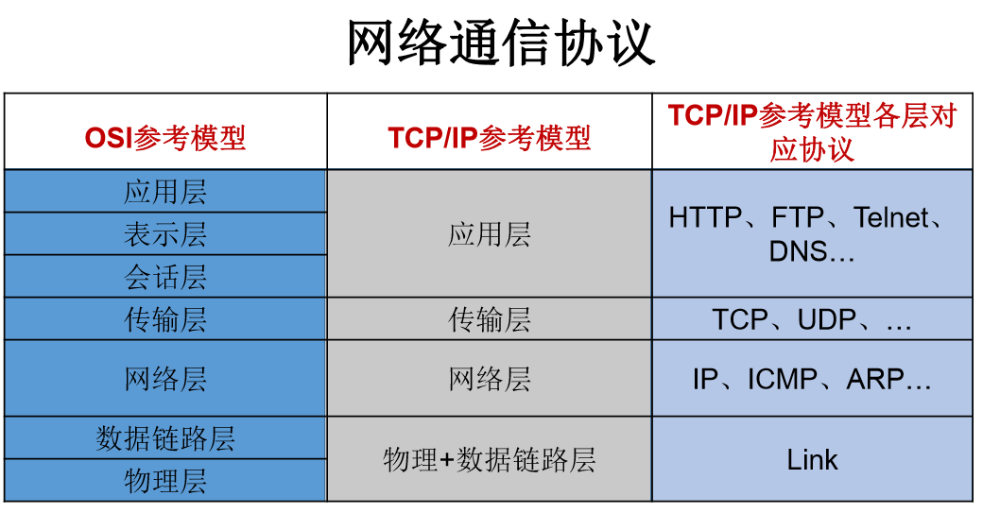
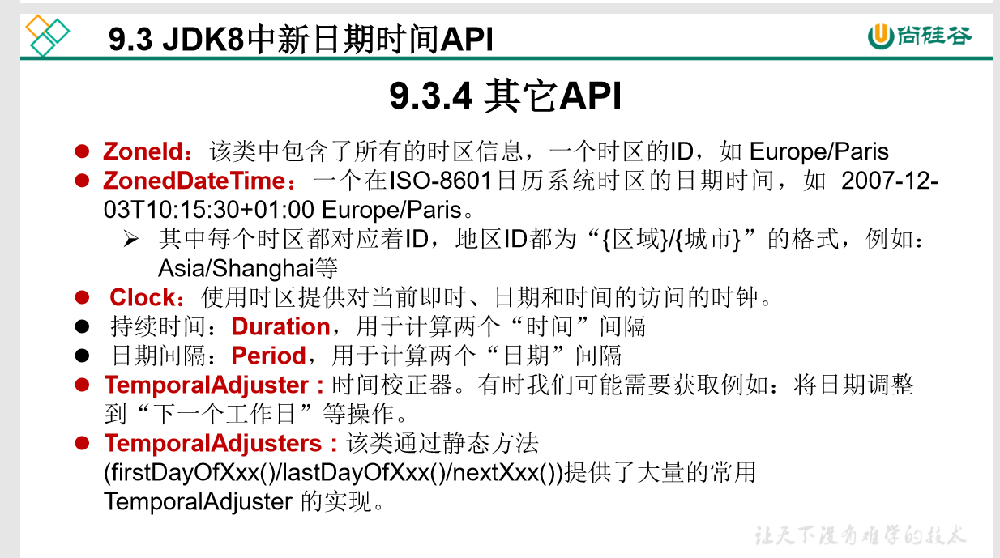

java基础知识总结，参考：

https://www.cnblogs.com/schiller-hu/p/10662429.html

或 https://www.cnblogs.com/jacking0325/p/10859350.html   （通俗易懂）

# 继承：

  好处：
  1.减少代码的冗余性
  2.提高代码的复用性
  3.提高代码的扩展性
  4.多态前提
  语法：

```
Class A extends B{

   }
```

  A：子类
  B：父类、超类、基类
  **通过extends关键字，子类A就拥有了父类B的所有属性和方法（除了构造方法以外）**//*************
**但父类的私有属性和私有方法，子类是不能简单的访问到的;而且子类可以调用父类的构造方法，只是调用（隐式或显式）。**

说明：
  1.继承中对于私有属性及方法的操作遵循封装的规则
  2.java中支持单继承和多层继承，不支持多重继承
  3.对于java类来说，都有一个统一的父类 java.lang.Object

- **构造函数**

Java构造函数，也叫构造方法：是java中一种特殊的函数。函数名与类名相同，无返回值；不要定义返回值类型,不可以写return语句 

   @写法：如： public A(){}  或直接 A(){}//************

```
作用：一般用来初始化成员属性和成员方法的，即new对象产生后，就调用了对象属性和方法
```

  @构造函数是对象一建立就运行，给对象初始化，就包括属性，执行方法中的语句。
  而一般函数是对象调用才执行，用".方法名“的方式，给对象添加功能。
  @一个对象建立，构造函数只运行一次。
  而一般函数可以被该对象调用多次。  

**子类的构造函数都必须要super()（自动调用）**

```java
public class Father {
   public String name; 
   public Father(String name) {
   this.name = name;
  }
}

public class Son extends Father{ 
    public Son(String name) {
    super(name);//必须调用，否则他会默认调用父类的无参构造函数，而父类的无参构造函数已经被有参的覆盖，所以找不到
    }
}

```


- **方法重载**

– 在同一个类中， 允许存在一个以上的同名方法， 只要它们
的参数个数或者参数类型不同即可。
  方法重载特点
– 与返回值类型无关， 只看方法名和参数列表（独一无二）//*******
– 在调用时， 虚拟机通过参数列表的不同来区分同名方法

  被重载的方法必须改变参数列表(参数个数或者类型不一样)

  一个方法中的参数列表类型不同，就可以顺序不同进行重载
  //参数的顺序不同也可以区分两个方法，但不能是同一类型

```java
//是重载
public void A(int i,String j){}
public void A(String j,int i){}
//不是重载
    public void A(int s,int c,int f){}
    public void A(int c,int s,int f){}
```


- **方法重写**

方法的重写：子类覆盖父类的方法//************
  前提：有继承关系

```
  访问修饰符 返回类型  方法名(参数列表){
      方法体
  }
```

  对于方法重写：
  1.子类的访问修饰符权限不能小于父类重写方法的访问修饰符权限
  特别声明：父类中的private方法不能被重写
  2.子类重写的方法的返回值类型不能大于父类被重写的方法的返回值类型
     2.1引用数据类型：子类重写的方法的返回值类型不能大于父类被重写的方法的返回值类型
     2.2基本数据类型：子类重写的方法的返回值类型（比如：double）必须和父类被重写的方法        的返回值类型一模一样
  3.对于方法名和参数列表：子类必须和父类相同//************

### 重写equals(推荐使用)

```java
idea中直接打印equals可以自动重写方法
public boolean equals(Object o) {
    if (o instanceof Person) {
        Person p = (Person) o;
        return Objects.equals(this.name, p.name) && this.age == p.age;
    }
    return false;
}

比较字符最好是要被比较的字符在前面，如：
.........
"e".equals(src);
.........
```


# 多态：

**编译时，看左边；运行时，看右边**//******
Java实现多态有**三个必要条件**：**继承、重写、向上转型。**
         继承：在多态中必须存在有继承关系的子类和父类。
         重写：子类对父类中某些方法进行重新定义，在调用这些方法时就会调用子类的方法
         向上转型：在多态中需要将子类的引用赋给父类对象，只有这样该引用才能够具备技能调用父类的方法和子类的方法。

  多态：一个事物的多种表现形态
  前提：继承  方法的重写
  应用：**父类的引用指向子类的对象**//属性是不存在覆盖之说的，对象的多态性只适用于方法，不      适用于属性
 **总结**：///////////////////////////*************************
   **属性：编译和运行都看左边****
   **方法：编译看左边，运行看右边**
   A a = new B();**
   对象a调用属性时只能调用A类的属性，即使B中有与A相同的属性也是调用A的属性；
   在调用方法时只能带用A中方法，但是如果B对A中方法进行了重写，则运行时会调用B中方法

  基本数据类型：自动类型转换（取数范围小的类型在赋值时可以自动转换为取数范围大的类型）如：double a =1;
   强制类型转换
       取数范围大的类型强制转换为取数范围小的类型）（）如：short a =(short)1;
 引用数据类型：
   向下转型：强制类型转换 同样使用(),当new出来的对象与向下转型的类型不一致会抛出ClassCastException类型转换异常
   通常使用instanceof关键字进行类型判断
 向上转型:多态

# 抽象

**简略信息：**

```
 与普通类的差别是 ： 不能实例化，可以有抽象方法(和普通方法)
   抽象类中一定有构造器
   修饰类、方法
   abstract定义
extends继承，子类必须重写父类中的所有的抽象方法才能实例化
```


**详细信息：**

**abstract关键字的使用**

1. abstract :抽象的

2. abstract可以用来修饰的结构:   类、方法

3. abstract修饰类: 抽象类//*************

   >此类不能实例化////不能new Person(),但能声明 Person p, 可以左边 不能边//******
   >抽象类中一定有构造器，便于子类实例化时调用(涉及:子类对象实例化的全过程)
   >开发中，都会提供抽象类的子类，让子类对象实例化，完成相关的操作
   >抽象类中可以有  抽象方法和普通方法

4. abstract修饰方法: 抽象方法

   >抽象方法只有方法的声明，没有方法体//public abstract ************
   >包含抽象方法的类，一定是一个抽象类。反之，抽象类中可以没有抽象方法的。
   >若子类重写了父类中的所有的抽象方法后，此子类方可实例化
   >若子类没有重写父类中的所有的抽象方法，则此子类也是一个抽象类，需要使用abstract修饰

抽象类中的变量默认是 default 型，其值可以在子类中重新定义，也可以重新赋值

abstract使用上的注意点: 

     1. abstract不能用来修饰:属性、构造器等结构
     2. abstract不能用来修饰私有方法、静态方法、final的方法、final的类

抽象类(Person)调用自身方法 可以将方法set()加上static  然后 Person.set();

# 接口

**简略信息：**

    interface定义
    接口中不能定义构造器
    implements实现
    除了定义全局常量和抽象方法之外，还可以定义静态方法、默认方法(略)
    实现类覆盖了接口中的所有抽象方法

**详细信息：**

 1.接口使用interface来定义
 2.Java中，接口和类是并列的两个结构
 3.如何定义接口:定义接口中的成员//接口中只有全局常量(也叫常量字段)和抽象方法。       

```
3.1 JDK7及以前:只能定义全局常量和抽象方法
  全局常量(常量字段): public static final，默认不写,定义的所有字段都带有它，写的话，public static final中可以只写1/2个，反正其他默认加上了 如：static，其他默认加上了。
  
  抽象方法: public abstract的//不能有方法体,默认  可以不写如:void a();

3.2 JDK8: 除了定义全局常量和抽象方法之外，还可以定义静态方法、默认方法(略)
             static void a(){}    default void a(){}
    //1.接口中静态方法通过接口名.方法名的方式直接调用
    //2.调用接口中的默认方法，需要创建子类的对象,通过子类对象.方法的方式
    //当子类(或实现类)调用父类（或父接口）中同名同参数的方法时，默认执行父类的方           法
    //当父接口中存在同名同参数的方法时，在实现类中出现接口冲突
```

 4.接口中不能定义构造器的!意味着接口不可以实例化//******************
 5.Java开发中， 接口通过让类去实现( implements )的方式来使用。
   如果实现类覆盖了接口中的所有抽象方法，则此实现类就可以实例化。
   如果实现类没有覆盖接口中所有的抽象方法，则此实现类仍为-一个抽象类
 6.Java类可以实现多个接口--->弥补了Java单继承性的局限性
     格式:class AA extends BB implements cC,DD,EE
 7.接与接口之间可以继承，而且可以多继承//interface A extends B,C
 8.接的具体使用，体现多态性
 9.接口，实际上可以看做是一种规范


# 泛型

所谓泛型，就是在**定义类、接口、方法、参数或成员变量**的时候，指定它们操作对象的类型为**通用类型**。**适用于类型不确定的情况**。**泛型只能代表引用类型，不能是原始类型**
注：可以和可变参数用一起用，导致参数个数不确定，类型不确定
**不指定泛型参数类型时，编译器会给出警告，且只能将<T>视为Object类型**

**使用 尖括号 <> 操作符表示泛型,** 尖括号内可以放置大写字母 （代表一个未知类型） 或问号 ? （代表若干个类型）作为参数。比如，习惯上选择以下字母代表某种类型：

**T 意味某种类型 (Type)** 
**E 意味 链表、数组里的元素，如List<E> list 表示 list 里的元素。**
**K意味map(k,v) 里的键值 Key**
**V 意味 返回或映射的值 Value**
**N - Number（数值类型）**
**？ -  表示不确定的java类型**
泛型构造器和普通的一样

**泛型的运用要受到如下限制（重要）**：
不能使用基本类型的类型参数，可以使用其**包装类型代替**。
**静态成员无法使用类型参数，静态方法 中不能使用类的泛型**
**不能使用泛型类异常**
**不能实例化泛型对象或数组**，如：
//编译不通过
T[]arr = new T[10];//因为new 后面的类必须是一个具体的类 但 T 不确定，所以编译报错
//编译通过
T[]arr = (T[]) new Object[10];

如果实例化时，没有指明泛型的类型。默认类型为java.lang.object类型。

public class Suborder extends order<Integer> {}  //Suborder:不是泛型类

public class suborder1<T> extends Order<T> {}    //suborder1<T>:仍然是泛型类
**泛型经常用于集合，如：**
**List<String> list = new ArrayList<>();**//可以省略 ArrayList<String>()  中的String

父类有泛型，子类可以选择保留泛型也可以选择指定泛型类型： 
子类不保留父类的泛型：按需实现 
         没有类型 擦除 
         具体类型 
类保留父类的泛型：泛型子类 
         全部保留
         部分保留 
结论：子类必须是“富二代”，子类除了指定或保留父类的泛型，还可以增加自 己的泛型


**泛型类**

**编写一个泛型类：**

```java
public class Pair {
    private String first;
    private String last;
    public Pair(String first, String last) {
        this.first = first;
        this.last = last;
    }
    public String getFirst() {
        return first;
    }
    public String getLast() {
        return last;
    }
}
//把特定类型String替换为T，并申明<T>：******************
public class Pair<T> {
    private T first;
    private T last;
    public Pair(T first, T last) {
        this.first = first;
        this.last = last;
    }
    public T getFirst() {
        return first;
    }
    public T getLast() {
        return last;
    }
}
```

泛型类可能有多个参数，此时应将多个参数一起放在尖括号内。比如： <E1,E2,E3> 
泛型如果不指定，将被擦除，泛型对应的类型均按照Object处理，但不等价 于Object。经验：泛型要使用一路都用。要不用，一路都不要用。 

**泛型方法**：
[访问权限] <泛型> 返回类型 方法名([泛型标识 参数名称]) 抛出的异常 

在方法中出现了泛型的结构，泛型参数与类的泛型参数没有任何关系。
换句话说，泛型方法所属的类是不是泛型类都没有关系。
泛型方法，可以声明为静态的。原因:泛型参数是在调用方法时确定的。并非在实例化类时确定。

```java
public class DAO {
   public <E> E get(int id, E e) {
       E result = null;
       return result;
   }
}


public class Pair<E> {
........................
public <E> List<E> copyFromArrayToList(E[]arr){}  //List前面的 E 向编译器表明这是一个泛型
public static <E>List<E> copyFromArrayToList(E[]arr){} // 这个<E>和Pair<E>类型的<E>已经没有任何关系了。

//为了静态方法和实例类型的泛型类型区分
public static <K> List<K> copyFromArrayToList(K[]arr){}  E  和 K 不是同一个
}
```


**擦拭法**：

擦拭法是指，虚拟机对泛型其实一无所知，所有的工作都是编译器做的。

**比如：String是Object的子类，但是List<String>并不是List<Object> 的子类。泛型具体了就定死了。同时因为有擦拭法的原因，所以有了通配符来解决这些问题**

**使用extends通配符表示可以读，不能写。**
**使用super  通配符表示只能写，不能读。**

**<? extends T>(上界通配符)**允许调用读方法T get()获取T的引用，但不允许调用写方法set(T)传入T的引用（传入null除外）；
**<? super T>（下界通配符）**允许调用写方法set(T)传入T的引用，但不允许调用读方法T get()获取T的引用（获取Object除外）。 
**无限定通配符：只定义一个 ?** 列：<?>    它是所有<T>类型的超类。
既不能读，也不能写，只能做一些null判断    //不能get()和set()

**使用类似<T extends Number>定义泛型类时表示：**
**public class Pair<T extends Number> { ... } **     **泛型类型限定为`Number`以及`Number`的子类。**

例子：

```java
 public static void main(String[] args) {
        Pair<Integer> p = new Pair<>(123, 456);
        int n = add(p);
        System.out.println(n);
    }

    static int add(Pair<? extends Number> p) {
        Number first = p.getFirst();
        Number last = p.getLast();
        return first.intValue() + last.intValue();
    }
}
class Pair<T> {
   ............
}
```

概念理解:https://www.cnblogs.com/zhaoyibing/p/9051428.html
PECS原则：
频繁往外读取内容的，适合用上界Extends。
经常往里插入的，适合用下界Super。


# 代码块：

​         **由父到子，静态先行（从父类到子类顺序，如果有静态，静态先行。在一个类中同时有代码块和要输出执行的代码，从上往下执行）**

类的成员之四：代码块（或初始化块）：
普通代码块：控制变量的生命周期，提高内存利用率
**构造代码块**：可以给所有对象进行初始化，**每次创建对象都会被调用**，**先于构造函数执行**
**静态代码块：对静态属性、类进行初始化，并且只执行一次。static{}**
同步代码块(多线程讲解)。
有一点需要注意构造代码块不是在构造函数之前运行的，它是依托构造函数执行的。

   **使用{}大括号括起来的代码被称为代码块**

**1.代码块的作用：用来初始化类、对象**
**2.代码块如果有修饰的话，只能使用static.**
**3.分类：静态代码块vs非静态代码块**

4.静态代码块
  作用：初始化类的信息
  内部可以有输出语句，**随着类的加载而执行,而且只执行一次**
  如果一个类中定义了多个静态代码块，则按照声明的先后顺序执行
  静态代码块的执行要优先于非静态代码块的执行
  静态代码块内只能调用静态的属性、静态的方法，不能调用非静态的结构

5.非静态代码块
作用：可以在创建对象时，对对象的属性等进行初始化
  内部可以有输出语句
  **随着对象的创建而执行，new一个对象的时候总是先执行代码块，再执行构造函数。**
  每创建一个对象，就执行一次非静态代码块
  如果一个类中定义了多个非静态代码块，则按照声明的先后顺序执行
  非静态代码块内可以调用静态的属性、静态的方法，或非静态的属性、非静态的方法

 **代码块的执行顺序：静态代码块（只被调用一次）>构造代码块{}>构造方法>普通方法（需调用）** 

****对属性赋值：**
 **1.默认赋值**
 **2.显式赋值/3.代码块////显式赋值是：int i = 1;**
 **4.构造器赋值**
 **5.对象.属性或对象.方法**
 先后顺序：1-->2/3-->4-->5

# 内部类（重要）

看：https://www.zhihu.com/question/26954130/answer/708467570

  1.Java中允许将一个类A声明在另一个类B中，则类A就是内部类，类B称为外部类
  2.内部类的分类:**成员内部类（静态、非静态）VS 局部内部类(方法内、代码块内、构造器内)**
  3.成员内部类:
       一方面，作为外部类的成员:
          >调用外部类的结构
          >可以被static修饰
          >可以被4种不同的权限修饰
       另一方面，作为一个类:
          >类内可以定义属性、方法、构造器等
          >可以被final修饰，表示此类不能被继承。言外之意，不使用final，就可以被继承
          >可以被abstract修饰
 4.关注如下的3个问题
     4.1 如何实例化成员内部类的对象
     4.2如何在成员内部类中区分调用外部类的结构
     4.3 开发中局部内部类的使用
   1.Person类里有 Dog，Bird类

```java
   //创建Dog实例(静态的成员内部类）:
        Person.Dog dog = new Person.Dog();//Person可以是抽象类，这时Dog必须是静态
        dog.show();
  //创建Bird实例(非静态的成员内部类）:
        Person p = new Person();
        Person.Bird bird = p.new Bird();
        bird.sing;
```

   2.Person.this.变量名或方法名    //外部类和内部类 变量或方法重名
   3.返回 内部类 就可以了：return new 内部类名();或者用 匿名内部类

**匿名内部类**：
new 实现接口() 或父类构造器 (实参列表){
　　//匿名内部类的类体部分
}
可以理解为：可以间接的    new接口或抽象类，不用子类继承来进行实例化

**列如：**

```java
      abstract class Hero{     //Hero  也可以是接口 interface
            public abstract void attack();
      }

  匿名内部类：Hero hero = new Hero() {//Hero是抽象类
               @Override
               public void attack() {
                  System.out.println("我飞了~~~");
               }
              };
              show(hero);
     简化为一步:
         show(new Hero(){
          @Override
               public void attack() {
                  System.out.println("我飞了~~~");
               } 
         });
```

# lambda表达式

**()->{}**

**1.替代匿名内部类**
它的用处浅显来说就是替代“匿名内部类”、可以对集合或者数组进行循环操作。
当 Lambda 体只有一条语句时，return 与大括号若有，都可以省略

左侧：指定了 Lambda 表达式需要的参数列表
右侧：指定了 Lambda 体，是抽象方法的实现逻辑，也即 Lambda 表达式要执行的功能。

**例子：**

```java
//匿名内部类1：
Runnable r1 = new Runnable() {
         @Override
         public void run() {
             System.out.println("Hello world");
         }
     };
//Lambda表达式1
Runnable r1 = () -> System.out.println("Hello world");


//匿名内部类2：
Thread thread = new Thread(new Runnable() {
        @Override
        public void run() {
            System.out.println("Hello world");
        }
    });
 thread.start();
//Lambda表达式2
new Thread(() -> System.out.println("java8 lambda实现线程")).start();


//匿名内部类3：
 Set<String> treeSet = new TreeSet<>(new Comparator<String>() {
         @Override
         public int compare(String s, String t1) {
             return Integer.compare(s.length(),t1.length());
         }
 });
 //Lambda表达式3
  Set<String> treeSet = new TreeSet<>((o1,o2)->
         Integer.compare(o1.length(),o2.length())
     );
     
 //Lambda表达式4
   Consumer<String> con = str -> System.out.println(str);
   con.accept("四川");
```


**2.使用lambda表达式对集合进行迭代**

```java
 List<String> languages = Arrays.asList("java","scala","python");
 
 languages.forEach(x -> System.out.println(x));
 languages.forEach(System.out::println);
```

.....................


# 异常

**简略信息：**
  **try-catch-finally           // 抓   catch可以有多个**
  **throws + 异常类型：  //抛**
  **自定义异常类和方法**
     **if (s==null) {**
        **throw new IllegalArgumentException();//自定义异常类和方法（或编译器自带的）**
    }

**详细信息：**

```
Object->Throwable：分为Error和Exception
 Error:
    Java虚拟机无法解决的严重问题。
      如:JVM系统内部错误、资源耗尽等严重情况。
      比如:StackOverflowError和OOM。
      —般不编写针对性的代码进行处理

 RuntimeException：运行时异常:编译能够通过，运行会出现错误javac-->java(出现错误)
          RuntimeException:无需强制捕获
              NullPointerException
              classCastException
              ArrayIndexOutOfBoundsException
              ArithmeticException
              NumberFormatException
              InputMismatchException等
 编译时异常:编译就不能通过//非RuntimeException需强制捕获，或者用throws声明
                  IOException
                  FileNotFoundException
                  classNotFoundException
                  SQLException等
```


**Java异常处理的方式:**

  方式一：throws + 异常类型:“抛”：当程序出现异常时，会产生具体异常的一个对象
  方式二：try-catch-finally  抓：

```java
       try -catch -finally :
         try{
            //可能出现异常的代码
         }catch(异常类型1参数名1){
           //处理异常的代码
         }
         catch(异常类型2参数名2){
           //处理异常的代码
         }
          ......
         finally{
            //一定会执行的代码  即使在try或catch有 return  也会执行
             
         }
  说明: finally是可选的
      try语句块中声明的变量不能在try-catch语句块外使用//////////
      当多个catch中捕获的异常没有父子关系时，catch语句的位置无所谓
      当存在父子关系时，不能将catch父类异常的代码放在最前面/////////
      开发中在catch语句块中一般使用:e.getMessage( )  或  e.printStackTrace();
  //finally中声明的是一定会被执行的代码。即使catch中又出现异常了，try中有return语句，     catch中有return语句等情况。
```

 3.像数据库连接、输入输出流、网络编程Socket等资源，JVW是不能自动的回收的，我们需要自己手动的进行资源的释放。此时的资源释放，就需要声明在finally中

在处理编译时异常，只是将编译时出现的错误延迟到了运行时再发生

throws + 异常类型 放在方法名()之后：

```java
 if (s==null) {
        throw new NullPointerException();////////////////////重要
    }
```

 在子类中重写父类抛出了异常的方法时，
 子类重写的方法抛出的异常不能大于父类方法抛出的异常

 没有finally这样的语句实现

 **开发中一般用try-catch还是throws?**
 一般到方法的最后执行者时，方法中出现异常，我们一般会使用try-catch
 当方法中存在多个方法的调用，并且多个方法间存在递进关系时，一般在这几个方法
 中使用throws,最后，在多个方法的执行者进行try-catch处理

**throw + 异常对象：手动在程序中抛出异常**

**抛出异常一般选择：RuntimeException /Exception**

**自定义异常/////////重要**
 需继承于目前存在的异常，通常使用RuntimeException/Exception

```java
   if (s==null) {
        throw new IllegalArgumentException();////////重要，自定义异常类和方法
    }
```


# 关键字：

## static：静态的  

**由父及子，静态先行**

1.static:静态的
2**.static可以用来修饰：属性、方法、代码块、内部类**
**3.使用static修饰属性：静态变量（或类变量）**
     3.1 属性，按是否使用static修饰，又分为：静态属性 vs 非静态属性(实例变量)
           实例变量：我们创建了类的多个对象，每个对象都独立的拥有一套类中的非静态属性。当修改其中一个对象中的非静态属性时，不会导致其他对象中同样的属性值的修改。
**java中静态属性和静态方法可以被继承，但是没有被重写(overwrite)而是被隐藏**

**静态的方法是无法被重写的，所以static不能和抽象(abstract)一起用** 

​     **静态变量：我们创建了类的多个对象，多个对象共享同一个静态变量。当通过某一个对象修改静态变量时，会导致其他对象调用此静态变量时，是修改过了的。相当于澡堂里的肥皂，肥皂只有一块，只能一次一个人使用，肥皂可以被修改，修改了下一个人用的是修改过了的**

​     **3.2 static修饰属性的其他说明**  
​                 **1、静态变量随着类的加载而加载。可以通过"类.静态变量"的方式进行调用**
​                 **2、静态变量的加载要早于对象的创建。** 
​                 **3、由于类只会加载一次，则静态变量在内存中也只会存在一份：存在方法区的静态域中**

```
                 类变量    实例变量
           类     yes       no
           对象    yes       yes
   静态属性举例：System.out; Math.PI;
```

**4.使用static修饰方法：静态方法**  

​    **1、随着类的加载而加载，可以通过"类.静态方法"的方式进行调用**
​    **2、静态方法中，只能调用静态的方法或属性**   
​          **非静态方法中，既可以调用非静态的方法或属性，也可以调用静态的方法或属性**  

```
                静态方法   非静态方法
           类     yes       no
           对象    yes       yes
```

5 、static注意点：
     5.1 **在静态的方法内，不能使用this关键字、super关键字**
     5.2 关于静态属性和静态方法的使用，大家都从生命周期的角度去理解。

6.开发中，如何确定一个属性是否要声明为static的？
          \> 属性是可以被多个对象所共享的，不会随着对象的不同而不同的。
          \> 类中的常量也常常声明为static
开发中，如何确定一个方法是否要声明为static的？  
          \> 操作静态属性的方法，通常设置为static的
          \> 工具类中的方法，习惯上声明为static的。 比如：Math、Arrays、Collections

​    举例：

  

   


## final：最终的

1. **final可以用来修饰的结构:类、方法、变量**
2. final 用来修饰一个**类:此类不能被其他类所继承，为最终类**。
   比如:String类、System类、StringBuffer类
3. final 用来修饰**方法:表明此方法不可以被重写**
   比如:Object类中getClass();
   //final用来修饰变量必须初始化
4. final用来修饰**变量:此时的"变量"就称为是一个常量**。
   4.1 final修饰属性:可以考虑赋值的位置有:显式初始化、代码块中初始化、构造器中初始化
   4.2 final修饰局部变量:
     尤其是使用final修饰形参时，表明此形参是一个常量。当我们调用此方法时，给常量形 参赋一个实参。一旦赋值以后，就只能在方法体内使用此形参，但不能进行重新赋值。
   **static final用来修饰属性:全局常量**

##  this关键字 

　1)可以调用属性和方法。 this.属性名（全局变量） this.方法名（）;

　　　　2)在构造方法中：

　　　　　　a.this();括号内的参数个数、顺序、类型根据调用的方法来决定。

　　　　　　b.必须放在第一行，只能调用一次。

　　　　　　c.调用构造方法时只能在构造方法中调用，调用属性和方法时可以在构造方法中可以在普通方法中。

　　　　　　d.当全局变量和局部变量有重名字的时候，用this来区分。


## super关键字

　　　　 1)super指代父类对象。

　　　　 2)super可以调用属性、方法、构造方法。

　　　　 3)super调用父类的构造方法。

　　　　 4)super调用构造方法时候必须放在第一行。

## this和super的区别

------

> 　　1)this指的是本类创建的对象。 super指代的是父类的对象
> 　　2)this可以调用属性、方法、构造方法。 super也可以调用属性、方法、构造方法。
> 　　3)this调用属性和方法的时候，调用自己本类的属性和方法。 如果本类没有，那就用super去父类中找
> 　　4)this调用构造方法调用，调用本类的其他构造方法。 super调用父类的构造方法。
> 　    5)this和super在调用构造方法的时候必须放在第一行。
> 　　6)**this和super不能同时存在**

# 反射

## Java反射机制概述(仅了解)

**通过`Class`实例获取`class`信息的方法称为反射（Reflection）,获取class的class**
**JVM为每个加载的`class`及`interface`创建了对应的`Class`实例来保存`class`及`interface`的所有信息**

**JVM总是动态加载`class`，可以在运行期根据条件来控制加载class。**
**通过反射读写字段是一种非常规方法，它会破坏对象的封装;使用反射，首先代码非常繁琐，其次，它更多地是给工具或者底层框架来使用，目的是在不知道目标实例任何信息的情况下，获取特定字段的值。**

Reflection（反射）是被视为动态语言的关键，反射机制允许程序在执行期 借助于Reflection API取得任何类的内部信息，并能直接操作任意对象的内 部属性及方法。

**加载完类之后，在堆内存的方法区中就产生了一个Class类型的对象（一个 类只有一个Class对象**），这个对象就包含了完整的类的结构信息。我们可 以通过这个对象看到类的结构。这个对象就像一面镜子，透过这个镜子看 到类的结构，所以，我们形象的称之为：反射。

动态语言 
是一类在运行时可以改变其结构的语言：例如新的函数、对象、甚至代码可以 被引进，已有的函数可以被删除或是其他结构上的变化。通俗点说就是在**运行时代码可以根据某些条件改变自身结构**。 主要动态语言：Object-C、C#、JavaScript、PHP、Python、Erlang。

静态语言 
与动态语言相对应的，**运行时结构不可变的语言就是静态语言**。如Java、C、 C++。

**Java不是动态语言，但Java可以称之为“准动态语言”**。即Java有一定的动 态性，我们可以利用反射机制、字节码操作获得类似动态语言的特性。 Java的动态性让编程的时候更加灵活！


## 类的加载与ClassLoader(仅了解)


## 理解Class类并获取Class实例(重要)

**Class类**， 此类是Java反射的源头，**java.lang.Class**

**反射可以直接访问类中的私有属性和方法等**
**一个`Class`实例包含了该`class`的所有完整信息**

关于java.lang.class类的理解
**1.类的加载过程:**
程序经过javac.exe命令以后，会生成一个或多个字节码文件(.class结尾)。
接着我们使用java.exe命令对某个字节码文件进行解释运行。相当于将某个字节码文件
加载到内存中。此过程就称为类的加载。加载到内存中的类，我们就称为运行时类，此
运行时类，就作为Class的一个实例。
**2.换句话说，class的实例就对应着一个运行时类**。即：
**Java的每个类都带有一个运行时类对象**

**3**.加载到内存中的运行时类，会缓存一定的时间。在此时间之内，我们可以通过不同的方式
来获取此运行时类。

**获取到了一个类的类型(重点)**

1）前提：若已知具体的类，**通过类的class属性**获取，该方法最为安全可靠， 程序性能最高 
                  实例：**Class clazz = String.class;** 
2）前提：已知某个类的实例，调用该实例的**getClass()方法获取Class对象实例**：
                 **Person p1 = new Person();**
                **Class clazz2 = p1.getClass();**
           **或在类中直接 ：  this.getClass();     因为Java的每个类都带有一个运行时类对象**

3）前提：已知一个类的全类名，且该类在类路径下，可**通过Class类的静态方法forName()**获取，可能抛出     ClassNotFoundException 
                  实例：**Class clazz = Class.forName(“java.lang.String”);** 
4）其他方式(不做要求) //使用类的加载器s
                     ClassLoader cl = this.getClass().getClassLoader(); 
                     Class clazz4 = cl.loadClass(“类的全类名”); 

```java
cLass实例可以是哪些结构的说明:
class c1 = Object.class;
Class c2 = Comparable.class;
Class c3 = String[].class;
Class c4 = int[][].class;
class c5 = ElementType.class;
Class c6 = override.class;
Class c7 = int.class;
class c8 = void.class;
Class c9 = class.class;
int[] a = new int[10];
int[]b = new int[100];

Class c10 = a.getclass();
Class c11 = b.getclass();
/只要元素类型与维度一样，就是同一个class
system.out.println(c10 == c11);//true

```


```java
通过反射获取该obj的class信息
Class cls = obj.getClass();

使用反射可以取得:
1.实现的全部接口
public Class<?>[] getlnterfaces()
确定此对象所表示的类或接口实现的接口。

2.所继承的父类
public Class<? Super T> getSuperclass()
返回表示此Class所表示的实体（类、接口、基本类型）的父类的Class。

3.全部的构造器
getConstructor(Class...)：获取某个public的Constructor；
getDeclaredConstructor(Class...)：获取某个Constructor；
getConstructors()：获取所有public的Constructor；
getDeclaredConstructors()：获取所有Constructor。

Constructor类中:
>取得修饰符:public int getModifiers();
>取得方法名称: public String getName();
>取得参数的类型: public Class<?>getParameterTypes();

4全部的方法
Method getMethod(name, Class...)：取某个public的Method（包括父类）
Method getDeclaredMethod(name, Class...)：获取当前类的某个Method（不包括父类）
Method[] getMethods()：获取所有public的Method（包括父类）
Method[] getDeclaredMethods()：获取当前类的所有Method（不包括父类）

Method类中:
getName()：返回方法名称，例如："getScore"；
getReturnType()：返回方法返回值类型，也是一个Class实例，例如：String.class；
getParameterTypes()：返回方法的参数类型，是一个Class数组，例如：{String.class, int.class}；
getModifiers()：返回方法的修饰符，它是一个int，不同的bit表示不同的含义。
public Class<?>[] getExceptionTypes()取得异常信息

5.全部的Field
Field getField(name)：根据字段名获取某个public的field（包括父类）
Field getDeclaredField(name)：根据字段名获取当前类的某个field（不包括父类）
Field[] getFields()：获取所有public的field（包括父类）
Field[] getDeclaredFields()：获取当前类的所有field（不包括父类）

Field方法中:
getName()：返回字段名称，例如，"name"；
getType()：返回字段类型，也是一个Class实例，例如，String.class；
getModifiers()：返回字段的修饰符，它是一个int，不同的bit表示不同的含义。

在Field中： 
public Object get(Object obj) 取得指定对象obj上此Field的属性内容 
public void set(Object obj,Object value) 设置指定对象obj上此Field的属性内容

6.Annotation相关
get Annotation(Class<T> annotationClass)
>getDeclaredAnnotations()
7.泛型相关
获取父类泛型类型: Type getGenericSuperclass()
泛型类型: ParameterizedType
获取实际的泛型类型参数数组: getActualTypeArguments()
8.类所在的包Package getPackage()
9.通过Class对象的isAssignableFrom()方法可以判断一个向上转型是否可以实现
// Integer i = ?
Integer.class.isAssignableFrom(Integer.class); // true，因为Integer可以赋值给Integer
// Number n = ?
Number.class.isAssignableFrom(Integer.class); // true，因为Integer可以赋值给Number
// Object o = ?
Object.class.isAssignableFrom(Integer.class); // true，因为Integer可以赋值给Object
// Integer i = ?
Integer.class.isAssignableFrom(Number.class); // false，因为Number不能赋值给Integer

```

## 调用运行时类的指定属性,方法等

调用运行时类的指定属性

```java
 Person p = new Person("Xiao Ming");

 Class c = p.getClass();//返回运行时类的对象

Field f = c.getDeclaredField("name");//获取运行时类中指定变量名的属性
f.setAccessible(true);//name是私有的，本来不可以访问，但setAccessible(true)后就可以访问了
f.set(p, "Tom" );//通过Field.set(Object, Object)设置字段值
System.out.println(p.getName());

class Person {
    private String name;

    public Person(String name) {
        this.name = name;
    }
......................
}

```


调用运行时类的指定方法(通过反射调用方法时，仍然遵循多态原则。)    **==invoke==**

```java
 public static void main(String[] args) throws Exception {
        // String对象:
        String s = "Hello world";
        // 获取String substring(int)方法，参数为int:
        Method m = String.class.getMethod("substring", int.class);
        // 在s对象上调用该方法并获取结果:
        String r = (String) m.invoke(s, 6);
        // 打印调用结果:
        System.out.println(r);
    }
对Method实例调用invoke就相当于调用该方法，invoke的第一个参数是对象实例，即在哪个实例上调用该方法，后面的可变参数要与方法参数一致，否则将报错。
  
如果获取到的Method表示一个静态方法，调用静态方法时，由于无需指定实例对象，所以invoke方法传入的第一个参数永远为null
Integer n = (Integer) m.invoke(null, "12345");
 
调用非public方法，我们通过Method.setAccessible(true)允许其调用
 Person p = new Person();
        Method m = p.getClass().getDeclaredMethod("setName", String.class);
        m.setAccessible(true);
        m.invoke(p, "Bob");
        System.out.println(p.name);
 

```

调用运行时类的构造方法

```java
        //1.获取构造方法Integer(int):
        Constructor cons1 = Integer.class.getConstructor(int.class);
        // 调用构造方法:
        Integer n1 = (Integer) cons1.newInstance(123);	
        System.out.println(n1);

        //2.获取构造方法Integer(String)
        Constructor cons2 = Integer.class.getConstructor(String.class);
        Integer n2 = (Integer) cons2.newInstance("456");
        System.out.println(n2);

```

**关于==setAccessible==方法的使用**
**Method和Field、Constructor对象都有setAccessible()方法**。
**setAccessible启动和禁用访问安全检查的开关**。
参数值为true则指示反射的对象在使用时应该取消Java语言访问检查。
      1.提高反射的效率。如果代码中必须用反射，而该句代码需要频繁的被调用，那么请设置为true。
      2.**使得原本无法访问的私有成员也可以访问**，如上面的代码
参数值为false则指示反射的对象应该实施Java语言访问检查。
如：

```java
Field.setAccessible(true)的意思是，别管这个字段是不是public，一律允许访问。

此外，setAccessible(true)可能会失败。如果JVM运行期存在SecurityManager，那么它会根据规则进行检查，有可能阻止setAccessible(true)。例如，某个SecurityManager可能不允许对java和javax开头的package的类调用setAccessible(true)，这样可以保证JVM核心库的安全。

```


## 创建运行时类的对象

**newInstance():调用此方法，创建对应的运行时类的对象。内部调用了运行时类的空参的构造器**

**要想此方法正常的创建运行时类的对象，要求**:
1.运行时类必须提供空参的构造器
2.空参的构造器的访问权限得够。通常，设置为public

```java
//先获取类的类型
Class clazz = Class.forName(“全类名”);

//创建对象
Person obj = clazz.newInstance();
//newInstance内部是调用了运行时类的空参的构造器,带参数的构造方法无法这样

```

在javabean中要求提供一个public的空参构造器。原因:
1.便于通过反射，创建运行时类的对象
2.便于子类继承此运行时类时，默认调用super()时，保证父类有此构造器

其他，如：

1）通过Class类的getDeclaredConstructor(Class … parameterTypes)**取得本类的指定形参类型的构造器** 2）向构造器的形参中传递一个对象数组进去，里面包含了构造器中所需的各个参数。 
3）通过Constructor实例化对象。

```java
//1.根据全类名获取对应的Class对象
String name ="atguigu.java.Person";
Class clazz = null;
clazz = Class.forName(name);
//2.调用指定参数结构的构造器，生成Constructor的实例
Constructor con = clazz.getConstructor(String.class,lnteger.class);
//3.通过Constructor的实例创建对应类的对象，并初始化类属性
Person p2 =(Person)con.newInstance("Peter",20);
System.out.println(p2);


```

## 反射的动态性

不确定造哪个类的对象，就可以通过反射的方式去写。

```java
class Test9{
    public static void main(String[] args) throws IllegalAccessException, InstantiationException, ClassNotFoundException {
        int num = new Random().nextInt(2);//0,1
        String s="";
        switch (num){
            case 0:
                s = "java.util.Date";
                break;
            case 1:
                s = "java.lang.Object";
                break;
        }
       Object object = getInstance(s);
        System.out.println(object);
    }
    public static Object getInstance(String classPath) throws ClassNotFoundException, IllegalAccessException, InstantiationException {
        Class c = Class.forName(classPath);
        return c.newInstance();
    }
}
```


## 动态代理

**静态代理：**

```java
//编译期间代理类和被代理类就确定下来了
class Test5{
    public static void main(String[] args) {
        NikeClothFactory nike = new NikeClothFactory();
        ProxyClothFactory pro = new ProxyClothFactory(nike);
        pro.produceCloth();
    }
}
interface ClothFactory{
    void produceCloth();
}
//代理类
class ProxyClothFactory implements ClothFactory{
    private ClothFactory factory;//用被代理类对象进行实例化
    public ProxyClothFactory(ClothFactory factory){
      this.factory = factory;
    }
    @Override
    public void produceCloth() {
        System.out.println("代理工厂做一些准备工作");
        factory.produceCloth();//被代理类实现方法
        System.out.println("代理工厂做一些收尾工作");
    }
}
//被代理类
class NikeClothFactory implements ClothFactory{
    @Override
    public void produceCloth() {
        System.out.println("Nike生成了一批运动服");
    }
}

```

**动态代理：只需要提供  被代理类和接口，动态生成代理类**

```java
interface Human{
    String getBelief();
    void eat(String food);
}
//被代理类
class SuperMan implements Human{
    @Override
    public String getBelief() {
        return "I believe I can fly!";
    }
    @Override
    public void eat(String food) {
        System.out.println("我喜欢吃"+food);
    }
}
/*要想实现动态代理，需要解决的问题?
问题一:如何根据加载到内存中的被代理类，动态的创建一个代理类及其对象。
问题二:当通过代理类的对象调用方法eat时，如何动态的去调用被代理类中的同名方法eat。
*/
class ProxyFactory{
    //调用此方法，返回一个代理类的对象。解决问题一
    public static Object getProxyInstance(Object obj){//obj：被代理的对象
     MyInvocationHandler handler = new MyInvocationHandler();//创建该对象，实现invoke和该类的联系
        handler.bind(obj);//传入obj：被代理对象
return Proxy.newProxyInstance(obj.getClass().
getClassLoader(),obj.getClass().getInterfaces(),handler);
    }
}

class MyInvocationHandler implements InvocationHandler{
    private Object obj;//需要使用被代理类的对象进行赋值
    public void bind(Object obj){
        this.obj = obj;
    }
    //*********************************************************
    //当我们通过代理类的对象，如调用方法eat时，就会自动的调用如下的方法: invoke()
    //将被代理类要执行的方法eat的功能就声明在invoke()中
    @Override
    public Object invoke(Object o, Method method, Object[] objects) throws Throwable {
        //method:即为代理类对象调用的方法，此方法也就作为了被代理类对象要调用的方法
        //obj:被代理类的对象
        Object returnValue = method.invoke(obj,objects);
        //上述方法的返回值就作为当前类中的invoke()的返回值。
        return returnValue;
    }
}
class ProxyTest{
    public static void main(String[] args) {
        SuperMan superMan = new SuperMan();
        //proxyInstance：代理类的对象
        Human proxyInstance = (Human) ProxyFactory.getProxyInstance(superMan);
        //当通过代理类对象调用方法时，会自动的调用被代理类中同名的方法
        String belief = proxyInstance.getBelief();
        System.out.println(belief);
        proxyInstance.eat("火锅");
        System.out.println("*************************");

        //如把静态改为动态
        NikeClothFactory nike = new NikeClothFactory();
       ClothFactory proxy  = (ClothFactory) ProxyFactory.getProxyInstance(nike);
       proxy.produceCloth();
    }
}

```

**动态代理与AOP（Aspect Orient Programming)**

 使用Proxy生成一个动态代理时，往往并不会凭空产生一个动态代理，这样没有 太大的意义。通常都是为指定的目标对象生成动态代理
 这种动态代理在AOP中被称为AOP代理，AOP代理可代替目标对象，AOP代理 包含了目标对象的全部方法。但AOP代理中的方法与目标对象的方法存在差异： **AOP代理里的方法可以在执行目标方法之前、之后插入一些通用处理**


# IO流

**例子最直观**

## File 类

 **例子：File dir1 = new File("D:/IOTest/dir1");**
java.io.File类：**文件和文件目录路径**的抽象表示形式，与平台无关
 File 能**新建、删除、重命名文件和目录**，但 File **不能访问文件内容本身**。 如果需要访问文件内容本身，则需要使用输入/输出流。
**想要在Java程序中表示一个真实存在的文件或目录，那么必须有一个File对 象，但是Java程序中的一个File对象，可能没有一个真实存在的文件或目录。**
File对象可以作为参数传递给流的构造器

### 路径

**当前在src目录，可以直接File file = new File("src");**

```java
 可以用`.`表示当前目录，`..`表示上级目录。
    （1）File directory = new File("abc"); 
            directory.getCanonicalPath(); //得到的是C:/test/abc 
            directory.getAbsolutePath();    //得到的是C:/test/abc 
            direcotry.getPath();                    //得到的是abc 
    （2）File directory = new File("."); 
            directory.getCanonicalPath(); //得到的是C:/test 
            directory.getAbsolutePath();    //得到的是C:/test/. 
            direcotry.getPath();                    //得到的是. 
    （3）File directory = new File(".."); 
            directory.getCanonicalPath(); //得到的是C:/ 
            directory.getAbsolutePath();    //得到的是C:/test/.. 
            direcotry.getPath();                    //得到的是.. 

```

**常用构造器:**
 **public File(String pathname)**
绝对路径：是一个固定的路径,从盘符开始 
相对路径：是相对于某个位置开始 ,**默认的当前路径在系统属性user.dir中存储**。 如idea找文件的时候是在workspace目录下找的

 **public File(String parent,String child)** 
以parent为父路径，child为子路径创建File对象

 **public File(File parent,String child)** 
根据一个父File对象和子文件路径创建File对象

**路径分隔符：**
windows和DOS系统默认使用**“\”**来表示   代码中是  **"\\\\\"**
UNIX和URL使用“/”来表示 
File类提供了一个常量： 
public  static final String separator。根据操作系统，动态的提供分隔符
例如：

```java
File file1 = new File("d:\\atguigu\\info.txt");
File file2 = new File("d:" + File.separator + "atguigu" + File.separator + "info.txt"); 
File file3 = new File("d:/atguigu");

相对路径：
如,在项目里新建image目录，目录下有a.png
 File file = new File("image/a.png");
 

```

**FilenameFilter：文件名过滤器**

```java
public class FilenameFilterDemo {

    public static void main(String[] args) {
        File file = new File("D:\\eclipse");
        //创建一个过滤器实例
        FilenameFilterDemo filenameFilterDemo = new FilenameFilterDemo();
        FileFilter fileFilter = filenameFilterDemo.new FileFilter();
        String[] list = file.list(fileFilter);
        for (String string : list) {
            System.out.println(string);
        }
    }

    //这是一个内部类过滤器
    class FileFilter implements FilenameFilter{
        @Override
        public boolean accept(File dir, String name) {
            //String的 endsWith(String str)方法  筛选出以str结尾的字符串
            if(name.endsWith(".exe"))
                return true;
            return false;
        }
    }
}

或/////////////////////////////////////////

        File f = new File("C:\\Windows");
      
        File[] fs2 = f.listFiles(new FilenameFilter() { // 仅列出.exe文件
            public boolean accept(File dir, String name) {
                return name.endsWith(".exe"); // 返回true表示接受该文件
            }
        });
        这种方式也可以：file1.getName().contains(".java")

```

### 递归

**地址下的所有文件都要输出(包括子目录等)**

```java
class Test_1{
        public static void main(String[] args) {
            File file = new File("D:\\文本");
            String s="";
            getFielname(file,s);
        }
        static void getFielname(File file,String s){
            File[] files = file.listFiles();
            if (files != null){
                for (File file1:files) {
                    System.out.println(s+file1.getName());
                    if (file1.isDirectory()){
                        getFielname(file1,s+"---");//递归
                    }
                }
            }
        }
}

```

**常用方法：**


##  IO流原理及流的分类

I/O是Input/Output的缩写，用于处理设备之间的数据传输。如读/写文件，网络通讯等
input：读取外部数据（磁 盘、光盘等存储设备的数据）到 程序（内存）中。
output：将程序（内存） 数据输出到磁盘、光盘等存储设 备中。
节点流：直接从数据源或目的地读写数据。见下图
处理流：相当于包在节点流上面。见下图
**处理数据时，一定要先明确数据源，与数据目的地**
**而流只是在帮助数据进行传输,并对传输的数据进行处理，比如过滤处理、 转换处理等**

**输出流都有   追加到原文件   和  覆盖到原文件 ；**
**如：FileOutputStream(file)     是默认，覆盖到原文件**
        **FileOutputStream(file,true)   是追加到原文件**


| 抽象基类     | 节点流（或文件流) | 缓冲流（处理流的一种） |
| ------------ | :---------------- | ---------------------- |
| InputStream  | FileInputStream   | BufferedInputStream    |
| outputStream | FileOutputStream  | BufferedOutputStream   |
| Reader       | FileReader        | BufferedReader         |
| Writer       | FileWriter        | BufferedWriter         |


## InputStream & Reader 

InputStream 和 Reader 是所有输入流的基类。 

**最好不要直接用基类，用他们的子类**

程序中打开的文件 IO 资源不属于内存里的资源，垃圾回收机制无法回收该资 源，所以应该**显式关闭文件 IO 资源**
**用read()方法读取  close()关闭**
FileInputStream 用于读取非文本数据之类的原始字节流。要读取字符流，需要使用 FileReader

**InputStream：**
   int read() ：从输入流中读取数据的下一个字节。返回 0 到 255 范围内的 int 字节值。如果因为已经到达流末尾而没有可用的字节，则返回值 -1。**返回值为字符的ACSII值,但对于汉字等*unicode*中的字符则不能正常读取。只能以乱码的形式显示**
   **int read(byte[] b)** 从此输入流中将最多 b.length 个字节的数据读入一个 byte 数组中。如果因为已 经到达流末尾而没有可用的字节，则返回值 -1。否则以整数形式返回实际读取 的字节数。**（重要，常用，可以读汉字，一个汉字占用2个字节，所以byte[]为2的倍数）**   
   int read(byte[] b, int off,int len) 将输入流中最多 len 个数据字节读入 byte 数组。尝试读取 len 个字节，但读取 的字节也可能小于该值。以整数形式返回实际读取的字节数。如果因为流位于 文件末尾而没有可用的字节，则返回值 -1。 
   public void close() throws IOException 关闭此输入流并释放与该流关联的所有系统资源。

**Reader**
     int read() 读取单个字符。作为整数读取的字符，范围在 0 到 65535 之间 (0x00-0xffff)（2个 字节的Unicode码），如果已到达流的末尾，则返回 -1  
     **int read(char[] cbuf)** 将字符读入数组。如果已到达流的末尾，则返回 -1。否则返回本次读取的字符数。 
     int read(char[] cbuf,int off,int len) 将字符读入数组的某一部分。存到数组cbuf中，从off处开始存储，最多读len个字 符。如果已到达流的末尾，则返回 -1。否则返回本次读取的字符数。 
     public void close() throws IOException 关闭此输入流并释放与该流关联的所有系统资源。

## OutputStream & Writer 

FileOutputStream 用于写出非文本数据之类的原始字节流。要写出字符流，需要使用 FileWriter

**最好不要直接用基类，用他们的子类**

**OutputStream**
 void write(int b) 将指定的字节写入此输出流。write 的常规协定是：向输出流写入一个字节。要写 入的字节是参数 b 的八个低位。b 的 24 个高位将被忽略。 即写入0~255范围的。
  void write(byte[] b) 将 b.length 个字节从指定的 byte 数组写入此输出流。write(b) 的常规协定是：应该 与调用 write(b, 0, b.length) 的效果完全相同。 
 **void write(byte[] b,int off,int len)** 将指定 byte 数组中从偏移量 off 开始的 len 个字节写入此输出流。 
 **public void flush()throws IOException** 刷新此输出流并强制写出所有缓冲的输出字节，调用此方法指示应将这些字节立 即写入它们预期的目标。
 public void close() throws IOException 关闭此输出流并释放与该流关联的所有系统资源。

**Writer**
因为字符流直接以字符作为操作单位，所以 Writer 可以用字符串来替换字符数组， 即以 String 对象作为参数 
 void write(int c) 写入单个字符。要写入的字符包含在给定整数值的 16 个低位中，16 高位被忽略。 即 写入0 到 65535 之间的Unicode码。
  void write(char[] cbuf) 写入字符数组。 
 **void write(char[] cbuf,int off,int len)** 写入字符数组的某一部分。从off开始，写入len个字符 
 **void write(String str)** 写入字符串。 
 void write(String str,int off,int len) 写入字符串的某一部分。 
 **void flush() 刷新该流的缓冲，则立即将它们写入预期目标**。
 public void close() throws IOException 关闭此输出流并释放与该流关联的所有系统资源。

## 节点流(或文件流)

**读取文件**

```
1.建立一个流对象，将已存在的一个文件加载进流。 
 FileReader fr = new FileReader(new File(“Test.txt”));
2.创建一个临时存放数据的数组。 
 char[] ch = new char[1024];
3.调用流对象的读取方法将流中的数据读入到数组中。
 fr.read(ch);
4. 关闭资源。 
 fr.close();

```

**写入文件**

```
1.创建流对象，建立数据存放文件 
 FileWriter fw = new FileWriter(new File(“Test.txt”));
char[] ch = new char[1024];
2.调用流对象的写入方法，将数据写入流 
 fw.write(ch);
3.关闭流资源，并将流中的数据清空到文件中。 
 fw.close();

```

**注意：**
**InputStream 终于有了一个非常有用的方法：transferTo，可以用来将数据直接 传输到 OutputStream**
**Reader也有了（java9的新特性）**

```java
 public static void main(String[]args) throws IOException {
      //字节流
      InputStream inputStream = new FileInputStream("3.jpg");
      OutputStream outputStream = new FileOutputStream("4.jpg");
      inputStream.transferTo(outputStream);
      inputStream.close();
      outputStream.close();
      //字符流
      Reader reader = new FileReader("a.txt");
      Writer writer = new FileWriter("data.txt");
      reader.transferTo(writer);
     reader.close();
     writer.close();
     //直接用transferTo();
    }
 transferTo()内部封装了缓存数组等，将while操作封装了。

```

**注意点：**

 定义文件路径时，注意：可以用“/”或者“\\”。
 在写入一个文件时，如果使用构造器**FileOutputStream(file)，则目录下有同名文 件将被覆盖**。 
 **如果使用构造器FileOutputStream(file,true)，则目录下的同名文件不会被覆盖， 在文件内容末尾追加内容。**
 **在读取文件时，必须保证该文件已存在，否则报异常。**
 **字节流操作字节，比如：.mp3，.avi，.rmvb，mp4，.jpg，.doc，.ppt**
** 字符流操作字符，只能操作普通文本文件**。最常见的文本文 件：.txt，.java，.c，.cpp 等语言的源代码。尤其注意.doc,excel,ppt这些不是文 本文件。
**一句话：字节流：非文本文件
                字符流：文本文件**

**注意：**

```java
  byte[] ch = new byte[65];
  int str;
  while ((str = fileInputStream.read()) != -1){
     fileOutputStream.write(str);
  }
  这时候的read()是按一个一个的字节读的，将read()读的 byte 封装为 int,再write的时候 int 转换为 byte
  
  byte[] ch = new byte[65];
  int str;
  while ((str = fileInputStream.read(ch)) != -1){
     //fileOutputStream.write(str);
      fileOutputStream.write(ch);
  }
  这时候的read将读到的字节存入ch数组，尽可能存满。而下一次是覆盖原来的数组的值，读一次覆盖一次。
  str则是ch数组的长度/个数，没有封装byte，就没有转换操作。write操作出错，要write(ch)。
 

```


## 缓冲流

为了提高数据读写的速度，缺省使用**8192个字节(8Kb)的缓冲区**。
 缓冲流要“套接”在相应的节点流之上，根据数据操作单位可以把缓冲流分为： 
**BufferedInputStream 和 BufferedOutputStream 
BufferedReader 和 BufferedWriter **     BufferedReader多了个.readLine()方法

当读取/写入数据时，数据按块读入/写入缓冲区，其后的读/写操作则直接访问缓冲区 。读取/写入文件时会读取规定的多少个，存在缓冲区中，直到缓冲区装满了，才重新读取/写入下面的。**flush()可以强制将缓冲区的内容全部写入输出流，即手动将buffer中内容写入文件 ** 

**关闭外层流(缓冲流)的同时，内层流也会自动的进行关闭。**

**当然，还可以**  

```java
 BufferedReader br = new BufferedReader(new InputStreamReader(System.in)) ;

```

**例子：文本复制(当然也可以用InputStream 的方法transferTo将数据直接传输到OutputStream,例子在上面)**

```java
字符流：
......................
br = new BufferedReader(new FileReader("d:\\IOTest\\source.txt"));
bw = new BufferedWriter(new FileWriter("d:\\IOTest\\dest.txt")); 
String str; 
while ((str = br.readLine()) != null) { // 一次读取字符文本文件的一行字符
     bw.write(str); // 一次写入一行字符串 
     bw.newLine(); // 写入行分隔符 
} 
//bw.flush(); // 刷新缓冲区 没有必要 Buffered内部提供了
........
bw.close();
.........
br.close();

字节流：
        //1.文件路径
        File file1 = new File("3.jpg");
        File file_out = new File("4.jpg");
        //2.节点流
        FileInputStream fileInputStream = new FileInputStream(file1);
        FileOutputStream fileOutputStream = new FileOutputStream(file_out);
        //3.缓冲
        BufferedInputStream b_i = new BufferedInputStream(fileInputStream);
        BufferedOutputStream b_o = new BufferedOutputStream(fileOutputStream);
        //4.循环读取
        int str;
        while ((str = b_i.read()) != -1){
            //System.out.println(str);
              b_o.write(str);
        }
        b_o.flush();
        b_o.close();
        b_i.close();
       .............


```


## 转换流(经常处理乱码)

转换流提供了在**字节流和字符流**之间的转换
** InputStreamReader：将输入的InputStream转换为输入的Reader，解码** 
** OutputStreamWriter：将Writer转换为OutputStream，编码**
 字节流中的数据都是字符时，转成字符流操作更高效。
很多时候我们使用**转换流来处理文件乱码问题**。实现**编码和解码**的功能
      编码：字符串--->字节数组 
      解码：字节数组--->字符串
**经常这样：**

```java
 BufferedReader br = new BufferedReader(new InputStreamReader(System.in)) ;
BufferedWriter bw = new BufferedWriter(new OutputStreamWriter(System.out));//输出到控制台
```

InputStreamReader
 需要和InputStream“套接”。
 构造器 :
    public InputStreamReader(InputStream in) 
    public InputSreamReader(InputStream in,String charsetName) 
    如： **Reader isr = new InputStreamReader(System.in,”gbk”);**   gbk为指定字符集

OutputStreamWriter
 需要和OutputStream“套接”。
 构造器 
   public OutputStreamWriter(OutputStream out) 
   public OutputSreamWriter(OutputStream out,String charsetName)
例子：

```java
public void testMyInput() throws Exception { 
    FileInputStream fis = new FileInputStream("dbcp.txt"); 
    FileOutputStream fos = new FileOutputStream("dbcp5.txt");

    InputStreamReader isr = new InputStreamReader(fis, "GBK"); 
    OutputStreamWriter osw = new OutputStreamWriter(fos, "GBK");

    BufferedReader br = new BufferedReader(isr); 
    BufferedWriter bw = new BufferedWriter(osw);
    String str = null; 
    while ((str = br.readLine()) != null) {
          bw.write(str); 
          bw.newLine(); 
          bw.flush(); 
} 
        bw.close(); 
        br.close();
}

```


## 序列化(对象流)

**ObjectInputStream和OjbectOutputSteam** 
**用于存储和读取基本数据类型数据或对象的处理流。它的强大之处就是可 以把Java中的对象写入到数据源中，也能把对象从数据源中还原回来。**

序列化：用ObjectOutputStream类**保存**基本类型数据或对象的机制 ，将对象写入到磁盘或者进行网传输 
反序列化：用ObjectInputStream类**读取**基本类型数据或对象的机制，将磁盘中的对象数据源读出
**序列化是指把一个Java对象变成二进制内容，本质上就是一个`byte[]`数组。**
 ObjectOutputStream和ObjectInputStream**不能序列化static和transient**修 饰的成员变量
为什么要把Java对象序列化呢？
因为序列化后可以把`byte[]`保存到文件中，或者把`byte[]`通过网络传输到远程，这样，就相当于把Java对象存储到文件或者通过网络传输出去了。

**序列化**，必须实现一个特殊的`java.io.Serializable`接口或`java.io.Externalizable`接口:

```java
public interface Serializable {
}
Serializable接口没有定义任何方法，它是一个空接口。我们把这样的空接口称为“标记接口”
实现了标记接口的类仅仅是给自身贴了个“标记”，并没有增加任何方法。

实现Serializable接口的类都有一个表示序列化版本标识符的静态变量：
 private static final long serialVersionUID；//最好自己显式定义
 用来表明类的不同版本间的兼容性，通常可以由IDE自动生成，可以自己改变。最好自己显式定义
 
 在进行反序列化时，JVM会把传来的字节流中的 serialVersionUID与本地相应实体类的serialVersionUID进行比较，如果相同 就认为是一致的，可以进行反序列化，否则就会出现序列化版本不一致的异常。(InvalidCastException)

```

**自定义类需要满足如下的要求，方可序列化：**

1.需要实现接口: Serializable
2.当前类提供一个全局常量: serialVersionUID   //  static final long  修饰
如：public static final long serialVersionUID = 475463534532L;
3.除了当前 类需要实现Serializable接口之外，还必须保证其内部所有属性也必须是可序列化的。（默认情况下，基本数据类型可序列化）


**序列化例子：**

```java
ObjectOutputStream oos = new ObjectOutputStream(new FileOutputStream(“data.txt"));
Person p = new Person("韩梅梅", 18, "中华大街", new Pet());
oos.writeObject(p); //1.创建一个 ObjectOutputStream 
oos.flush();   //2.调用 ObjectOutputStream 对象的 writeObject(对象) 方法输出可序列化对象 
oos.close();   //3.注意写出一次，操作flush()一次 

```

**反序列化例子：**

```java
ObjectInputStream ois = new ObjectInputStream(new FileInputStream(“data.txt")); Person p1 = (Person)ois.readObject(); //1.创建一个 ObjectInputStream 
System.out.println(p1.toString());    //2.调用 readObject() 方法读取流中的对象
ois.close();

```

**强调**：如果某个类的属性不是基本数据类型或 String  类型，而是另一个 引用类型，那么这个引用类型必须是可序列化的，否则拥有该类型的 Field 的类也不能序列化


## 随机存取文件流

**RandomAccessFile**直接继承于java.lang.Object类，并且实现了DataInput、DataOutput这两个接口，也就意味着这个类既可以读也 可以写；**既可以作为一个输入流，又可以作为一个输出流**
如果RandomAccessFile作为输出流时，写出到的文件如果不存在，则在执行过程中自动创建
如果写出到的文件存在，则会对原有文件内容进行覆盖。（默认情况下，从头覆盖）

**默认内部是  ISO-8859-1  编码格式**

**RandomAccessFile 对象包含一个记录指针，用以标示当前读写处的位置**。
 RandomAccessFile 类对象可以自由移动记录指针： 
**long getFilePointer()：获取文件记录指针的当前位置** 
**void seek(long pos)：将文件记录指针定位到 pos 位置，pos是字节位置**
如：seek(1000)   把文件的记录指针定位到1000字节的位置，也就是说程序将从1000字节开始读取数据readFully(byte[] b):这个方法的作用就是将文本中的内容填满这个缓冲区b
**注意：不同的编码格式字符的字节不同，可以通过      "好".getBytes().length这种查看**

构造器 
public RandomAccessFile(File file, String mode) 
public RandomAccessFile(String name, String mode)
创建 RandomAccessFile 类实例需要指定一个 mode 参数，该参数指 定 RandomAccessFile 的访问模式：
 r: 以只读方式打开
 rw：打开以便读取和写入
 rwd:打开以便读取和写入；同步文件内容的更新
 rws:打开以便读取和写入；同步文件内容和元数据的更新
  如果模式为只读r。则不会创建文件，而是会去读取一个已经存在的文件， 如果读取的文件不存在则会出现异常。 如果模式为rw读写。如果文件不 存在则会去创建文件，如果存在则不会创建。
可以用RandomAccessFile这个类，来实现一个多线程断点下载的功能

```java
RandomAccessFile raf = new RandomAccessFile("test.txt", "rw"); 
raf.seek(5);//将指针调到角标为5的位置
//先读出来 
String temp = raf.readLine();
raf.seek(5); 
raf.write("xyz".getBytes()); 
raf.write(temp.getBytes());
raf.close();

```

```java
使用随机文件流类RandomAccessFile将一个文本文件倒置读出

public static void main(String[] args) throws IOException {
         RandomAccessFile rand = new RandomAccessFile("x.txt","rw");
         StringBuilder builder = new StringBuilder();
         long len = rand.length();
         while (len>0){
             len--;
             //设置在那个位置发生下一个读取或写入操作
             rand.seek(len);
             int size = rand.readByte();
             if (0<=size && size<=128){
                 builder.append((char)size);
             }
             else {
                 len-=2;
                 rand.seek(len);
                 byte[] bytes = new byte[3];//UTF-8中中文为3个字节
                 // bytes被复制为连续3个字节
                 rand.readFully(bytes);
                 builder.append(new String(bytes));
             }
         }
        System.out.println(builder.toString());
         rand.close();
         //不同编码格式占用字节长度

		System.out.println("中".getBytes("UTF-8").length); //3

		System.out.println("中".getBytes("GBK").length); //2

		System.out.println("中".getBytes("ISO-8859-1").length); //1

		System.out.println("。".getBytes("UTF-8").length); //3
    }

```


## 其他

### **标准输入、输出流**

 System.in和System.out分别代表了系统标准的输入和输出设备 

 **System.in的类型是InputStream** 
 **System.out的类型是PrintStream**，其是OutputStream的子类 FilterOutputStream 的子类 

 重定向：通过System类的setIn，setOut方法对默认设备进行改变。 
 public static void setIn(InputStream in) 
 public static void setOut(PrintStream out)
例子：

```java
InputstreamReader isr = new InputStreamReader(System.in);
BufferedReader br = new BufferedReader(isr);

```


### **打印流**

实现将基本数据类型的数据格式转化为字符串输出
**打印流：PrintStream和PrintWriter** 
 提供了一系列重载的print()和println()方法，用于多种数据类型的输出 
 PrintStream和PrintWriter的输出不会抛出IOException异常 
 PrintStream和PrintWriter有**自动flush**功能 
 PrintStream 打印的所有字符都使用平台的默认字符编码转换为字节。 在需要写入字符而不是写入字节的情况下，应该使用 PrintWriter 类。 
 System.out返回的是PrintStream的实例

 **开发时尽量使用PrintWriter**。 

```java
PrintStream ps = new PrintStream("E:\\ZY\\ieda_install\\project03\\result.txt");
//重定向到文本
//new PrintStream(file,true)  //true是追加到file文件上；默认是false，覆盖原来的文件

 PrintStream out = System.out;//重定向到控制台

 System.setOut(ps);//**重定向到文本，输出到文本**
 System.setOut(out);//**重定向到控制台，输出到控制台**

```


**数据流**

为了方便地操作Java语言的基本数据类型和String的数据，可以使用数据流。 
数据流有两个类：(用于读取和写出基本数据类型、String类的数据） 
 DataInputStream 和 DataOutputStream 
 分别“套接”在 InputStream 和 OutputStream 子类的流上 
DataInputStream中的方法 boolean readBoolean() byte readByte() char readChar() float readFloat() double readDouble() short readShort() long readLong() int readInt() String readUTF()                         void readFully(byte[] b) 
 将上述的方法的read改为相应的write即可。

```java
DataOutputStream dos = null; 
......................
dos = new DataOutputStream(new FileOutputStream("destData.dat")); 
dos.writeUTF("我爱北京天安门"); // 写UTF字符串 
dos.writeBoolean(false); // 写入布尔值 
dos.writeLong(1234567890L); // 
写入长整数 System.out.println("写文件成功!"); 
........................

```

**NIO.2中Path、Paths、Files类的使用**

NIO与原来的IO有同样的作用和目 的，但是使用的方式完全不同，NIO支持面向缓冲区的(IO是面向流的)、基于 通道的IO操作。NIO将以更加高效的方式进行文件的读写操作。 

Path可以看成是File类的升级版本，实际引用的资 源也可以不存在。 

```java
在以前IO操作都是这样写的: 
import java.io.File; 
File file = new File("index.html"); 
但在Java7 中，我们可以这样写： 
import java.nio.file.Path;
import java.nio.file.Paths; 
Path path = Paths.get("index.html");

```

 Paths 类提供的静态 get() 方法用来获取 Path 对象： 
static Path get(String first, String … more) : 用于将多个字符串串连成路径 
static Path get(URI uri): 返回指定uri对应的Path路径


# 网络编程

**如何实现网络中的主机互相通信**
 **IP 和 端口号** 

**IP地址:InetAddress**
**唯一的标识Internet上的计算机（通信实体）**
**本地回环地址(hostAddress):127.0.0.1主机名(hostName): localhost**
IP地址分类方式1:IPV4和IPV6
经用尽。以点分十进制表示，如192.168.0.1
数之间用冒号（:）分开，如:3ffe:3201:1401:1280:c8ff:fe4d:db39:1984
构内部使用
特点:不易记忆
√IPV4:4个字节组成，4个0-255。大概42亿，30亿都在北美，亚洲4亿。2011年初已
√IPV6:128位（16个字节），写成8个无符号整数，每个整数用四个十六进制位表示，
IP地址分类方式2:**公网地址(万维网使用)和私有地址(局域网使用)**。192.168.
开头的就是私有址址，范围即为192.168.0.0--192.168.255.255，专门为组织机

**端口号标识正在计算机上运行的进程（程序）** 
不同的进程有不同的端口号 
被规定为一个 16 位的整数 0~65535。 
端口分类： 
        公认端口:0~1023。被预先定义的服务通信占用（如:HTTP占用端口80，FTP占用端口21，Telnet占用端口         23)(需要管理员权限)
        注册端口:1024~49151。分配给用户进程或应用程序。（如:Tomcat占用端口8080，MySQL占用端口3306，Oracle占用端口1521等）。
        动态l私有端口:49152~65535。
注意：端口号与IP地址的组合得出一个网络套接字：Sockdet。

**InetAddress类**

Internet上的主机有两种方式表示地址:
     域名(hostName): www.atguigu.com
     IP地址(hostAddress):202.108.35.210
InetAddress类主要表示IP地址，两个子类:Inet4Address、 Inet6Address。
InetAddress类对象含有一个Internet主机地址的域名和IP地址:
www.atguigu.com和202.108.35.210。
域名容易记忆，当在连接网络时输入一个主机的域名后，域名服务器(DNS)****
**负责将域名转化成IP地址**，这样才能和主机建立连接。--.----域名解析

InetAddress类没有提供公共的构造器，而是提供了如下几个静态方法来获取
InetAddress实例

>public static InetAddress getLocalHost()
>public static InetAddress getByName(String host)
>InetAddress提供了如下几个常用的方法
>public String getHostAddress():返回IP地址字符串（以文本表现形式）。
>public String getHostName():获取此IP地址的主机名
>public boolean isReachable(int timeout):测试是否可以达到该地址

```java
InetAddress address_1 = InetAddress.getByName( "www.atguigu.com");
system.out.println(address_1);
//获取工netAddress 对象所含的域名
system.out.print1n(address_1.getHostName());
//获取InetAddress对象所含的工P地址
system.out.println(address_1.getHostAddress());
//获取本机的域名和工Р地址。
InetAddress address_2 = InetAddress.getLocalHost();
system.out.println(address_2);

```

**注意：UDP端口和TCP端口虽然都使用0~65535，但他们是两套独立的端口，即一个应用程序用TCP占用了端口1234，不影响另一个应用程序用UDP占用端口1234。**

## TCP

**节点流只能用字节流基类(InputStream和OutputStream)，但 可以通过处理流包上字符流**

**客户端Socket的工作过程包含以下四个基本的步骤**：
1.创建 Socket：根据指**定服务端的 IP 地址或端口号**构造 Socket 类对象。若服务器端
响应，则建立客户端到服务器的通信线路。若连接失败，会出现异常。 
2.打开连接到 Socket 的输入/出流： 使用 getInputStream()方法获得输入流，使用 getOutputStream()方法获得输出流，进行数据传输 
3.按照一定的协议对 Socket  进行读/写操作：通过输入流读取服务器放入线路的信息
（但不能读取自己放入线路的信息），通过输出流将信息写入线程。 
4.关闭 Socket：断开客户端到服务器的连接，释放线路
**客户端程序可以使用Socket类创建对象，创建的同时会自动向服务器方发起连接。**

**服务器程序的工作过程包含以下四个基本的步骤：**
1.调用 ServerSocket(int port) ：创建一个服务器端套接字，并绑定到指定端口 上。用于监听客户端的请求。 
2.调用 accept()：监听连接请求，如果客户端请求连接，则接受连接，返回通信 套接字对象。 
3.调用 该Socket类对象的 getOutputStream() 和 getInputStream ()：获取输出 流和输入流，开始网络数据的发送和接收。 
4.关闭ServerSocket和Socket对象：客户端访问结束，关闭通信套接字
**服务器端通常使用多线程同时处理多个客户端连接，利用线程池可大幅提升效率；**

**服务器必须事先建立一个等待客户请求建立套接字 连接的ServerSocket对象。** 

**实例1：**

```java
// 发送端
class Client{
    public static void main(String[] args){
        try {
            Socket socket = new Socket("127.0.0.1", 8778);
            OutputStream os = socket.getOutputStream();//打开自己的输出流
            BufferedReader br = new BufferedReader(new InputStreamReader(System.in));
            BufferedWriter bw = new BufferedWriter(new OutputStreamWriter(os));
            int len = 2;
            while (len > 0) {
                if (len==2)   System.out.println("输入用户名");
                if (len==1) System.out.println("输入密码");
                String s = br.readLine();
                bw.write(s);
                bw.newLine();
                bw.flush();
                len--;
            }
        }catch (UnknownHostException e) {
            e.printStackTrace();
        } catch (IOException e) {
            e.printStackTrace();
        }

    }
}
//接受端 服务器
class Server{
    public static void main(String[] args) throws IOException {
        Map<String,String> map = new LinkedHashMap<>();
        map.put("a","123");
        map.put("b","456");
       ServerSocket ss= new ServerSocket(8778);
       Socket socket = ss.accept
       
       InputStream in = socket.getInputStream();//打开自己的输入流
       BufferedReader br = new BufferedReader(new InputStreamReader(in));
       for (int i=0;i<map.size();i++){
           String str1 = br.readLine();
           if (map.containsKey(str1)){
               String str2 = br.readLine();
               if (map.get(str1).equals(str2)){
                   System.out.println("登录成功");
                   break;
               }
               else {
                   System.out.println("密码错误");
                   break;
               }
           }
           else {
               System.out.println("没有该用户");
               break;
           }
       }

    }
}

```

**实例2(有问题，最好加上处理流)：**

```java
 //客户端/发送端
public void client(){
        Socket socket = null;
        OutputStream os = null;//最好不要直接用基类
        try {
            //1.创建Socket对象，指明服务器端的ip和端口号
            InetAddress inet = InetAddress.getByName("127.0.0.1");
            socket = new Socket(inet,8889);
            //2.获取一个输出流，用于输出数据
           os = socket.getOutputStream();
           //3.写出数据的操作
            os.write("Hello".getBytes());
        } catch (IOException e) {
            e.printStackTrace();
        }
           //4.资源的关闭
      ..........
  //服务端/接受端
    public void server(){
        ServerSocket ss = null;
        Socket socket=null;
        InputStream is = null;
        ByteArrayOutputStream baos = null;  //类内部开辟的   它把字节拼接在一起 然后输出
        try {
            //1.创建服务器端的ServerSocket，指明自己的端口号
            ss = new ServerSocket(8899);
            //2.调用accept()表示接收来自于客户端的socket
            socket = ss.accept();
            //3.获取输入流
            is = socket.getInputStream();
            //4.读取输入流中的数据
            baos = new ByteArrayOutputStream();
            byte[] buff = new byte[5];
            int len;
            while ((len = is.read(buff)) != -1){
                baos.write(buff,0,len);
            }
            system.out.println(baos.toString();
            System.out.println("收到了客服端的信息");
            //5.资源的关闭
       ........................................
```

## UDP

类 DatagramSocket 和 DatagramPacket 实现了基于 UDP 协议网络程序。 
 UDP数据报通过数据报套接字 DatagramSocket 发送和接收，系**统不保证 UDP数据报一定能够安全送到目的地，也不能确定什么时候可以抵达。** 
 DatagramPacket 对象封装了UDP数据报，在数据报中包含了发送端的IP 地址和端口号以及接收端的IP地址和端口号。 
 UDP协议中每个数据报都给出了完整的地址信息，因此**无须建立发送方和接收方的连接**。如同发快递包裹一样。

流 程： 

1. DatagramSocket与DatagramPacket 
2. 建立发送端，接收端 
3. 建立数据包 
4. 调用Socket的发送、接收方法 
5. 关闭Socket 

发送端与接收端是两个独立的运行程序 

```java
发送端//客户端
DatagramSocket ds = null;
try{
    ds = new DatagramSocket();
    byte[] by = "he1lo,atguigu.com".getBytes();
    DatagramPacket dp = new DatagramPacket(by,0,by.length,
   InetAddress.getByName("127.0.0.1")，10000);
   
   //或 不加InetAddress.getByName("127.0.0.1")，10000
   //用：
   //DatagramPacket dp = new DatagramPacket(by, by.length);
   //ds.connect(InetAddress.getByName("localhost"), 6666); // 连接指定服务器和端口
   
   ds.send(dp);
}catch(Exception e) i
  e.printStackTrace();
}finally {
    if (ds != nul1)
    ds.close();
}
//如果客户端认为通信结束，就可以调用disconnect()断开连接：ds.disconnect();


接收//服务器端
在接收端，要指定监听的端口。
DatagramSocket ds = null;
try{
     ds = new DatagramSocket(10000);
     byte[] by = new byte[1024];
     DatagramPacket dp = new DatagramPacket(by,by.length);
     ds.receive(dp);
     String str = new String(dp.getData(),0,dp.getLength());
     System.out.print1n(str + "--" +dp.getAddress());
catch(Exception e){
   e.printstackTrace();
}finally{
   if (ds != nul1)
   ds.close();
}


```


## Socket

**套接字用于连接客户端和服务器**




## URL编程

URL(Uniform Resource Locator)：统一资源定位符，它表示 Internet 上某一 资源的地址。 

 URL的基本结构由5部分组成： <传输协议>://<主机名>:<端口号>/<文件名>#片段名?参数列表 
例如: http://192.168.1.100:8080/helloworld/index.jsp#a?username=shkstart&password=123 
#片段名：即锚点，例如看小说，直接定位到章节 
参数列表格式：参数名=参数值&参数名=参数值....

为了表示URL，java.net 中实现了类 URL。我们可以通过下面的构造器来初 始化一个 URL 对象：

1.**public URL(String spec)**:通过一个表示URL地址的字符串可以构造一个URL对象。
例如:URL url= new URL(http://www. atguigu.coml");
2.**public URL(URL context,String spec):**通过基URL和相对URL构造一个URL对象。
例如:URL downloadUrl= new URL(url, "download.htm")
3.public URL(String protocol,String host,String file);
例如: new URL("http","www.atguigu.com", "download. html");
4.public URL(String protocol,String host,int port,String file);例如:URLgamelan = new
URL("http", "www.atguigu.com", 80, "download.htm");

**URL类的构造器都声明抛出非运行时异常，必须要对这一异常进行处理，通常是用 try-catch 语句进行捕获。**

**URL类常用方法**
public String getProtocol(  )     获取该URL的协议名 
public String getHost(  )        获取该URL的主机名 
public String getPort(  )        获取该URL的端口号 
public String getPath(  )        **获取该URL的文件路径** 
public String getFile(  )         获取该URL的文件名 
public String getQuery(   )      **获取该URL的查询名**
  **openStream()：能从网络上读取数据**
  **openConnection() 生成对应的 URLConnection 对象**

**URLConnection：表示到URL所引用的远程对象的连接**
通过URLConnection对象获取的输入流和输出流，即可以与现有的CGI 程序进行交互。
public Object getContent( ) throws IOException 
public int getContentLength( ) 
public String getContentType( ) 
public long getDate( ) 
public long getLastModified( ) 
public InputStream getInputStream( )throws IOException 
public OutputSteram getOutputStream( )throws IOException

```java
//URL:统一资源定位符，一个URL的对象，对应着互联网上一个资源。
//我们可以通过调用URL对象调用相应的方法，将此资源读取"下载"
public class TestURL {
	public static void main(String[] args) throws Exception {
		//1.创建一个URL对象
		URL url = new URL("http://127.0.0.1:8080/examples/HelloWorld.txt?a=b");//File file = new File("文件的路径");
		/*
		 	public String getProtocol(  )     获取该URL的协议名
			public String getHost(  )           获取该URL的主机名
			public String getPort(  )            获取该URL的端口号
			public String getPath(  )           获取该URL的文件路径
			public String getFile(  )             获取该URL的文件名
			public String getRef(  )             获取该URL在文件中的相对位置
			public String getQuery(   )        获取该URL的查询名
		 */
		System.out.println(url.getProtocol());
		System.out.println(url.getHost());
		System.out.println(url.getPort());
		System.out.println(url.getPath());
		System.out.println(url.getFile());
		System.out.println(url.getRef());
		System.out.println(url.getQuery());
		
		//如何将服务端的资源读取进来：openStream
		InputStream is = url.openStream();
		byte[] b = new byte[1024];
		int len;
		while((len = is.read(b)) != -1) {
			String str = new String(b, 0, len);
			System.out.println(str);
		}
		is.close();
		
		//如果既有数据的输入，又有数据的输出，则考虑使用URLConnection
		URLConnection urlConn = url.openConnection();
		InputStream is1 = urlConn.getInputStream();
		FileOutputStream fos = new FileOutputStream(new File("abc.txt"));
		byte [] b1 = new byte[20];
		int len1;
		while((len1 = is1.read(b1)) != -1) {
			fos.write(b1,0,len1);
		}
		fos.close();
		is.close();
	}
}


```

**URI、URL和URN的区别:**


# 多线程

## 基本概念

程序(program)：即指一 段静态的代码，静态对象。
进程(process)：是程序的一次执行过程，或是正在运行的一个程序。是一个动态 的过程：有它自身的产生、存在和消亡的过程。——生命周期 如：运行的QQ；程序是静态的，进程是动态的 ；进程作为资源分配的单位
线程(thread):进程可进一步细化为线程，是一个程序内部的一条执行路径。 线程作为调度和执行的单位，每个线程拥有独立的运行栈和程序计数器(pc)，线程切换的开销小 


单核CPU，其实是一种假的多线程，因为在一个时间单元内，也只能执行一个线程 的任务。==如：虽然有多车道，但是收费站只有一个工作人员在收费==
多核CPU，有多个工作人员
一个Java应用程序java.exe，其实至少有三个线程：main()主线程，gc() 垃圾回收线程，异常处理线程。当然如果发生异常，会影响主线程

并行：多个CPU同时执行多个任务。比如：多个人同时做不同的事。 
**并发：一个CPU(采用时间片)同时执行多个任务**。比如：秒杀、多个人做同一件事。

多线程程序的优点：
1.提高应用程序的响应。对图形化界面更有意义，可增强用户体验。
2.提高计算机系统CPU的利用率 
3.改善程序结构。将既长又复杂的进程分为多个线程，独立运行，利于理解和 修改

何时需要多线程：
 程序需要同时执行两个或多个任务。
 程序需要实现一些需要等待的任务时，如用户输入、文件读写操作、网络操作、搜索等。
 需要一些后台运行的程序时。

## 线程的创建和使用

**两种方式都会用到Thread类**/////////////////////////////////////

### 继承Thread类

 1)  **定义子类继承Thread类 ，由子类重写run方法 。**
 2) 子类中重写Thread类中的run方法。
 3)  创建Thread子类对象，即创建了线程对象。
 4)  调用线程对象start方法：启动线程，调用run方法。
Thread()：创建新的Thread对象
Thread(String threadname)：创建线程并指定线程实例名
Thread(Runnable target)：指定创建线程的目标对象，它实现了Runnable接 口中的run方法
Thread(Runnable target, String name)：创建新的Thread对象
**说明:在继承Thread类创建多线程的方式中，慎用this充当同步监视器(因为很多时候this不唯一)，考虑使用当前类充当同步监视器**

如：

```java
public class Main {
    public static void main(String[] args) {
        Thread t = new MyThread();
        t.start(); // 启动新线程
    }
}

class MyThread extends Thread {
    @Override
    public void run() {
        System.out.println("start new thread!");
    }
}

或用Java8引入的lambda语法
 Thread t = new Thread(() -> {
            System.out.println("start new thread!");
        });
 t.start(); // 启动新线程
 
或用匿名内部类
Thread t = new Thread() {
            public void run() {
                System.out.println("thread run...");
                System.out.println("thread end.");
            }
        };
t.start();

```

 注意点：

1. 如果自己手动调用run()方法，那么就只是普通方法，没有启动多线程模式。
2. **run()方法由JVM调用，什么时候调用，执行的过程控制都有操作系统的CPU**
   **调度决定。和main方法并发执行，程序本身无法确定线程的调度顺序。**
3. 想要启动多线程，必须调用start方法。 
4. **一个线程对象只能调用一次start()方法启动**，如果重复调用了，则将抛出以上 的异常“IllegalThreadStateException”。

### 实现Runnable接口 (一般用它)

1) 定义子类，实现Runnable接口。 
2) 子类中重写Runnable接口中的run方法。
3) **通过Thread类**含参构造器创建线程对象。
4) 将Runnable接口的子类对象作为实际参数传递给Thread类的构造器中。
5) 调用Thread类的start方法：开启线程，调用Runnable子类接口的run方法。

 　**因为实现Runnable接口可以避免单继承的局限性。** 

如：

```java
public class Main {
    public static void main(String[] args) {
        Thread t = new Thread(new MyRunnable());
        t.start(); // 启动新线程
    }
}

class MyRunnable implements Runnable {
    @Override
    public void run() {
        System.out.println("start new thread!");
    }
}

```

Thread类的有关方法：


**interrupt()方法：中断一个线程**

**继承方式和实现方式的联系与区别**

**public class Thread extends Object implements Runnable** 
区别 
     继承Thread：线程代码存放Thread子类run方法中。 
     实现Runnable：线程代码存在接口的子类的run方法。 
实现方式的好处 
 **避免了单继承的局限性** 
 多个线程可以共享同一个接口实现类的对象，非常适合多个相同线 程来处理同一份资源。

### 优先级,调度和线程的分类


## 线程的生命周期

1.**新建**:当一个Thread类或其子类的对象被声明并创建时，新生的线程对象处于新建
状态
2.**就绪**:处于新建状态的线程被start()后，将进入线程队列等待CPU时间片，此时它已
具备了运行的条件，只是没分配到CPU资源
3.**运行**:当就绪的线程被调度并获得CPU资源时,便进入运行状态，run()方法定义了线
程的操作和功能
4.**阻塞**:在某种特殊情况下，被人为挂起或执行输入输出操作时，让出 CPU并临时中
止自己的执行，进入阻塞状态
5.**死亡**:线程完成了它的全部工作或线程被提前强制性地中止或出现异常导致结束


## 线程的同步


**没有特殊说明时，一个类默认是非线程安全的。** 

### Synchronized(锁)

同步机制

1. **同步代码块**： synchronized (同步监视器){ 
   // 需要被同步的代码，如操作共享数据的代码
    }
   说明:
   1.操作共享数据的代码，即为需要被同步的代码
   2.共享数据:多个线程共同操作的变量。比如: ticket就是共享数据。
   3.同步监视器，俗称:锁。任何一个类的对象，都可以充当锁。
   **要求:多个线程必须要共用同一把锁。**
   **如何使用`synchronized`:**
   **1.找出修改共享变量的线程代码块；**
   **2.选择一个共享实例作为锁；**
   **3.使用synchronized(lockObject) { ... }。**
2. **同步方法**：synchronized还可以放在方法声明中，表示整个方法为同步方法。synchronized`方法加锁对象是`this， 例如： 
   **public synchronized void show (String name){ …. }**
   关于同步方法的总结:
   1．同步方法仍然涉及到同步监视器，只是不需要我们显式的声明。
   2．非静态的同步方法，同步监视器是:this
   静态的同步方法，同步监视器是:当前类本身
3. 补充:在实现Runnable接口创建多线程的方式中，我们可以考虑使用this充当同步监视器。
   在继承Thread类创建多线程的方式中，慎用this充当同步监视器，考虑使用当前类充当同步监视器。

同步的方式，解决了线程的安全问题。---好处
操作同步代码时，只能有一个线程参与，其他线程等待。相当于是一个单线程的过程，效率低。
**一个线程类中的所有静态方法共用同一把锁（类名.class）**，所有非静态方 法共用同一把锁（**this**），同步代码块（指定需谨慎）

```java
用`synchronized`修饰的方法就是同步方法，它表示整个方法都必须用`this`实例加锁
public void add(int n) {
    synchronized(this) { // 锁住this
        count += n;
    } // 解锁
}
说明:在继承Thread类创建多线程的方式中，慎用this充当同步监视器(因为很多时候this不唯一)，考虑使用当前类充当同步监视器

public synchronized static void test(int n) {//这时候是 	该类的this 当同步监视器
    ...
}
对于static方法，是没有this实例的，因为static方法是针对类而不是实例。但是我们注意到任何一个类都有一个由JVM自动创建的Class实例，因此，对static方法添加synchronized，锁住的是该类的Class实例。上述synchronized static方法实际上相当于:

public class Counter {
    public static void test(int n) {
        synchronized(Counter.class) {
            ...
        }
    }
}

或者这种也可以
private object obj = new object();
  @Override
    public void run() {
      while(true){
      synchronized (obj){
      
      	}
     }

    }

```


**单例设计模式之懒汉式(线程安全)** 

```java
class Bank {
    private Bank() {}
    private static Bank instance = null;
    public static Bank getInstance() {  //这里理解为getInstance()方法在 run 中调用了只是这里没写完；就是创建多个线程，他们各自调用run方法，各自的run方法又调用了各自的getInstance
    
//        if (instance == null){       
//线程进入，可能会出现阻塞，同时可能会有别的线程进入，instance会被new Bank 多次
//            instance = new Bank();
//        }
//        return instance;

        //方式一：效率稍差
        //相当于 手机店里只有一部手机了，但很多人都在排队等待。第一个客户进入，拿走了手机。但其他用户不知道手机店里没手机了，还是要进入到手机店里走一次，浪费了时间
//      synchronized(Bank.class){
//          if (instance == null){
//              instance = new Bank();
//          }
//          return instance;
        //方式二
        // 相当于 手机店里只有一部手机了，但很多人都在排队等待。第一个客户进入，拿走了手机。然后商家在门外立了个牌子，没手机了,其他用户就不用等待了
        if (instance == null) {
            synchronized (Bank.class) {
                if (instance == null) {
                    instance = new Bank();
                }
            }
        }
        return instance;
    }
}

```

**synchronized**除了加锁外，还具有内存屏障功能，并且**强制读取所有共享变量的主内存最新值**，退出synchronized时再强制回写主内存（如果有修改）


###  Lock(锁)

从JDK 5.0开始，Java提供了**更强大的线程同步机制**——通过显式定义同 步锁对象来实现同步。**同步锁使用Lock对象充当**。
 **java.util.concurrent.locks.Lock接口是控制多个线程对共享资源进行访问的 工具**。锁提供了对共享资源的独占访问，每次只能有一个线程对Lock对象 加锁，线程开始访问共享资源之前应先获得Lock对象。
**ReentrantLock 类实现了 Lock** ，它拥有与 synchronized 相同的并发性和 内存语义，在实现线程安全的控制中，**比较常用的是ReentrantLock，可以 显式加锁、释放锁**。
使用`ReentrantLock`比直接使用`synchronized`更安全，线程在`tryLock()`失败的时候不会导致死锁

如：

```java
class A{
private final ReentrantLock lock = new ReenTrantLock(); 
   public void m(){ 
   lock.lock(); 
   try{ 
   //保证线程安全的代码;
   } 
   finally{ lock.unlock();  }
   }
}
注意：如果同步代码有异常，要将unlock()写入finally语句块

```

**Lock方法**

```java
// 获取锁  
void lock()   
// 如果当前线程未被中断，则获取锁，可以响应中断  
void lockInterruptibly()   
// 返回绑定到此 Lock 实例的新 Condition 实例  
Condition newCondition()   
// 仅在调用时锁为空闲状态才获取该锁，可以响应中断  
boolean tryLock()   
// 如果锁在给定的等待时间内空闲，并且当前线程未被中断，则获取锁  
boolean tryLock(long time, TimeUnit unit)   
// 释放锁  
void unlock()

```

**用synchronized实现的功能可以	通过ReentrantLock和Condition来实现**

`java.util.concurrent.locks`包提供的`ReentrantLock`用于替代`synchronized`加锁：

如：

```java
传统的synchronized代码：
public class Counter {
    private int count;

    public void add(int n) {
        synchronized(this) {
            count += n;
        }
    }
}

用ReentrantLock替代:
public class Counter {
    private final Lock lock = new ReentrantLock();
    private int count;

    public void add(int n) {
        lock.lock();
        try {
            count += n;
        } finally {
            lock.unlock();
        }
    }
}
因为synchronized是Java语言层面提供的语法，所以我们不需要考虑异常，而ReentrantLock是Java代码实现的锁，我们就必须先获取锁，然后在finally中正确释放锁。

和synchronized不同的是，ReentrantLock可以尝试获取锁：
if (lock.tryLock(1, TimeUnit.SECONDS)) {
    try {
        ...
    } finally {
        lock.unlock();
    }
}
上述代码在尝试获取锁的时候，最多等待1秒。如果1秒后仍未获取到锁，tryLock()返回false，程序就可以做一些额外处理，而不是无限等待下去。
所以，使用ReentrantLock比直接使用synchronized更安全，线程在tryLock()失败的时候不会导致死锁。

```


**Condition对象来实现wait和notify的功能：**

**Condition可以替代wait和notify；**
**Condition对象必须从Lock对象获取。**

- `await()`会释放当前锁，进入等待状态；
- `signal()`会唤醒某个等待线程；
- `signalAll()`会唤醒所有等待线程；
- 唤醒线程从`await()`返回后需要重新获得锁。

如：

```java
class TaskQueue {
    private final Lock lock = new ReentrantLock();///  1
    private final Condition condition = lock.newCondition();/// 2
    private Queue<String> queue = new LinkedList<>();
    
//可见，使用Condition时，引用的Condition对象必须从Lock实例的newCondition()返回，这样才能获得一个绑定了Lock实例的Condition实例。

    public void addTask(String s) {
        lock.lock();//////
        try {
            queue.add(s);
            condition.signalAll();//////
        } finally {
            lock.unlock();//////
        }
    }

    public String getTask() {
        lock.lock();//////
        try {
            while (queue.isEmpty()) {
                condition.await();//////
            }
            return queue.remove();
        } finally {
            lock.unlock();///////
        }
    }
}
此外，和tryLock()类似，await()可以在等待指定时间后，如果还没有被其他线程通过signal()或signalAll()唤醒，可以自己醒来：
if (condition.await(1, TimeUnit.SECOND)) {
    // 被其他线程唤醒
} else {
    // 指定时间内没有被其他线程唤醒
}

```


**synchronized 与 Lock 的对比**
相同：都可以解决线程安全

不同：

1. Lock是显式锁（手动开启和关闭锁，别忘记关闭锁），synchronized是 隐式锁，出了作用域自动释放
2. Lock只有代码块锁，synchronized有代码块锁和方法锁
3. **使用Lock锁，JVM将花费较少的时间来调度线程，性能更好**。并且具有 更好的扩展性（提供更多的子类）

**优先使用顺序：** 

Lock ---	-->同步代码块（已经进入了方法体，分配了相应资源） ----->同步方法 （在方法体之外）

**同步和异步：**

```
同步就是单例模式，多个线程执行时，只允许一个一个的通过
异步就是多个线程并行执行，如三辆小车并行前行

```


### volatile

public volatile boolean running = true;
目的是告诉虚拟机：
**每次访问变量时，总是获取主内存的最新值；**
每次修改变量后，立刻回写到主内存。
volatile只保证：
  读主内存到本地副本；
  操作本地副本；
  回写主内存。
  这3步多个线程可以同时进行。所以要用 锁 实现同步
    **所以volatile相当于只是用于提高程序执行效率**

### 死锁

在获取多个锁的时候，不同线程获取多个不同对象的锁可能导致死锁
JVM允许同一个线程重复获取同一个锁，这种能被同一个线程反复获取的锁，就叫做可重入锁
如：

```java
一个线程可以获取一个锁后，再继续获取另一个锁
public void add(int m) {
    synchronized(lockA) { // 获得lockA的锁
        this.value += m;
        synchronized(lockB) { // 获得lockB的锁
            this.another += m;
        } // 释放lockB的锁
    } // 释放lockA的锁
}

public void dec(int m) {
    synchronized(lockB) { // 获得lockB的锁
        this.another -= m;
        synchronized(lockA) { // 获得lockA的锁
            this.value -= m;
        } // 释放lockA的锁
    } // 释放lockB的锁
}
线程1和线程2如果分别执行add()和dec()方法时
   线程1：进入add()，获得lockA；
   线程2：进入dec()，获得lockB。
随后：
   线程1：准备获得lockB，失败，等待中；
   线程2：准备获得lockA，失败，等待中。

```

死锁发生后，没有任何机制能解除死锁，只能强制结束JVM进程。

那么我们应该如何避免死锁呢？答案是：线程获取锁的顺序要一致
如：

```java
改写dec()方法:
public void dec(int m) {
    synchronized(lockA) { // 获得lockA的锁
        this.value -= m;
        synchronized(lockB) { // 获得lockB的锁
            this.another -= m;
        } // 释放lockB的锁
    } // 释放lockA的锁
}

```


###  线程的通信


**wait() 方法：**
在当前线程中调用方法： **对象名.wait()** 
**使当前线程进入等待（某对象）状态 ，直到另一线程对该对象发出 notify (或notifyAll) 为止。** 
**调用方法的必要条件：当前线程必须具有对该对象的监控权（加锁）** 
调用此方法后，当前线程将释放对象监控权 ，然后进入等待 
在当前线程被notify后，要重新获得监控权，然后从断点处继续代码的执行

**notify()/notifyAll():**
在当前线程中调用方法： **对象名.notify()**
功能：**唤醒等待该对象监控权的一个/所有线程。**
调用方法的必要条件：当前线程必须具有对该对象的监控权（加锁）

**1.wait()，notify()，notifyAlL()三个方法必须使用在同步代码块或同步方法中。**
**2.wait()，notify()，notifyALL()三个方法的调用者必须是同步代码块或同步方法中的同步监视器。**
       否则，会出现**illegalMonitorStateException异常**
3.wait()，notify()，notifyALL()三个方法是定义在java.lang.object类中
如：

```java
 public void prodece(){
         synchronized (list){////////////////////
          if (list.size()>MAX_COUNT){
              try {
                  System.out.println(Thread.currentThread().getName()+" 当前已满");
                  list.wait();
              } catch (InterruptedException e) {
                  e.printStackTrace();
              }
          }
          list.add(new Object());
         System.out.println(Thread.currentThread().getName()+"添加一个商品");
         list.notifyAll();

     }

```

==面试题: sleep()和wait()的异同?==
1.相同点:一旦执行方法，都可以使得当前的线程进入阻塞状态。
2.不同点:
    1）两个方法声明的位置不同: Thread类中声明sleep() , object类中声明wait()
    2）**调用的要求不同: sleep()可以在任何需要的场景下调用。wait()必须使用在同步代码块或同步方法中**
    3）关于是否释放同步监视器:如果两个方法都使用在同步代码块或同步方法中，**sleep()不会释放锁，wait会**

```java
public void produce(){
        synchronized(list) {
            while (list.size() +1> MAX_SIZE) {
                System.out.println("仓库已满，"+Thread.currentThread().getName()+"已有"+MAX_SIZE+"个产品");
                try {
                    list.wait();/////////////////////////
                } catch (InterruptedException e) {
                    e.printStackTrace();
                }
            }
            list.add(new Object());
            System.out.println("【生产者"+ Thread.currentThread().getName() +
                    "生产一个产品，现库存"+ list.size());
            list.notifyAll();//////////////////////
        }
    }

```


#### 生产者消费者问题

https://blog.csdn.net/ldx19980108/article/details/81707751


### JDK5.0新增线程创建方式

**新增方式一：实现Callable接口**

与使用Runnable相比， Callable功能更强大些 
1.比run()方法，可以有返回值 

2. 方法可以抛出异常 
   3.支持泛型的返回值 
   4.需要借助FutureTask类，比如获取返回结果

Future接口
 可以对具体Runnable、Callable任务的执行结果进行取消、查询是
否完成、获取结果等。 
 FutrueTask是Futrue接口的唯一的实现类 
 FutureTask 同时实现了Runnable, Future接口。它既可以作为 Runnable被线程执行，又可以作为Future得到Callable的返回值

**新增方式二：使用线程池**

背景：经常创建和销毁、使用量特别大的资源，比如并发情况下的线程， 对性能影响很大。 
 思路：提前创建好多个线程，放入线程池中，使用时直接获取，使用完 放回池中。可以避免频繁创建销毁、实现重复利用。类似生活中的公共交 通工具。 
**好处**： 
   1.提高响应速度（减少了创建新线程的时间） 
   2.降低资源消耗（重复利用线程池中线程，不需要每次都创建） 
   3.便于线程管理 
      corePoolSize：核心池的大小 
      maximumPoolSize：最大线程数 
      keepAliveTime：线程没有任务时最多保持多长时间后会终止


# Collection：集合：

 **特点：**

​         单列集合，用来存储一个一个的对象
 一是实现了接口和实现类相分离，例如，有序表的接口是List，具体的实现类有ArrayList       ，LinkedList等。
 二是支持泛型，我们可以限制在一个集合中只能放入同一种数据类型的元素
Collection 接口是 List、Set 和 Queue 接口的父接口

 **访问集合**：
     通过统一的方式——**迭代器（Iterator）**来实现
 主要提供了3种集合类：
     **List**：一种**有序列表**的集合，存储有序的、可重复的数据 例如，按索引排列的Student的           List。---ArrayList. LinkedList，Vector
     **Set**：一种**无序，没有重复元素**的集合，例如，所有无重复名称的Student的Set。
              ---HashSet. LinkedHashSet. Treeset
     **Map**：一种通过键值（key-value）查找的映射表集合，例如，根据Student的name查找对应          Student的Map。
              ----HashMap. LinkedHashMap.TreeMap.Hashtable、Properties

   **LinkedList是一个全能选手，它即是List，又是Queue，还是Deque**
  注意：  直接调用对象输出都是地址值哦 ，要注意

**重点理解**：  **值(key)------->hash值-------->hash地址  用了两个算法**
            **不同的key可能有相同的hash值，不同的hash值可能有相同的hash地址**


```java
如int[] a;  要将数组  Arrays.asList(a); 才能添加

```

## List接口

**简略信息：（有序列表）**
**继承了Collection ，所以有它的方法**
**默认是Object泛型**

```properties
存储有序的、可重复的数据。
   初始化： List<String> list = new ArrayList<>()//限制了数据类型，可以不使用泛型，        实现类有多种：ArrayList(常用)，LinkedList(效率最高),Vector(基本不用)等
   方法：add(),remove(),get(),size()
   遍历：使用Iterator，或for each(内部是通过Iterator实现的)
 
   List的行为和数组几乎完全相同，操作List类似于操作数组，却不用关心内部元素如何移动，可以在任意位置添加和删除元素，比数组方便。

```

**详细信息：**

考察List<E>接口，可以看到几个主要的接口方法：
在末尾添加一个元素：**boolean add(E e)**//允许添加null
从index位置开始将eles中的所有元素添加进来：**boolean addAll(int index，Collection eles)**
将eles中的所有元素添加进来**:boolean addAll(Collection eles)**
在指定索引添加一个元素：**boolean add(int index, E e)**
删除指定索引的元素：**int remove(int index)**
删除某个元素：**int remove(Object e)**
在索引为index位置的元素更改为element元素：**E set(int index, E  element)**

差集:从当前集合中移除coll中所有的元素:removeAll(Collection coll)
获取指定索引的元素：**E get(int index)**
获取链表大小（包含元素的个数）：**int size()**
判断List是否包含某个指定元素：  **boolean contains(Object o)**方法  //内部是通过equals判断，从上到下遍历
返回某个元素的索引：  **int indexOf(Object o)**//内部是通过equals判断
List<E> **subList(int fromIndex, int toIndex)** 

        - 用于返回当前集合中从fromIndex(包含)到toIndex(不包含)之间的部分视图。
                - 返回的集合和当前集合共用同一块内存区域。

**初始化:**

 常规： **List<String> list = new ArrayList<>();**  //**************
         或**List<String> numbers = new ArrayList<>(Arrays.asList("1", "2", "3"));**
List<Integer> list = List.of(1, 2, 5);//List.of()方法不接受null值

​                    **List<String> list = Arrays.asList(s);   和   List.of ("1", "2", "3");**      
​                    //**生成的list不能进行add()等操作，是  只读List**    底层是AbstractList类中的add，remove等是报                UnsupportedOperationException() 错误，没有重写方法

**使用Iterator遍历List**：//****************************

```java
 List<String> list = List.of("apple", "pear", "banana");
        for (Iterator<String> it = list.iterator(); it.hasNext(); ) {
            String s = it.next();
            System.out.println(s);
        }
      // 或	
         for (String s : list) {
            System.out.println(s);
        }
```

**List和Array转换：**

把List变为Array有三种方法
第一种是调用toArray()方法直接返回一个Object[]数组（用的少）
  Object[] array = list.toArray();//这种方法会丢失类型信息，所以实际应用很少

第二种方式是给toArray(T[])传入一个类型相同的Array，List内部自动把元素复制到传入的Array中：
   Integer[] array = list.toArray(new Integer[3]);

第三种(最常用的)：/////////////////////重要  ***********
   **Integer[] array = list.toArray(new Integer[list.size()]);**
 或Integer[] array = list.toArray(Integer[]::new);

**Array变为List**: 不能对List增删，只能查改，否则抛异常。 

方法一： Arrays.asList(strArray)   如： List list = Arrays.asList(strArray); 

方法二：**List<Integer> list = List.of(array);////////最简单*********

**Array转为List后，支持增删改查的方式：**

方法一：**Collections.addAll(arrayList, strArray)**方式转换，根据数组的长度创建一个长度相同的List，然后通过`Collections.addAll()`方法，将数组中的元素转为二进制，然后添加到List中，**这是最高效的方法**。 

方法二： **ArrayList<String> list = new ArrayList<String>(Arrays.asList(strArray))** 

**ArrayList. LinkedList. Vector三者的异同?**
同:三个类都是实现了List接口，存储数据的特点相同:存储有序的、可重复的数据
不同：
--ArrayList:作为List接口的主要实现类;线程不安全的，效率高;底层使用Object[] elementData存储
--LinkedList:对于频繁的插入、删除操作，使用此类效率比ArrayList高;底层使用双向链表存储
--Vector:作为list接口的古老实现类;线程安全的，效率低;底层使用object[] elementData存储

  **jdk 7的情况下**： 底层创建了长度是10的object[]数组elementData,容量不够就扩容，==扩容为原来的1.5倍==，同时将原有数组中的数据复制到新的数组中。
  **jdk 8的情况下**：底层object[] elementData初始化为{},并没有创建长度为10的数组,==第一次调用add()时，底层才创建了长度10的数组。==

**LinkedList://双向链表**
LinkedList list = new LinkedList();
  内部声明了Node类型的irst和Last属性，默认值为null
  其中，Node定义为:体现了LinkedList的双向链表的说法


## Iterator(迭代器)推荐使用

Iterator是一种抽象的数据访问模型。使用Iterator模式进行迭代的好处有：
   对任何集合都采用同一种访问模型；
   调用者对集合内部结构一无所知；
   集合类返回的Iterator对象知道如何迭代。
    Java提供了标准的迭代器模型，即集合类实现java.util.Iterable接口，返回    java.util.Iterator实例。
      **hasNext(),next(),remove();**  hasPrevious()是否有前一个  previous返回前一个元素
    hasNext()//判断是否还有下一个元素
    next()//①指针下移②将下移以后集合位置上的元素返回
   Iterator iterator = list.iterator();
==注意==： 
Iterator可以删除集合的元素，但是是遍历过程中通过迭代器对象的remove方 法，不是集合对象的remove方法。  如果还未调用next()或在上一次调用 next 方法之后已经调用了 remove 方法， 再调用remove都会报IllegalStateException。

在迭代过程中，**容器应当保持不变**，即最好不用add，remove等添加删除方法:
**因为java认为在迭代过程中，容器应当保持不变**。因此，java容器中通常保留了一个域称为modCount，每次你对容器修改，这个值就会加1。当你调用iterator方法时，返回的迭代器会记住当前的modCount，随后迭代过程中会检查这个值，一旦发现这个值发生变化，就说明你对容器做了修改，就会抛异常。

**如果要在遍历过程中对集合添加元素，需要使用ListIterator，是List专用**


  **遍历结束，指针移到了最下端；要想再遍历，要重新赋值 iterator = list.iterator()**
**foreach语句是由iterator实现的**


**例子：**(以List为例)

```java
   List<String> list = List.of("apple", "pear", "banana");
        for (Iterator<String> it = list.iterator(); it.hasNext(); ) {
            String s = it.next();
            System.out.println(s);
        }
       或	
         for (String s : list) {
            System.out.println(s);
        }

//反向遍历
 while(listIterator.hasNext()){
            listIterator.next();//正向走一遍
        }
        while(listIterator.hasPrevious()){
           News news= listIterator.previous();    
            System.out.println(news);
        }

```

## Set

**简略信息：**
**继承了Collection ，所以有它的方法**

   实际上相当于**只存储key、不存储value的Map**,**常用Set用于去除重复元素**
   底层也是数组，**初始容量为16**，当如果使用率超过0.75，（16*0.75=12）就会扩大容量为原来    的2倍。（16扩容为32，依次为64,128..等）；
   用于存储不重复的元素集合,存储不重复的key，并不需要存储映射的value
   无序
   **正确实现equals()和hashCode(Object obj)方法以实现对象相等规则。即：“相等的对象必须具有相等的散列码”。**
结论：复写equals方法的时候一般都需要同时复写hashCode方法。通 常参与计算hashCode的对象的属性也应该参与到equals()中进行计算。

 方法:
   将元素添加进**Set<E>：boolean add(E e)**
   将元素从**Set<E>删除：boolean remove(Object e)**
   判断是否包含元素：**boolean contains(Object e)**
   **size()**
   ...............

**HashSet:是无序的**，因为它实现了Set接口，并没有实现SortedSet接口，**底层是 哈希表** 
**TreeSet是有序的**，因为它实现了SortedSet接口使用方法和TreeMap基本一致 ，覆写compareTo
正确实现equals()和hashCode()方法 **TreeSet底层的数据结构就是二叉树。** 

**如：在List内去除重复数字值**

```java
public static List duplicateList(List list) {
   HashSet set = new HashSet(); 
   set.addAll(list); 
   return new ArrayList(set); 
} 

```

### 重写hashcode方法

```java
idea中直接打印hashCode可以自动重写方法
例子1：
public class News {
 private String title;
    private String content;
    private String author;
    private Date date;
....................
@Override
    public int hashCode() {
        return title != null ? title.hashCode() : 0;  //title相同的是同一对象
    }
......................
}

例子2：
上述3个字段分别相同的实例，hashCode()返回的int必须相同;反复使用31*h，这样做的目的是为了尽量把不同的Person实例的hashCode()均匀分布到整个int范围。
public class Person {    
    String firstName;
    String lastName;
    int age;

    @Override
    int hashCode() {     //firstName和lastName都要相同
        int h = 0;
        h = 31 * h + firstName.hashCode();
        h = 31 * h + lastName.hashCode();
        h = 31 * h + age;
        return h;
    }
}
例子3：
public class Dish {
private String dishCode;
    private boolean weighing;
    private String categoryCode;
    private boolean currentPrice;
    private boolean discountable;
    private boolean stopSell;
    private boolean soldOut;
.............................
@Override

    public int hashCode() {
        int result = dishCode != null ? dishCode.hashCode() : 0;
        result = 31 * result + (soldOut ? 1 : 0);
        result = 31 * result + (stopSell ? 1 : 0);
        result = 31 * result + (currentPrice ? 1 : 0);
        result = 31 * result + (weighing ? 1 : 0);
        result = 31 * result + (categoryCode != null ? categoryCode.hashCode() : 0);
        result = 31 * result + (dealGroupList != null ? dealGroupList.hashCode() : 0);
        return result;
    }
..................
}


```

**详细信息：**

----Set接口:存储无序的、不可重复的数据
------HashSet:作为Set接口的主要实现类;线程不安全的;可以存储null值
--------LinkedHashSet:作为HashSet的子类;遍历其内部数据时，可以按照添加的顺序遍历
                      对于频繁的遍历操作，LinkedHashSet效率高于HashSet. 
------Treeset:可以按照添加对象的指定属性，进行排序。

1. Set接口中没有额外定义新的方法，使用的都是Collection中声明过的方法。
2. 要求:向Set中添加的数据，其所在的类一定要重写hashCode()和equals()
   要求:重写的hashCode()和equals()尽可能保持一致性:相等的对象必须具有相等的散列码

**以HashSet为例说明:**

1．无序性:不等于随机性。存储的数据在底层数组中并非按照数组索引的顺序添加，而是根据数据的哈希值决定的

2. 不可重复性：保证添加的元素按照equals()判断时，不能返回true.即:相同的元素只能添加一个

**添加元素的过程：**

  我们向HashSet中添加元素a,首先调用元素α所在类的hashCode()方法，计算元素a的哈希值， 此哈希值接着通过某种算法计算出在HashSet底层数组中的存放位置（即为:索引位置），判断
数组**此位置上是否已经有元素**:
   如果此位置上没有其他元素，则元素α添加成功。--->情况1
   如果此位置上有其他元絜b(或以链表形式存在的多个元素），则比较元素a与元素b的**hash值**:
     如果**hash值不相同**，则元素α添加成功。--->情况2
     如果**hash值相同**，进而需要调用元素α所在类的**equlas()**方法:
               equals()返回true,元素α添加失败
               equals()返回false,则元素α添加成功。--->情况2

   对于添加成功的情况2和情况3而言:元素a与已经存在指定索引位置上数据以链表的方式存储。
  例子： 1 2 3 按顺序放入  
   jdk 7 ∶元素a放到数组中，指向原来的元素    数组结果，从上到下：3 2 1
   jdk 8 :原来的元素在数组中，指向元素a       数组结果，从上到下：1 2 3 
总结:七上八下

### 重点理解：

​               **值(key)------->hash值-------->hash地址  用了两个算法**
​            **不同的key可能有相同的hash值，不同的hash值可能有相同的hash地址**

Treeset：
1.向Treeset中添加的数据，要求是相同类的对象。
**2.两种排序方式:自然排序和定制排序(要重写compareTo方法)**
3.自然排序中，比较两个对象是否相同的标准为: compareTo()返回e.不再是equals().

LinkedHashSet:
LinkedHashSet作为HashSet的子类，在添加数据的同时，每个数据还维护了两个引用，记录此数据前一个数据和后一个数据


## Map:

### 简略信息：

**没有继承Collection,Map是一个接口**

Map键值（key-value）映射表:
    **初始化时默认的数组大小只有16,自动扩容，每次扩容一倍**
         当hashmap中的元素个数超过数组大小loadFactor时，就会进行数组扩容，loadFactor的默认值为0.75，当hashmap中元素个数超过16 x 0.75=12的时候，就把数组的大小扩展为2 x 16=32，即扩大一倍，然后重新计算每个元素在数组中的位置，而这是一个非常消耗性能的操作，所以要预设元素的个           数，new HashMap(2048)最合适

​    **传入key，计算出key 的 hashCode ，根据hashCode存储，返回 value //简略信息**
​        特殊情况:哈希冲突
​    将键映射到值的对象：
​    一个映射不能包含重复的键，每个键最多只能映射到一个值:
​          --**始终牢记**：**Map中不存在重复的key**，**因为放入相同的key，只会把原有的key-value对应的value给替换掉。** 
​    Map集合的数据结构针对键有效，跟值无关
​    内部通过**空间换时间**的方法
**相同的`key`对象（使用`equals()`判断时返回`true`）必须要计算出相同的索引**
HashMap的底层:数组+链表(jdk7及之前）
​                   **数组+链表+红黑树**(jdk 8)

  **HashMap记得要正确覆写equals()，hashCode()**
  **TreeMap记得要正确覆写compareTo()**
  HashSet,TreeSet和HashMap，TreeMap基本一样

**哈希冲突:**
        不同的key值具有相同的hashCode()地址的情况,在该hashCode地址存的是List，不是对象实例
       要注意   hashCode是值（hash值）      hash地址是地址（hash地址）  

**重点理解**：  值(key)------->hash值-------->hash地址  用了两个算法
            不同的key可能有相同的hash值，不同的hash值可能有相同的hash地址

**HashMap为例**
**初始化：**

Map<String, Student> map = new HashMap<>();//HashMap最常用

**方法：**
**Map与Collection并列存在，value可以是list集合等，这时可以通过key找到特点的list,进行添加删除等操作；要记得灵活运用**

  **添加** put(K key, V value) //将指定的值与此映射中的指定键关联（可选操作）。
      putAll(Map m):将m中的所有key-value对存放到当前map中
  **获取** get(Object key) //返回指定键所映射的值；如果此映射不包含该键的映射关系，则返回                         null。
      int size()：返回集合中的键值对的对数 
      map.values()，获取map集合类所有的值(value)
      map.keySet()，获取map集合所有的键(key)
     Entry和entrySet() 用于封装Map集合中的一组键值,entrySet返回所有key-value对构成的Set集合
  **删除** remove(Object key)：根据键删除键值对元素，并把值返回
      void clear():移除所有的键值对元素
  **判断** containsKey(Object key) //如果此映射包含指定键的映射关系，则返回 true。
      containsValue(object vaLue):是否包含指定的vaLue
      isEmpty()：如果此映射未包含键-值映射关系，该map集合为空，则返回 true。

**遍历：**

​          **遍历Map时，它不保证顺序(linkedHashMap除外)**，每个key会保证被遍历一次且仅遍历一次，但顺序完全没有保证。
  使用Iterator，或for each(内部是通过Iterator实现的)

```java
    遍历key：
     1.简单的可以直接： System.out.println(map);
     
     2.Map.forEach()  lambda表达式遍历Map的方法 如：
                            map.forEach((k,v)-> {
		              System.out.println(k+":"+v);
		            });
     3.循环遍历Map实例的keySet()方法返回的Set集合，它包含不重复的key的集合
       for (String key : map.keySet()) {
            Integer value = map.get(key);
            System.out.println(key + " = " + value);
       }
     4.//推荐使用
     遍历key和value：
       循环遍历Map对象的entrySet()集合，它包含每一个key-value映射
       for (Map.Entry<String, Integer> entry : map.entrySet()) {
            String key = entry.getKey();
            Integer value = entry.getValue();
            System.out.println(key + " = " + value);
        }
     或//不太推荐
     Iterator<Map.Entry<String,String>>it=map.entrySet().iterator();
     while(it.hasNext()){
     Map.Entry<String,String>entry=it.next();
     System.out.println("key:"+entry.getKey()+"
     key:"+entry.getValue());
}

```

**覆写**：正确使用HashMap，作为key的类必须正确覆写equals()和hashCode()方法；

**覆写规则：**
   如果equals()返回true，则hashCode()返回值必须相等；
   如果equals()返回false，则hashCode()返回值尽量不要相等。


**TreeMap：**

   向TreeMap中添加key-value，要求key必须是由同一个类创建的对象
    实现Comparable接口或创建的时候传入一个Comparable对象
    **因为要按照key进行排序:自然排序、定制排序**

```java
        自然排序：如：String默认按字母排序
        定制排序：自己实现作为Key的class的Comparable接口或创建TreeMap时同时指定一个                   自定义排序算法，如： 
             Map<Person, Integer> map = new TreeMap<>(new Comparator<Person>() {
                   public int compare(Person p1, Person p2) {
                   return p1.name.compareTo(p2.name);
            }
        });

```

注：HashMap内部用equals比较，TreeMap内部用compareTo比较  都要覆写实现各自的方法


### **Properties：**

配置文件,是Hashtable的子类
  key和value都是string类型
  用Properties读取配置文件，一共有三步：
   1.创建Properties实例；//Properties pros = new Properties();
   2.调用load()读取文件；//pros.load(fis);加载流对应的文件
   3.调用getProperty()获取配置。//String name = pros.getProperty( "name" );获得了name属性的值

```java
Properties pros = new Properties();
//此时的文件默认在当前的module 下。
//读取配置文件的方式一:
FileInputstream fis = new FileInputStream("jdbc.properties");
pros.Load(fis);
//读取配置文件的方式二:使用cLassLoader
//配置文件默认识别为:当前moduLe的src下
classLoader classLoader = ClassLoaderTest.class.getClassLoader();
InputStream is = classLoader.getResourceAsstream( name: "jdbc1.properties")
pros.load(is);

String name = pros.getProperty( "name" );

```


### 详细信息：

**一、Map的实现类的结构:**
   --Map:双列数据。存诸key-value对的数据  ---类似于高中的函数: y = f(x)
       --HashMap:作为Map的主要实现类;线程不安全的，效率高;存储null的key和value
            linkedHashMap:**保证在遍历map元素时，可以按照添加的顺序实现遍历**。
               原因:在原有的HashMap底层结构基础上，添加了一对指针，指向前一个和后一个元素。
               对于频繁的遍历操作，此类执行效率高于HashMap 
       --TreeMap:保证按照添加的key-value对进行排序，实现排序遍历。此时考虑key 的自然排序或定制排序
                 底层使用红黑树
       --Hashtable:作为古老的实现类;线程安全的，效率低;不能存储null的key和value
            Properties:常用来处理配置文件。key和value都是String类型

   --HashMap的底层:数组+链表(jdk7及之前）
                   数组+链表+红黑树(jdk 8)

**二、Map结构的理解:**
Map中的**key:无序的、不可重复的**，使用Set存储所有的key ---〉key所在的类要重写equals()和hashCode()(以Hashlap为例）
Map中的**value:无序的、可重复的**，使用Collection存储所有的value --->value所在的类要重写equals()
一个键值对: key-value构成了一个Entry对象。
Map中的entry:无序的、不可重复的，使用Set存储所有的entry

**三、正确使用Map必须保证：//*********
  1.作为key的对象必须**正确覆写equals()**方法，相等的两个key实例调用equals()必须返回true
  2.作为key的对象还必须**正确覆写hashCode()**方法，且hashCode()方法要严格遵循以下规范：
     如果两个对象相等，则两个对象的hashCode()必须相等；
     如果两个对象不相等，则两个对象的hashCode()尽量不要相等。
  即对应两个实例a和b：
     如果a和b相等，那么a.equals(b)一定为true，则a.hashCode()必须等于b.hashCode()；
     如果a和b不相等，那么a.equals(b)一定为false，则a.hashCode()和b.hashCode()尽量不要相等。
 1是正确性规范，2是效率性要求
HashMap 判断两个 key 相等的标准是：两个 key 通过 equals() 方法返回 true， hashCode 值也相等。 HashMap 判断两个 value相等的标准是：两个 value 通过 equals() 方法返回 true

四、**HashMap的底层实现原理?以jdk7为例说明:**
HashMap map = new HashMap():
  在实例化以后，底层创建了长度是16的一维数组Entry[] table.
...可能已经执行过多次put...
map.put( key1,value1):
首先，调用key1所在类的hashCode()计算key1哈希值，此哈希值经过某种算法计算以后，得到在Entry数组中的**存放位置**。
如果此位置上的**数据为空**，此时的key1-value1添加成功。----情况1
如果此位置上的**数据不为空**，(意味着此位置上存在一个或多个数据(以链表形式存在)，比较key1和已经存在的一个或多个数据的哈希值：
         如果key1的哈希值与已经存在的数据的**哈希值都不相同**，此时key1-value1添加成功                 ----情况2
         如果key1的哈希值和已经存在的某一个数据(key2-value2)的**哈希值相同**，继续比较:调用key1所在类的**equals(key2)**
              如果equals()返回false:此时key1-value1添加成功。----情况3
              如果equals()返回true:使用value1替换value2。
补充:关于情况2和情况3:此时key1-value1和原来的数据以链表的方式存储。

在不断的添加过程中，会涉及到扩容问题，当超出临界值(且要存放的位置非空)时，扩容。
默认的扩容方式:扩容为原来容量的2倍，并将原有的数据复制过来。

**jdk8相较于jdk7在底层实现方面的不同:**

1. new HashMap():底层没有创建一个长度为16的数组
2. jdk8底层的数组是:Node[]，而非Entry[]
3. 首次调用put()方法时，底层创建长度为16的数组
4. jdk7底层结构只有:数组+链表。jdk8中底层结构:数组+链表+红黑树。
   当数组的某一个索引位置上的元素以链表形式存在的数据个数〉8且当前数组的长度〉64时，此时此索引位置上的所有数据改为使用红黑树存储。
5. 形成链表结构时，新添加的key-value对在链表的尾部（七上八下） 

```
DEFAULT_INITIAL_CAPACITY : HashMap的默认容量，16
DEFAULT_LOAD_FACTOR: HashMap的默认加载因子:0.75
threshold:扩容的临界值，=容量*填充因子:16 * 0.75 =>12
TREEIFY_THRESHOLD: Bucket中链表长度大于该默认值，转化为红黑树:8
MIN_TREEIFY_CAPACITY:桶中的Node被树化时最小的hash表容量:64

```

**五、LinkedHashMap的底层实现原理（了解）**
源码中:

```java
static class Entry<K,V> extends HashMap.Node<K,v> {
    Entry<K,V> before，after;//能够记录添加的元素的先后顺序
    Entry(int hash，K key, V value,Node<K,V> next) {
    super(hash，key,value, next);
    }
}

```

### **map中存储List例子**:

```java
 public static void main(String[] args) {
		List<User> list = new ArrayList<>();
		list.add(new User(1, 1));
		list.add(new User(1, 2));
		list.add(new User(2, 1));
		list.add(new User(2, 3));
		list.add(new User(2, 2));
		list.add(new User(3, 1));
		Map<Integer, List<User>> map = new HashMap<>();
		for(User user : list){
			if(map.containsKey(user.getId())){//map中存在此id，将数据存放当前key的map中
				map.get(user.getId()).add(user);
			}else{//map中不存在，新建key，用来存放数据
				List<User> tmpList = new ArrayList<>();
				tmpList.add(user);
				map.put(user.getId(), tmpList);
			}
		}
		System.out.println(map.toString());
	}
```


## 队列和栈：

Queue:队列 先进先出 有序表 
  操作：
     把元素添加到队列末尾；
     从队列头部取出元素。
    例子：超市收银台
  方法：
    int size()：获取队列长度；
    boolean add(E)/boolean offer(E)：添加元素到队尾；
    E remove()/E poll()：获取队首元素并从队列中删除；
    E element()/E peek()：获取队首元素但并不从队列中删除。  
   使用方法1：add，remove,element遇到错误会抛出exception
   使用方法2：offer，poll,peek   遇到错误会返回false或null
        两套方法可以根据需要来选择使用。

  初始化： Queue<String> q = new LinkedList<>();
             **LinkedList即实现了List接口，又实现了Queue接口，**
       // 这是一个List:
           List<String> list = new LinkedList<>();
      // 这是一个Queue:
           Queue<String> queue = new LinkedList<>();

  对于具体的实现类，有的Queue有最大队列长度限制，有的Queue没有
  要避免把null添加到队列，否则poll()方法返回null时，很难确定是取到了null元素还是队列   为空。

**PriorityQueue：**

     优先队列
     PriorityQueue和Queue的区别在于，它的出队顺序与元素的优先级有关，返回的总是优先级最高的元素


使用：必须给每个元素定义“优先级”，实现Comparable接口。
      默认按元素比较的顺序排序（必须实现Comparable接口），也可以通过Comparator自定义      排序算法（元素就不必实现Comparable接口）
    Queue<String> q = new PriorityQueue<>();

Deque：
  双端队列，允许两头都进，两头都出，
  实现类有ArrayDeque和**LinkedList**
方法：
  将元素添加到队尾或队首：addLast()/offerLast()/addFirst()/offerFirst()；
  从队首／队尾获取元素并删除：removeFirst()/pollFirst()/removeLast()/pollLast()；
  从队首／队尾获取元素但不删除：getFirst()/peekFirst()/getLast()/peekLast()；
  总是调用xxxFirst()/xxxLast()以便与Queue的方法区分开；
  避免把null添加到队列。

**Stack**：栈 后进先出 例子：杯子里放乒乓球
      只能不断地往Stack中压入（push）元素，最后进去的必须最早弹出（pop）来
   方法：
     把元素压栈：push(E)；
     把栈顶的元素“弹出”：pop(E)；
     取栈顶元素但不弹出：peek(E)。
      java没有单独的Stack接口
      在Java中，我们用Deque可以实现Stack的功能，注意只调用push()/pop()/peek()方法，避       免调用Deque的其他方法
     只能用Deque接口来“模拟”一个Stack,不要使用遗留类Stack。

## Collections：

  注意Collections结尾多了一个s，不是Collection！
Collections 是一个操作 Set、List 和 Map 等集合的工具类
**排序： Collections.sort(list);**
  **洗牌：随机打乱内部元素的顺序：Collections.shuffle(list);**
**反转：collections.reverse(list);**

创建空集合：
   创建空List：List<T> emptyList()
   创建空Map：Map<K, V> emptyMap()
   创建空Set：Set<T> emptySet()
  注意到返回的空集合是不可变集合，无法向其中添加或删除元素
创建单元素集合：
   创建一个元素的List：List<T> singletonList(T o)
   创建一个元素的Map：Map<K, V> singletonMap(K key, V value)
   创建一个元素的Set：Set<T> singleton(T o)
  也可以用各个集合接口提供的of(T...)方法创建单元素集合
不可变集合：把可变集合封装成不可变集合
  封装成不可变List：List<T> unmodifiableList(List<? extends T> list)
  封装成不可变Set：Set<T> unmodifiableSet(Set<? extends T> set)
  封装成不可变Map：Map<K, V> unmodifiableMap(Map<? extends K, ? extends V> m)
  对原始的可变List进行增删是可以的，并且，会直接影响到封装后的“不可变”List
线程安全集合：已经没有什么用了


# 常用类：

## String类：

#### String

**简略信息：**

   是不可变的字符串,即对象内容不能更改，**具有不可变性**
   **final修饰的类型.底层是  final  char[]  value**
   字符索引从0开始.
   重写了Object类的equals()与toString().
   默认使用Unicode编码**,任意字符都占用两个字节.**
   **(java8)底层是字符数组(char[])**及其对数组的操作，但在**java9及其以上版本，底层是byte[] value存储**
   **转化为数组：toCharArray()**

遇到String问题 一定要考虑到**String是 引用类型**，且有不可变性，然后具体问题，具体考虑

Java采用unicode来表示字符，java中的一个char是2个字节，一个中文或英文字符的unicode编码都占2个字节，但如果采用其他编码方式，一个字符占用的字节数则各不相同。

在GBK 编码中，一个英文字母字符存储需要1个字节，一个汉子字符存储需要2个字节。

**在UTF-8编码中，一个英文字母字符存储需要1个字节，一个汉字字符储存需要3到4个字节。**

**详细信息：**

1.String类使用了final修饰，表示String类不能被继承，字符串是常量//******
2.实现了Serializable接口：表示String类能够被序列化
3.实现了Comparable接口：表示String类可以比较大小
4.实现了 CharSequence接口：字符序列
5.String类内部是通过一个private final char[]数组存放字符内容//******

6.根据final的特性，推断出String是一个不可变的字符序列，简称不可变性；//********
    **体现**：
        ①通过字面量的方式（new的方式区别）给字符串赋值，**给字符串重写赋值时，不会
        改变原定字符串的值，而会在字符串常量池中重新开辟内存空间**
        ②通过**连接符**为字符串重新赋值，也不会改变原定字符的值，
        而会在字符串常量池中**重新开辟内存空间**
        ③通过字符串中**replace**方法修改字符中某个字符或字符串的值，也不会更改
        原定字符的内容，而会在字符串常量池中**重新开辟内存空间**

```
String s = "123";
s = "456";          //123 还在常量池中   重新开辟空间赋值456
String i = "123"    //常量池中有 123  所以 i 直接指向它，不开辟空间 常量池中不会有重复的值
String j = new String("123")  //  new操作一定会重新开辟空间，不管常量池中是否有该值
```

7.通过字面量的方式（new的方式区别）给字符串赋值，会在字符串常量池为其开辟内存空间
8.字符串常量池不会存储相同的字符串内容

**关于JAVA中string直接初始化赋值和new的区别**：//********************
String str1 = "ABC"; 可能创建一个或者不创建对象  看java String池是否有，有就指向，常量池中不会有重复的值
String str2 = new String("ABC");至少创建一个对象，也可能两个
   因为使用new构造器创建字符串对象一定会开辟一个新的heap空间，而双引号则是采用了String interning(字符串驻留)进行了优化，效率比构造器高。

String str2 = new String("xyz");  2个对象
第一个对象是字符串常量"xyz" 第二个对象是new String("xyz")的时候产生的，在堆中分配内存给这个对象，只不过这个对象的内容是指向字符串常量"xyz" 另外还有一个引用s，指向第二个对象。这是一个变量，在栈中分配内存。

详细解释:https://www.cnblogs.com/mayj/p/7093526.html

**当字符串进行连接操作**是：////*******************
  两边同为字面量时，等同于就将两个字面两拼接为一个字面量进行赋值
     如     String s3="helloworld";
          String s4="hello"+"world";    s3==s4
  **当一方或两方出现变量时，等同于new 的操作**
  但如果是String j = i  这样， == 结果为 true  因为这是地址赋值
  如果拼接的结果调用intern()方法，返回值就在常量池中。如果字符常量池中已经包含一个等于此String对象的字符串,则返回常量池中字符串的引用,否则,将新的字符串放入常量池,并返回新字符串的引用’ 

#### String与char(byte)转换

**字符数组--->字符串 :**
  **String(char[])** 和 **String(char[]，int offset，int length)** 分别用字符数组中的全部字符和部分字符创建字符串对象。
**字符串--->字符数组** 
**public char[] toCharArray()：**将字符串中的全部字符存放在一个字符数组 中的方法。 public void getChars(int srcBegin, int srcEnd, char[] dst, int dstBegin)：提供了将指定索引范围内的字符串存放到数组中的方法。

**字节数组-->字符串 :和上面基本一样**
**字符串--->字节数组  :**
   public byte[] getBytes() ：使用平台的默认字符集将此 String 编码为 byte 序列，并将结果存储到一个新的 byte 数组中。 
   public byte[] getBytes(String charsetName) ：使用**指定的字符集**将 此 String 编码到 byte 序列，并将结果存储到新的 byte 数组。如：**byte[] b_utf8 = "中".getBytes("UTF-8");**

##### 常用方法：


#### StringBuilder和StringBuffer：

 **StringBuilder**
高效拼接字符串，在内存使用上要优于String类，效率三者最高。
     可变对象，可以预分配缓冲区 ，新增字符时，不会创建新的临时对象
     底层创建一个长度为16的数组，默认情况下，扩容为原来容量的2倍+2，同时将原数组中的元素复制到新数组中            但.length()操作返回的是count  只有添加了才有
    开发中建议还是指定容量，避免多次扩容影响效率 如：StringBuilder(20)
   支持链式操作：
	     int length():返回有效字符的长度.
         StringBuilder append(Type a):将参数a追加到StringBuilder对象里.返回此对象.
         StringBuilder insert(int index,Type a):将a插入到对象的下标index处.
         StringBuilder delete(int start,int end):删除对象中部分字符,从start开始删除到end,范围[start,end),包前不包后
         StringBuilder replace(int start,int end,String str):使用str替换,从start到end.
         **Reverse()：将此字符序列用其反转形式取代。**
         public char charAt(int n )
         public void setCharAt(int n ,char ch)
         public String substring(int start,int end) 返回一个从start开始到end索引结束的左闭右开区间的子字符串

**StringBuffer：**

没有必要使用，和StringBuilder的用法基本一模一样，**仅仅是线程安全一些。**

   StringBuffer()：初始容量为16的字符串缓冲区 
   StringBuffer(int size)：构造指定容量的字符串缓冲区 
   StringBuffer(String str)：将内容初始化为指定字符串内容

**对比：String、StringBuffer、StringBuilder** 

​    String(JDK1.0)：不可变字符序列
​    StringBuffer(JDK1.0)：可变字符序列、效率低、线程安全 
​    StringBuilder(JDK 5.0)：可变字符序列、效率高、线程不安全 
 注意：作为参数传递的话，方法内部String不会改变其值，StringBuffer和StringBuilder 会改变其值。

#### String和基本数据类型之间的转换

//**实质是和包装类转换，利用了自动拆装箱**
  **String 转化成 基本数据类型** ：
    利用基本数据类型对应的包装类的parseXxx() 或 valueOf() 方法
    String str = "100";
    Double doubleString = Double.parseDouble（str）;//parseXxx() 首选方案
    Double doubleString = Double.valueOf（str）;//valueOf()
    如果str="100ab" 带有字母，转化的时候会报错:NumberFormatException错误
  **基本数据类型 转化成 String:**
    Double toBeString = 400.40;
    使用串联运算符 “+”              :String fromDouble = "" + toBeString;
    使用String.valueOf（double d）方法:String strDouble = String.valueOf(toBeString)
    使用String.format（）方法并返回一个格式化的字符串,可以控制精度级别:
    String strDouble = String.format（“％.3f”，toBeString）;
    基本数据类型对应包装类的toString 方法 转化成String实例://重点是用的包装类的方        法，在用的时候要**把变量转换为包装类**
    String strDouble = toBeString.toString（）;   


#### 判断字符串编码格式

```java
str = "aaa";
String encode = "GB2312"; 
if (str.equals(new String(str.getBytes(encode), encode))) { //判断是不是GB2312
System.out.println("yyyyyy");
}

ISO-8859-1
UTF-8
GBK

```


## Date类：

java.util.Date类
      ---java.sqL.Date类

###  JDK8之前日期时间API:

#### Date  SimpleDateFormat

1.两个构造器的使用
 构造器一: Date():创建一个对应当前时间的Date对象
 构造器二:创建指定毫秒数的Date对象  括号里是毫秒数  （毫秒数L）
2.两个方法的使用
 **tostring():**显示当前的年、月、日、时、分、秒
 **getTime()**∶获取当前Date对象对应的毫秒数。（时间戳） 返回自从GMT 1970-01-01 00:00:00到此date对象上时间的毫秒数。*
3.java.sql.Date对应着数据库中的日期类型的变量
  **如何实例化**
  如何将java.util.Date对象转换为java.sql.Date对象

```java
   Date date = new Date();
   System.out.println(date.getYear() + 1900); // 必须加上1900
   System.out.println(date.getMonth() + 1); // 0~11，必须加上1             System.out.println(date.getDate()); // 1~31，不能加1

```

**simpleDateFormat：**///***
SimpleDateFormat的使用:SimpleDateFormat对日期Date类的格式化和解析
1.两个操作:
1.1格式化:日期--->字符串
1.2解析:格式化的逆过程，字符串--->日期

2.SimpleDateFormat的实例化

```java
simpleDateFormat sdf = new SimpleDateFormat();
Date date = new Date();

```

//格式化 ：日期---->字符串

```java
String s = sdf.format(date);

```

//解析:格式化的逆过程，字符串--->日期

```java
String str = "19-12-18上午11:43";
Date date1 = sdf.parse(str);
System.out.print1n(date1);

```

//按照指定的方式格式化和解析:调用带参的构造器

```java
simpleDateFormat sdf1 = new SimpleDateFormat( pattern:"yyyy-MM-dd-hh:mm:ss");

```

格式化

```java
String format1 = sdf1.format(date);
System.out.println(format1);//2019-02-18 11:48:27

```

解析
Date date2 = sdf1.parse( source: "2020-02-18 11:48:27");
System.out.print1n(date2);

**Calendar(日历)类 ：**
 Calendar是一个抽象基类，主用用于完成日期字段之间相互操作的功能。 

```java
Calendar calendar = Calendar.getInstance(); 
   public void set(int field,int value)  
   public void add(int field,int amount) 
   public final Date getTime() 
   public final void setTime(Date date) 
       。。。。。

```


### JDK8中新日期时间API:

新的 java.time 中包含了所有关于本地日期（LocalDate）、本地时间 （LocalTime）、本地日期时间（LocalDateTime）、时区（ZonedDateTime） 和持续时间（Duration）的类。

Date 类新增了 toInstant() 方法， 用于把 Date 转换成新的表示形式

LocalDate、LocalTime、LocalDateTime 类是其中较重要的几个类，它们的实例 是不可变的对象

LocalDate代表IOS格式（yyyy-MM-dd）的日期,可以存储 生日、纪念日等日期。

LocalTime表示一个时间，而不是日期。 

LocalDateTime是用来表示日期和时间的，这是一个最常用的类之一。


瞬时：Instant  //java.time包

Instant表示时间线上的一点，而不需要任何上下文信息，例如，时区。 概念上讲，它只是简单的表示自1970年1月1日0时0分0秒（UTC）开始的秒 数。因为java.time包是基于纳秒计算的，所以Instant的精度可以达到纳秒级。 


DateTimeFormatter 类：


其他API：




## 比较器：

自然排序：java.lang.Comparable 
定制排序：java.util.Comparator

Comparable接口与Comparator的使用的对比:
1、Comparable接口的方式一旦一定，保证Comparable接口实现类的对象在任何位置都可以比较大小
2、Comparator接口属于临时性的比较。

Comparable接口的使用举例:自然排序

1.像String、包装类等实现了Comparable接口，重写了compareTo(obj)方法，给出了比较两个对象大小的方式
2.**像String、包装类重写compareTo()方法以后，进行了从小到大的排列**
**3.重写compareTo(obj)的规则:**
**如果当前对象this大于形参对象obj，则返回正整数，//从小到大排序**
**如果当前对象this小于形参对象obj，则返回负整数，//  从大到小**
**如果当前对象this等于形参对象obj，则返回零。**
4．对于自定义类来说，如果需要排序，我们可以让自定义类实现Comparable接口，重写compareTo方法，在compareTo(obj)方法中指明如何排序
建议（虽然不是必需的）最好使自然排序与 equals 一致

Comparator接口的使用：定制排序
**重写compareTo方法和compare方法都必须用引用类型，return的时候两个都可以用**

### 1.实现Comparable接口，重写compareTo方法

```java
public class Dish implements Comparable{
public int compareTo(Object o){
   if(o instanceof Dish){
       Dish dish=(Dish)o;
        //根据菜品价格进行排序
     return Double.compare(price,dish.price);
     或 return price.compareTo(dish.price);//前提是price类型是引用类型
   }
}
}
..........
Arrays.sort(dishs);
System.out.println(Arrays.toString(dishs));

```


### 2.实例化Comparator类，重写compare方法

1.重写compare(Object o1,Object o2)方法，比较o1和o2的大小：
    如果方法返 回正整数，则表示o1大于o2；//从小到大排序
    如果返回0，表示相等；
    返回负整数，表示 o1小于o2。//  从大到小

```java
例子：
Goods[] goods = new Goods[4]; 
.....................
Arrays.sort(goods, new Comparator() {
  @Override 
  public int compare(Object o1, Object o2) {
    Goods g1 = (Goods) o1;
    Goods g2 = (Goods) o2;
    return g1.getName().compareTo(g2.getName());
    //或 String.compare(g1.getName,g2.getName);
  }
});
System.out.println(Arrays.toString(goods));

```

## **Arrays**

java.util.Arrays
 **Arrays.sort() 对数组的排序(从小到大)**		
 Arrays.binarySerch() 二分查找，找到则定位元素下标
 **Arrays.toString()数组的打印**		
 Arrays.fill() 数组的填充
 Arrays.equals() 判断两个数组大小是否相等			
 Arrays.asList(arr)  **将数组转换成list集合。** 
 Arrays.copyOf 数组的拷贝
如：

```java
  String[] str = {"黑龙江省","浙江省","江西省","广东省","福建省"};
        System.out.println(Arrays.toString(str));

```


## System类：

 **重定向：通过System类的setIn，setOut方法对默认设备进行改变。
      public static void setIn(InputStream in) 
      public static void setOut(PrintStream out)**


## Math类


## BigInteger与BigDecimal


## 枚举类(enum)

**核心重点在下面，靠近代码**
—、枚举类的使用
1.枚举类的理解**:类的对象只有有限个，确定的**。我们称此类为枚举类
2.**当需要定义一组常量时，强烈建议使用枚举类**
3.如果枚举类中只有一个对象，则可以作为单例模式的实现方式。

**枚举类与普通类的区别**：
    没有任何区别，只不过它有以下几个特点：

- 定义的`enum`类型总是继承自`java.lang.Enum`，且无法被继承；
- 只能定义出`enum`的实例，而无法通过`new`操作符创建`enum`的实例；列出这些实例时，系统会自动添加public static final修饰。
- 定义的每个实例都是引用类型的唯一实例；
- 可以将`enum`类型用于`switch`语句。

二、如何定义枚举类
方式一: jdk5.已之前，自定义枚举类
方式二: jdk5.e，可以使用**enum关键字**定义枚举类

必须在枚举类的第一行声明枚举类对象
JDK 1.5 中可以在 switch 表达式中使用Enum定义的枚举类的对象 作为表达式, case 子句可以直接使用枚举值的名字, 无需添加枚举 类作为限定。

**定义枚举类:例子：//////重点，核心********************************************
**枚举类是类，和普通类基本没有区别**。只有几个特点，见上方。

**核心：枚举定义一组常量其实是定义的一组不可变的实例对象，对象内的属性恒定，用get调用，不能set。和基本的实例调用一样。**
**必须在枚举类的第一行声明枚举类对象**
**枚举类的所有实例必须在枚举类中显式列出(, 分隔 ; 结尾)**
**实例会自动添加  public static final **
**构造器只能使用 private 权限修饰符**
**对象的属性不应允许被改动, 所以应该使用 private final 修饰** 

```java
public enum SeasonEnum {
     SPRING("春天","春风又绿江南岸"), //省略public static final 
     SUMMER("夏天","映日荷花别样红"), //相当于固定赋值了  一组实例
     AUTUMN("秋天","秋水共长天一色"), 
     WINTER("冬天","窗含西岭千秋雪");
     //通过括号赋值,而且必须带有一个参构造器和一个属性跟方法，否则编译出错
     
     //
     
     private final String seasonName; 
     private final String seasonDesc; 
     private SeasonEnum(String seasonName, String seasonDesc) { 
        this.seasonName = seasonName;
        this.seasonDesc = seasonDesc; 
     } 
     public String getSeasonName() { 
        return seasonName; 
     } 
     public String getSeasonDesc() { 
        return seasonDesc; 
     }
}


public enum SexEnum
{
    male,female;
}
public enum Color
{
    RED,BLUE,GREEN,BLACK;
}
之后便可以通过枚举类型名直接引用常量，如 SexEnum.male、Color.RED。


```

三、Enum类的主要方法
**values()**方法：返回枚举类型的对象数组。该方法可以很方便地遍历所有的 枚举值。
**valueOf(String str)**：可以把一个字符串转为对应的枚举类对象。要求字符 串必须是枚举类对象的“名字”。如不是，会有运行时异常： IllegalArgumentException。 
**toString()**：返回当前枚举类对象常量的名称

四、使用enum关键字定义的枚举类实现接口的情况
情况一:实现接口，在enum类中实现抽象方法
情况二:让枚举类的对象分别实现接口中的抽象方法

#  注解(Annotation)

1.概述：
       jdk 5.0新增的功能
       Annotation 其实就是代码里的特殊标记, 这些标记可以在编译, 类加 载, 运行时被读取, 并执行相应的处理。通过使用Annotation, 程序员 可以在不改变原有逻辑的情况下, 在源文件中嵌入一些补充信息。
       在JavaSE中，注解的使用目的比较简单，例如标记过时的功能， 忽略警告等。在JavaEE/Android中注解占据了更重要的角色，例如 用来配置应用程序的任何切面，**代替**JavaEE旧版中所遗留的繁冗 代码和**XML配置，servlet配置等**；==注解就相当于封装了配置和一些jdk的特殊函数==

2.Annocation的使用示例
示例一:**生成文档相关的注解：**

@author 标明开发该类模块的作者，多个作者之间使用,分割 
@version 标明该类模块的版本 
@see 参考转向，也就是相关主题 
@since 从哪个版本开始增加的 
@param 对方法中某参数的说明，如果没有参数就不能写 
@return 对方法返回值的说明，如果方法的返回值类型是void就不能写 
@exception 对方法可能抛出的异常进行说明 ，如果方法没有用throws显式抛出的异常就不能写
等................

示例二**:在编译时进行格式检查(JDK内置的三个基本注解)**

**@Override:** 限定重写父类方法, 该注解只能用于方法
**@Deprecated:** 用于表示所修饰的元素(类, 方法等)已过时。通常是因为
所修饰的结构危险或存在更好的选择
**@SuppressWarnings:** 抑制编译器警告：如

```
@SuppressWarnings("unused") //unused 没有使用  编译器不会报  黄色！ 号了
int a = 10;  

```

示例三：**跟踪代码依赖性，实现替代配置文件功能** **(如：servlet配置)**

如：Servlet3.0提供了注解(annotation),使得不再需要在web.xml文件中进行Servlet的部署。

```
@WebServlet("/login") 

```

3.==如何自定义注解:==参照@Suppresswarnings定义
     注解声明为:**@interface**
     内部**定义成员**，通常使用**value**表示
     可以指定成员的**默认值**，使用**default**定义
     如果**自定义注解没有成员，表明是一个标识作用。**
**如果注解有成员，在使用注解时，需要指明成员的值。**
**自定义注解必须配上注解的信息处理流程(使用反射)才有意义。**
**自定义注解通过都会指明两个元注解:Retention和Target**


 **JDK 中的元注解**:

4.jdk提供的**4种元注解**
Retention、Target、Documented、Inheriled

**元注解:对现有的注解进行解释说明的注解**
**Retention:**指定所修饰的Annotation的生命周期:**SOURCE\CLASS(默认行为）\RUNTIME**
         **只有声明为RUNTIME生命周期的注解，才能通过反射获取**。
RetentionPolicy.SOURCE:在源文件中有效（即源文件保留），编译器直接丢弃这种策略的 注释 RetentionPolicy.CLASS:在class文件中有效（即class保留） ， 当运行 Java 程序时, JVM 不会保留注解。 这是默认值 
RetentionPolicy.RUNTIME:在运行时有效（即运行时保留），当运行 Java 程序时, JVM 会 保留注释。程序可以通过反射获取该注释。

**Target:**用于指定被修饰的Annotation能用于修饰哪些程序元素


**Documented:**表示所修饰的注解在被javadoc解析时，保留下来。用于指定被该元 Annotation 修饰的                              Annotation 类将被 javadoc 工具提取成文档。
定义为Documented的注解必须设置Retention值为RUNTIME。

**Inheriled:**被它修饰的Annotation将具有继承性。 

5.通过反射获取注解信息---到反射内容时系统讲解

6.JDK8中注解的新特性 ：

**可重复的注解及可用于类型的注解**
**可重复注解示例**: 
                     1.在MyAnnotation上声明@Repeatable，成员值为MyAnnotations.class
                     2.MyAnnotation的Target和Retention等元注解与MyAnnotations相同。


**类型注解：**

ELementType.TYPE_PARAMETER表示该注解能写在类型变量的声明语句中（如:泛型声明）。
ELementType.TYPE_USE表示该注解能写在使用类型的任何语句中。

例子：


# **可变参数**

**定义**:
 可变参数：**适用于参数个数不确定，类型确定的情况，java把可变参数当做数组处理**。
 注意：**可变参数必须位于最后一项。**可变参数的使用与数组是一样的
在定义方法时，在最后一个形参后加上**三点“…“**，就表示该形参可以接受多个参数值，多个参数值被当成数组传入
可变参数的核心是将参数封装为数组，但是传入null时并不是只含有一个null元素的数组，而是null
**注：可以和泛型用一起用，导致参数个数不确定，类型不确定**

**特点**:

只能出现在参数列表的最后； 
...位于变量类型和变量名之间，前后有无空格都可以；
调用可变参数的方法时，编译器为该可变参数隐含创建一个数组，在方法体中以数组的形式访问可变参数。

例子：

```java
public void foo(String...args){}
//args传入多个的时候 和数组一样

```

和泛型一起：

```java
class Test {
  public static void main(String[]args){
            Test.foo(12,1.321,'诺',"df");
  }
    public static  <T> void foo(T...args){
        for (T i: args) {
            System.out.println(i);
        }
    }
}

```

# 类的生命周期

**类加载** .class文件进行加载，未涉及到jvm

**连接**

```
验证：语法是否正确，方法命名，变量命名这些是否重复
准备：静态的成员变量随着类的加载而加载进入类的信息，初始化值
解析：对静态的成员变量、静态方法名等从符号引用转化为地址引用

```

**初始化**：就是对这些静态的成员变量进行初始化赋值的过程前面三步穿插进行

**使用**

```
对象实例化：new jvm加载内存	
对象使用：
垃圾回收：当当前对象不存在任何引用是进行回收

```

**销毁**：类未被使用，就被销毁


# 递归

**自已调用自已**

**递归三要素：**

1.一定有一种可以退出程序的情况；
2.总是在尝试将一个问题化简到更小的规模
3.父问题与子问题不能有重叠的部分

实例：

```java
例一
class Test_1{
        public static void main(String[] args) {
            File file = new File("D:\\文本");
            String s="";
            getFielname(file,s);
        }
        static void getFielname(File file,String s){
            File[] files = file.listFiles();
            if (files != null){
                for (File file1:files) {
                    System.out.println(s+file1.getName());
                    if (file1.isDirectory()){
                        getFielname(file1,s+"---");//递归
                    }
                }
            }
        }
}

例二
public static long factorial(int n) throws Exception {
    if (n < 0)
        throw new Exception("参数不能为负！");
    else if (n == 1 || n == 0)
        return 1;
    else
        return n * factorial(n - 1);//递归
}

```

# 正则表达式

**String.matches()**	
如：

```java
String s = "02-12345678";
String re = "\\d{3,4}-\\d{7,8}";
System.out.println(s.matches(re));  //false

String.matches()方法内部调用的就是Pattern和Matcher类的方法。

```

**Pattern：**
Pattern用于描述正则表达式，可以对正则表达式进行解析。 
用`Pattern`对象匹配，匹配后获得一个`Matcher`对象，如果匹配成功，就可以直接从`Matcher.group(index)`返回子串：  

 **Matcher类**
Matcher对象的方法来操作字符串
提供了对正则表达式的分组支持,以及对正则表达式的多次匹配支持 	

```java
        Pattern p = Pattern.compile("(\\d{3,4})\\-(\\d{7,8})");/////重要
        Matcher m = p.matcher("010-12345678");///////重要
        if (m.matches()) {//使用Matcher时，必须首先调用matches()判断是否匹配成功，匹配成功后，才                           //能调用group()提取子串。
            String g1 = m.group(1);//用1表示第一个子串
            String g2 = m.group(2);//2表示第二个子串
            System.out.println(g1);
            System.out.println(g2);
        } else {
            System.out.println("匹配失败!");
        }

```

正则表达式用`(...)`分组可以通过`Matcher`对象快速提取子串：

- `group(0)`表示匹配的整个字符串；
- `group(1)`表示第1个子串，`group(2)`表示第2个子串，以此类推。

分割字符串：String.split()
搜索子串：Matcher.find()
替换字符串：String.replaceAll()

如：

```java
//搜索子串
        String s = "the quick brown fox jumps over the lazy dog.";
        Pattern p = Pattern.compile("\\wo\\w");
        Matcher m = p.matcher(s);
        while (m.find()) {
            String sub = s.substring(m.start(), m.end());//   \\wo开头   \\w结尾
            System.out.println(sub);
            //row
            //fox
            //dog
        }
 //替换字符串       
  String s = "The     quick\t\t brown   fox  jumps   over the  lazy dog.";
        String r = s.replaceAll("\\s+", " ");//把大空格替换为 一个空格

```

反向引用

如果我们要把搜索到的指定字符串按规则替换，比如前后各加一个`xxxx`，这个时候，使用`replaceAll()`的时候，我们传入的第二个参数可以使用`$1`、`$2`来反向引用匹配到的子串。例如：

```java
public class Main {
    public static void main(String[] args) {
        String s = "the quick brown fox jumps over the lazy dog.";
        String r = s.replaceAll("\\s([a-z]{4})\\s", " <b>$1</b> ");
        System.out.println(r);
    }
}
//结果为：the quick brown fox jumps <b>over</b> the <b>lazy</b> dog.

它实际上把任何4字符单词的前后用<b>xxxx</b>括起来。实现替换的关键就在于" <b>$1</b> "，它用匹配的分组子串([a-z]{4})替换了$1。

```


单个字符的匹配规则如下：

| 正则表达式 | 规则                     | 可以匹配                       |
| :--------- | :----------------------- | :----------------------------- |
| `A`        | 指定字符                 | `A`                            |
| `\u548c`   | 指定Unicode字符          | `和`                           |
| `.`        | 任意字符                 | `a`，`b`，`&`，`0`             |
| `\d`       | 数字0~9                  | `0`~`9`                        |
| `\w`       | 大小写字母，数字和下划线 | `a`~`z`，`A`~`Z`，`0`~`9`，`_` |
| `\s`       | 空格、Tab键              | 空格，Tab                      |
| `\D`       | 非数字                   | `a`，`A`，`&`，`_`，……         |
| `\W`       | 非\w                     | `&`，`@`，`中`，……             |
| `\S`       | 非\s                     | `a`，`A`，`&`，`_`，……         |

多个字符的匹配规则如下：	

| 正则表达式 | 规则             | 可以匹配                 |
| :--------- | :--------------- | :----------------------- |
| `A*`       | 任意个数字符     | 空，`A`，`AA`，`AAA`，…… |
| `A+`       | 至少1个字符      | `A`，`AA`，`AAA`，……     |
| `A?`       | 0个或1个字符     | 空，`A`                  |
| `A{3}`     | 指定个数字符     | `AAA`                    |
| `A{2,3}`   | 指定范围个数字符 | `AA`，`AAA`              |
| `A{2,}`    | 至少n个字符      | `AA`，`AAA`，`AAAA`，……  |
| `A{0,3}`   | 最多n个字符      | 空，`A`，`AA`，`AAA`     |

要注意正则表达式在Java代码中也是一个字符串，所以，对于正则表达式`a\&c`来说，对应的Java字符串是`"a\\&c"`，因为`\`也是Java字符串的转义字符，两个`\\`实际上表示的是一个`\`：


复杂匹配规则主要有：

| 正则表达式 | 规则                 | 可以匹配                             |
| :--------- | :------------------- | :----------------------------------- |
| ^          | 开头                 | 字符串开头                           |
| $          | 结尾                 | 字符串结束                           |
| [ABC]      | […]内任意字符        | A，B，C                              |
| [A-F0-9xy] | 指定范围的字符       | `A`，……，`F`，`0`，……，`9`，`x`，`y` |
| [^A-F]     | 指定范围外的任意字符 | 非`A`~`F`                            |
| AB\|CD\|EF | AB或CD或EF           | `AB`，`CD`，`EF`                     |

**非贪婪匹配：**

正则表达式匹配默认使用贪婪匹配，可以使用`?`表示对某一规则进行非贪婪匹配。实际上，我们期望分组匹配结果是：

实际上，我们期望分组匹配结果是：

| input  | `\d+`  | `0*`  |
| :----- | :----- | :---- |
| 123000 | "123"  | "000" |
| 10100  | "101"  | "00"  |
| 1001   | "1001" | ""    |

但实际的分组匹配结果是这样的：

| input  | `\d+`    | `0*` |
| :----- | :------- | :--- |
| 123000 | "123000" | ""   |
| 10100  | "10100"  | ""   |
| 1001   | "1001"   | ""   |

**正则表达式默认使用贪婪匹配**：**任何一个规则，它总是尽可能多地向后匹配**，因此，`\d+`总是会把后面的`0`包含进来。
要让`\d+`尽量少匹配，让`0*`尽量多匹配，我们就必须让`\d+`使用非贪婪匹配。在规则`\d+`后面加个`?`即可表示非贪婪匹配，如：**Pattern pattern = Pattern.compile("(\\d+?)(0*)");**

 `(\d??)(9*)`，注意`\d?`表示匹配0个或1个数字，后面第二个`?`表示非贪婪匹配


# JAVA新特性

## 函数式(Functional)接口

**只包含一个抽象方法的接口，称为函数式接口。** 

我们可以在一个接口上使用 @FunctionalInterface 注解，这样做可以检 查它是否是一个函数式接口。同时 javadoc 也会包含一条声明，说明这个 接口是一个函数式接口。 
**在java.util.function包下定义了Java 8 的丰富的函数式接口**

如：

```java
自定义函数式接口
@FunctionalInterface
public interface MyNumber{
    public Integer getValue();
}

//函数式接口中使用泛型
@FunctionalInterface
public interface MyNumber<T>{
    public T getValue(T t);
}

```


## 方法引用

**格式：使用操作符 “::” 将类(或对象) 与 方法名分隔开来**。 

如下三种主要使用情况： 
    对象::实例方法名 
    类::静态方法名 
    类::实例方法名

要求：实现接口的抽象方法的参数列表和返回值类型，必须与方法引用的 方法的参数列表和返回值类型保持一致！
**方法引用可以看做是Lambda表达式深层次的表达**。换句话说，方法引用就 是Lambda表达式，也就是函数式接口的一个实例，通过方法的名字来指向 一个方法，可以认为是Lambda表达式的一个语法糖。

如：

```
 String[] array = new String[] { "Apple", "Orange", "Banana", "Lemon" };
        Arrays.sort(array, Main::cmp);
        System.out.println(String.join(", ", array));
        
//注意：在这里，方法签名只看参数类型和返回类型，不看方法名称，也不看类的继承关系。

```


## 使用Stream

详情：https://blog.csdn.net/y_k_y/article/details/84633001

 **Stream可以对集合进行操作，方便快捷，简单来说就是 ：增加了集合的计算方法**
**“集合讲的是数据，Stream讲的是计算！”**

Stream 是 Java8 中处理集合的关键抽象概念，它可以指定你希望**对集合进 行的操作，可以执行非常复杂的查找、过滤和映射数据等操作。 使用 Stream API 对集合数据进行操作，就类似于使用 SQL 执行的数据库查询。 也可以使用 Stream API 来并行执行操作。简言之，Stream API 提供了一种高效且易于使用的处理数据的方式**

注意： 
①Stream 自己不会存储元素。 
②Stream 不会改变源对象。相反，他们会返回一个持有结果的新Stream。 
③Stream 操作是延迟执行的。这意味着他们会等到需要结果的时候才执行。

Stream API的特点是：

- Stream API提供了一套新的流式处理的抽象序列；
- Stream API支持函数式编程和链式操作；
- Stream可以表示无限序列，并且大多数情况下是惰性求值的；真正的计算通常发生在最后结果的获取，也就是惰性计算

**创建 Stream**

1.**Stream.of()**

```java
 Stream<String> stream = Stream.of("A", "B", "C", "D");

```

2.基于数组或Collection

```java
Stream<String> stream1 = Arrays.stream(new String[] { "A", "B", "C" });
Stream<String> stream2 = List.of("X", "Y", "Z").stream();

```

3.基于Supplier

```java
Stream<String> s = Stream.generate(Supplier<String> sp);
基于Supplier创建的Stream会不断调用Supplier.get()方法来不断产生下一个元素，这种Stream保存的不是元素，而是算法，它可以用来表示无限序列。

用limit()方法可以截取前面若干个元素，这样就变成了一个有限序列
如：
s.limit(20).forEach(System.out::println);

```

**Stream提供的常用操作有：**
转换操作：map()，filter()，sorted()，distinct()；
合并操作：concat()，flatMap()；
并行处理：parallel()；
聚合操作：reduce()，collect()，count()，max()，min()，sum()，average()；
其他操作：allMatch(), anyMatch(), forEach()。

```java
例子（流的常用创建方法）：
List<String> list = new ArrayList<>();
Stream<String> stream = list.stream(); //获取一个顺序流
Stream<String> parallelStream = list.parallelStream(); //获取一个并行流

//排序：
//sorted()：自然排序，流中元素需实现Comparable接口
//sorted(Comparator com)：定制排序，自定义Comparator排序器  

List<String> list = Arrays.asList("aa", "ff", "dd");
//String 类自身已实现Compareable接口
list.stream().sorted().forEach(System.out::println);// aa dd ff

Student s1 = new Student("aa", 10);
Student s2 = new Student("bb", 20);
Student s3 = new Student("aa", 30);
Student s4 = new Student("dd", 40);
List<Student> studentList = Arrays.asList(s1, s2, s3, s4); 

//自定义排序：先按姓名升序，姓名相同则按年龄升序
studentList.stream().sorted(
       (o1, o2) -> {
            if (o1.getName().equals(o2.getName())) {
                return o1.getAge() - o2.getAge();
            } else {
                return o1.getName().compareTo(o2.getName());
            }
        }
).forEach(System.out::println);

```


## Optional类

**解决空指针异常**

Optional<T> 类(java.util.Optional) 是一个容器类，它可以保存类型T的值，代表 这个值存在。或者仅仅保存null，表示这个值不存在。原来用 null 表示一个值不 存在，现在 Optional 可以更好的表达这个概念。并且可以避免空指针异常。

Optional类的Javadoc描述如下：这是一个可以为null的容器对象。如果值存在 则isPresent()方法会返回true，调用get()方法会返回该对象。


例子：

```java
@Test 
public void test1() { 
   Boy b = new Boy("张三"); 
   Optional<Girl> opt = Optional.ofNullable(b.getGrilFriend()); 
   // 如果女朋友存在就打印女朋友的信息 
   opt.ifPresent(System.out::println); 
}

@Test 
public void test2() { 
   Boy b = new Boy("张三"); 
   Optional<Girl> opt = Optional.ofNullable(b.getGrilFriend()); 
   // 如果有女朋友就返回他的女朋友，否则只能欣赏“嫦娥”了 
   Girl girl = opt.orElse(new Girl("嫦娥")); 
   System.out.println("他的女朋友是：" + girl.getName());
}

@Test 
public void test3(){ 
   Optional<Employee> opt = Optional.of(new Employee("张三", 8888)); 
   //判断opt中员工对象是否满足条件，如果满足就保留，否则返回空 
   Optional<Employee> emp = opt.filter(e -> e.getSalary()>10000); 
   System.out.println(emp); 
} 

@Test 
   public void test4(){ 
   Optional<Employee> opt = Optional.of(new Employee("张三", 8888)); 
   //如果opt中员工对象不为空，就涨薪10% 
   Optional<Employee> emp = opt.map(e -> {e.setSalary(e.getSalary()%1.1);return e;});      System.out.println(emp); 
}
```


# 杂谈：

byte，short char（包括自身）类型之间做运算时，结果会自动转换为int类型（默认）
**自动类型转换**：
byte,short,char—> int —> long—> float —> double（小的可以变大的，大变小会损失精度或不可以）

**基本数据类型和引用数据类型区别**，举例：
int 是基本数据类型，默认值为0，不需要进行实例化
 integer 是引用数据类型，是int的封装类型，默认值为null，创建该类型需要进行实例化。
基本数据类型是可以用“==”进行比较，而引用数据类型则不可以，一般是通过equals方法来实现比较。
基本数据类型:变量名指向具体的数值  引用数据类型:变量名指向存数据对象的内存地址,即变量名指向hash值
基本数据类型:变量在声明之后java就会立刻分配给他内存空间
引用数据类型:它以特殊的方式(类似C指针)指向对象实体（具体的值），这类变量声明时不会分配内存，只是存储了一个内存地址。

原始类型有byte/short/int/long 浮点型：float.double 字符型char 布尔型：boolean,除了原始类型以外的都是引用类型如：Integer等，引用类型与原始类型的区别在于虽然二者保存在栈中，但原始类型保存的是实际值，而引用类型保存的是一个对象的内存地址

**instanceof 运算符**：检查该对象是否是一个特定类型 列：
  String name = "James";
  boolean result = name instanceof String;//结果为true//name必须是引用数据类型
  //如果被比较的对象兼容于右侧类型,该运算符仍然返回true。如：
  Vehicle a = new Car();

**Scanner**（扫描）：Scanner 类来获取用户的输入：
  **Scanner s = new Scanner(System.in);**
  s.next()//读取字符串，要读取到有效字符后才结束输入，不能读取空格，即遇到空格就停
  s.nextLine()//nextLine()遇到回车才断，空格也算是有效字符
  nextDouble();
  nextLong();
  nextInt();
  nextFloat();
  nextByte();
  hasNextLine()

**将数字进行格式化，比如取2位小数  利用  DecimalFormat　类：**【
   DecimalFormat 类主要靠 # 和 0 两种占位符号来指定数字长度。0 表示如果位数不足则以 0 填充，# 表示只要有可能就把数字拉上这个位置：
   double pi=3.1415927;
   System.out.println(new DecimalFormat("0").format(pi));//3
   System.out.println(new DecimalFormat("0.00").format(pi));　//3.14
　 System.out.println(new DecimalFormat("#.##%").format(pi));　//314.16%

**&和&&的区别**： & 左边为flase，仍然要执行右边的表达式
              && 左边为flase，不再执行右边的表达式
|和||的区别： | 左边为true，仍然要执行右边的表达式
               || 左边为true，不再执行右边的表达式
如：boolean b = false;
    int i =1;
    if(b & (i++>0))  // i=2   if(b && (i++>0)) //i=1

左移和右移都是移动二进制：
左移：int i = 3;
      i<<2;//  3<<2  i=12  
      左移：3*(2^2)=3*4=12
右移：int i = 8;
      i>>2;// 8>>2  i= 2
      右移：8*(2^-2)=8*(1/4)=2

**switch……case里的case中的多个都执行相同的代码**，如：
case 3:case 4:case 5:alert(month+"是春季");
没有break关键字时，当我匹配case时，它会继续往下执行，不会匹配其他case直到遇到break或程序结束;

for循环内的具体步骤可以用：
                 int num=1;
		for(System.out.println("a");num<=3;System.out.println("b"),num++)
			System.out.println("c");
                //结果为:acbcbcb

**Random rd =new Random();**
 **int num=rd.nextInt(3);//[0,3)  左闭右开**
    //获取随机数，3表示获取到0~2之间的随机数(整数)因为是nextInt();

数组的元素既可以为基本数据类型，也可以为引用数据类型
**判断数组是否为空,可以直接判断：if(arr!=null)**

**二位数组：可以先初始化row,在根据需求初始化col 列：**

```
int[][] a =new int[8][];
a[i] = new int[i+1];
```

**java中形参和实参的传递：**
形参出现在函数定义中，在整个函数体内都可以使用，离开该函数则不能使用，形参变量只有在被调用时才分配内存单元，在调用结束时，即刻释放所分配的内存单元。

因此，形参只在函数内部有效。函数调用结束返回主调用函数后则不能再使用该形参变量。
而进行函数调用的时候需要实参从主函数中传给被调用函数中的形参，这样函数才可以执行，实参和形参起到一个桥梁的作用。所以在函数调用过程中，形参值发生改变，而实参中的值不会变化。

注意：基本数据类型没有影响，引用数据类型有一定的影响，但引用数据类型要具体分析
   数组可以通过形参改变实参，方法可以通过数组的地址改变内存中数组的内容。
   String就不行，虽然传的是地址值，但String具有不可变性，String使用了final修饰

Object o1 = true?new Integer(1) : new Double(2.0)
  o1=1.0
**因为编译的时候编译器就确定了返回大类型的（两个类型取最大的）**

Integer i = 1;
Integer j = 1;
System.out.println(i==j);//true

Integer x = 128;
Integer y = 128;
System.out.println(x==y);//false
对于Integer类java为了提高效率，**初始化了-128--127之间的整数对象在（常量池）中**,有的话直接指向它，超过了界限才新建一个。其他类型都类似，有就指向，无就创建


PrintStream ps = new PrintStream("E:\\ZY\\ieda_install\\project03\\result.txt");//重定向到文本
new PrintStream(file,true)  //true是追加到file文件上；默认是false，覆盖原来的文件

 PrintStream out = System.out;//重定向到控制台

 System.setOut(ps);//**重定向到文本，输出到文本**
 System.setOut(out);//**重定向到控制台，输出到控制台**


**Unicode 和 UTF-8 之间的关系**：

https://www.cnblogs.com/tsingke/p/10853936.html


**IO流操作文件时中文乱码:**由于文件的编码解码方式与系统的编码解码方式不一致
 ISO-8859-1、GB2312、GBK、UTF-8等

```java
//获取系统默认的编码字符集UTF-8
System.out.println(Charset.defaultCharset());

//方式一:使用String构造器将字节以特定一些编码格式返回
 String str=new String("你好".getBytes("utf-8"),"gbk");
  fileOutputStream.write(str.getBytes());

//方式二：使用转换流指定对应的编码字符集
InputStreamReader inputStreamReader=new InputStreamReader(fileInputStream,"gbk");
OutputStreamWriter outputStreamWriter=new OutputStreamWriter(fileOutputStream,"GBK");


```

**子类重写父类的静态方法**
https://www.cnblogs.com/tuyang1129/p/11178925.html

```java

class C {
    public static void eat(){
        System.out.println("111");
    }
    public void he(){
        System.out.println("222");
    }
}
class D extends C{
    public static void eat(){
        System.out.println("333");
    }
    public void he(){
        System.out.println("444");
    }
}
class f{
    public static void main(String[] args) {
        C c = new D();
        c.eat();
        c.he();
        System.out.println("0.0");

        D d = new D();
        d.eat();
        d.he();
    }
}
//结果：
/**
111
444
0.0
333
444
*/

/*
原因：首先要明确一个概念，静态方法属于类，在编译阶段类被加载时，类的静态方法或者属性就会被分配内存，存储到类所在的内存中（堆内存的方法区中）；而类的非静态方法却是属于对象的，每个对象都有一份非静态方法的引用，并且若方法被重写，引用的就是子类重写的方法，且这是在运行时创建；

　　正因如此，即使子类重写了父类的静态方法，但是本质上它们还是两个独立的类，在内存中分别占用不同的内存，它们的静态方法也是在编译时就被加载，独立的占用着不同的内存。上面的代码中，一个父类的变量，指向子类的对象，调用一个被子类重写的静态方法时，由于这是一个父类的变量，并且静态方法属于类，所以在调用时，JVM会去父类所在的内存中寻找这个方法，所以最终的结果就是调用父类的方法，而不是子类重写的方法。
*/
```


# 面试题


